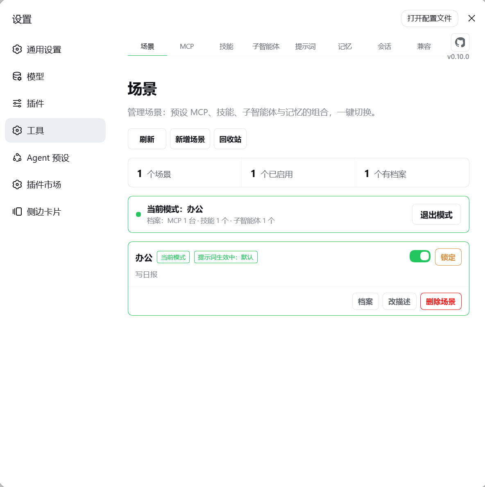
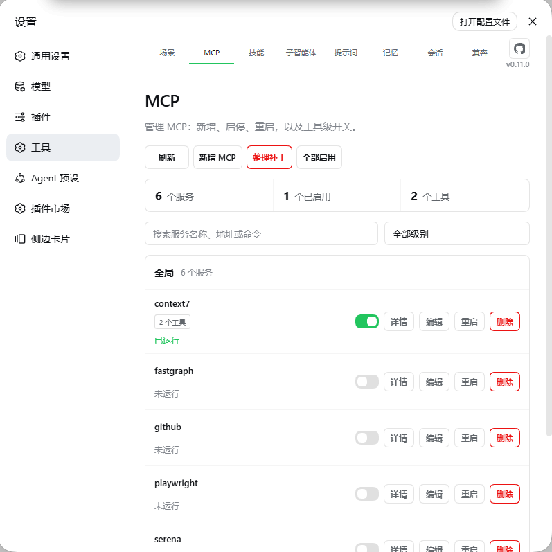
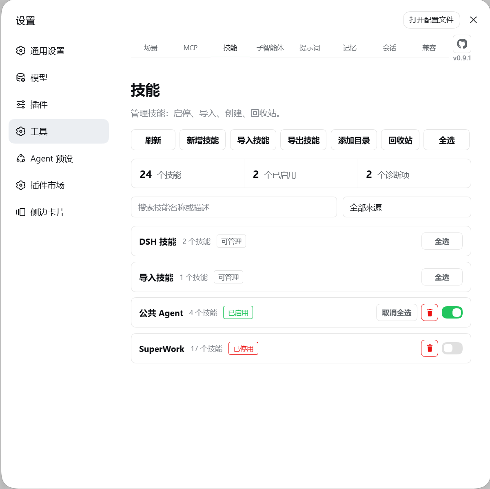
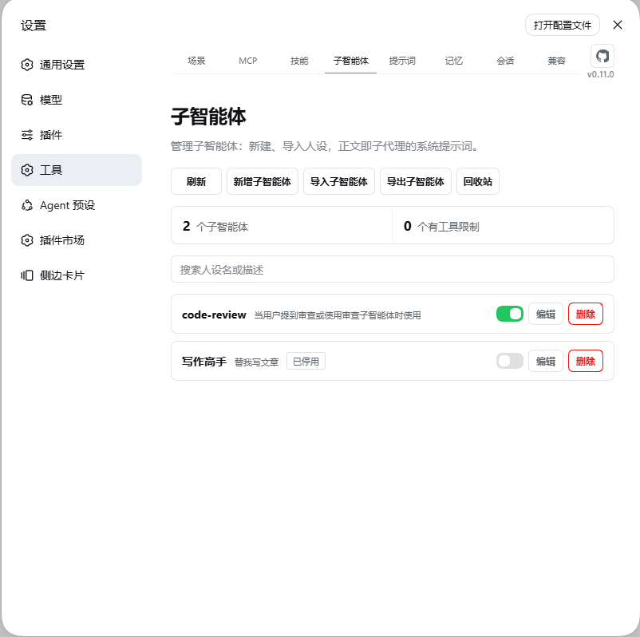
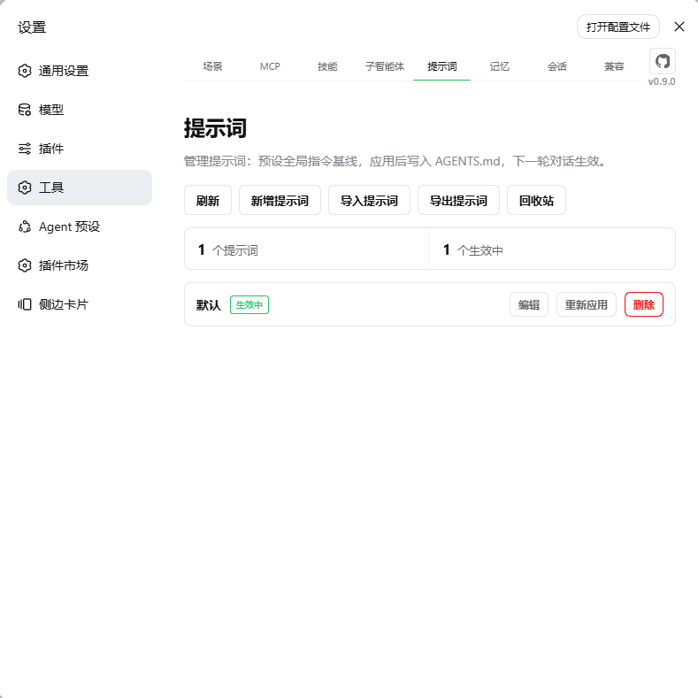
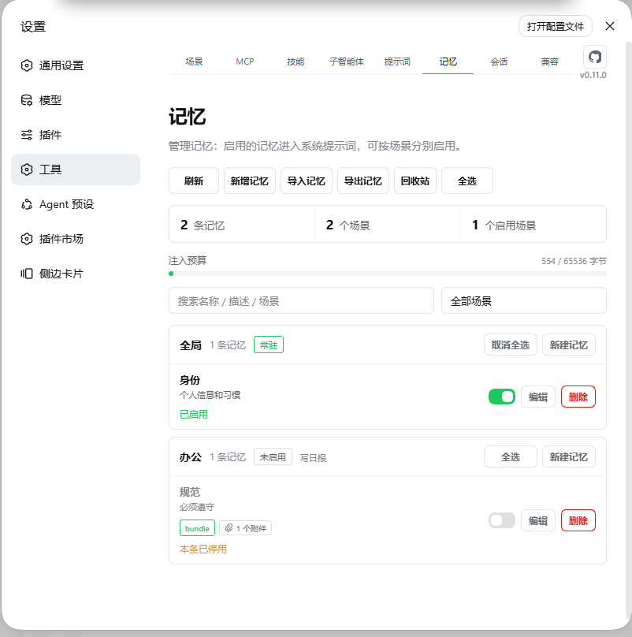
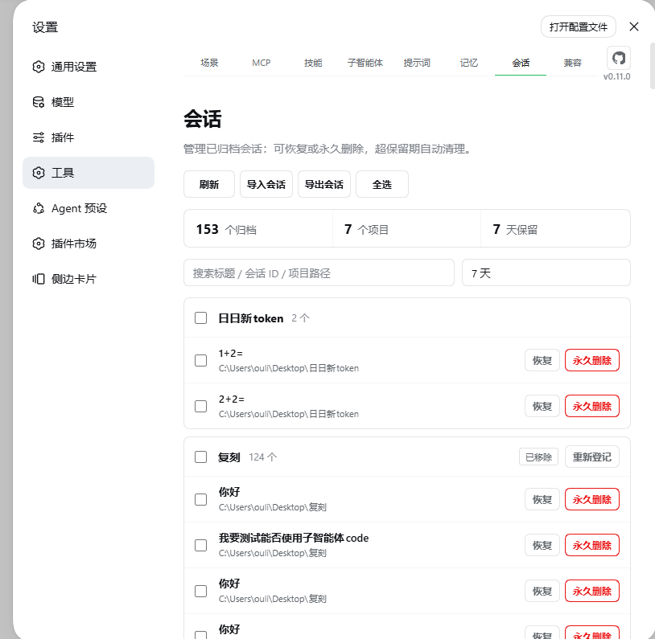
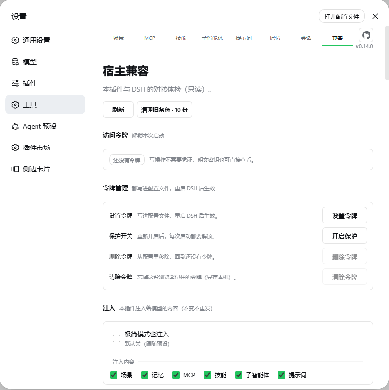

# dsh-plugin-tool-management

[](https://www.npmjs.com/package/dsh-plugin-tool-management)
[](LICENSE)
[](package.json)
[](https://github.com/ouli-1242/dsh-plugin-tool-management)

[](https://dsh.market/)
[](https://awesome-dsh-plugin.com)
[](https://dshfind.com/zh/plugins/ouli-1242/dsh-plugin-tool-management)
[](https://github.com/0xsline/awesome-deepseek-harness)

**简体中文** · [English](README_EN.md) · [Changelog](CHANGELOG.md) · [版本更新概要](docs/update.md)

- DeepSeek Harness 的 **MCP、技能、场景、记忆、子智能体、提示词与归档会话**管理插件。
- 八个页签：**场景**、**MCP**、**技能**、**子智能体**、**提示词**、**记忆**、**会话**、**兼容**。

```sh
dsh plugin --profile web add dsh-plugin-tool-management@latest
```

装完硬刷新浏览器（Cmd/Ctrl+Shift-R），设置 → **工具** 即安装成功。不手改 `cordis.patch.yml`，不碰技能源文件，重启与升级后配置依旧。

---

## 截图

|                              |                                |
|:----------------------------:|:------------------------------:|
|    |       |
| **场景**                     | **MCP**                        |
|    |  |
| **技能**                     | **子智能体**                   |
|  |      |
| **提示词**                   | **记忆**                       |
|    |      |
| **会话**                     | **兼容**                       |

## 核心亮点

一句话：**把「工作 / 写作 / 编程」各配成一套场景，点一下整套切换；插件管的东西，模型都看得见。**

| 亮点                        | 说明                                                                                                                                                                                                            |
| --------------------------- | --------------------------------------------------------------------------------------------------------------------------------------------------------------------------------------------------------------- |
| 一键换场景                  | 每个场景各配一套：用哪些 MCP 服务器、哪些技能、哪些人设、哪些记忆；点一下整套切换，关掉自动还原                                                                                                                 |
| 记忆自动送到模型眼前        | 每个场景下写几段 `.md` 就是它的资料库，正文自动进上下文，不用每次复制粘贴                                                                                                                                       |
| 给 MCP 服务器写备注         | 像「A 不可用时改用 B 兜底」这种话写进备注，模型看得到，会照做                                                                                                                                                   |
| 单个工具也能关              | 一台服务器里只停掉某个工具，模型看不见也调不到；「重启」只重连，不会偷偷改变开关                                                                                                                                |
| 技能状况一眼看穿            | 哪些在生效、哪些被同名技能覆盖、哪一份是首选，都标得清清楚楚                                                                                                                                                    |
| 子智能体 = 一个文件一个角色 | 写一份角色说明就能派活；跑完只回结果、不占你的会话记录；哪些角色能用还能按场景定                                                                                                                                |
| 提示词备好几套              | AGENTS.md 可以存多份（简洁模式 / 教学口吻……），一键切换；场景可以各自绑一份                                                                                                                                     |
| 会话不再丢                  | 归档按项目分组、能搜、能批量恢复；Claude Code / Cursor / Codex 的聊天记录都能导进来                                                                                                                             |
| 模型一定看得见              | 插件管的内容（记忆 / MCP / 技能 / 子智能体 / 提示词）会主动告诉模型，每个域各发一条、内容没变不重复；极简模式下默认不注入（跟随预设），可在「兼容」页逐项打开                                                   |
| 锁住就不怕手滑              | 场景可以上锁：MCP / 技能 / 子智能体 / 记忆 / 提示词五个域的**增删改**整体只读，先解锁才能改（场景本身的新建/改名/绑定/启停切换、回收站、重启等不在冻结清单内，见「场景锁定」）                                  |
| 删了能找回，配好能带走      | 技能 / 记忆 / 人设 / 提示词 / 场景的删除都进回收站，随时恢复；它们都能勾选打包成 zip 再导回来。**会话历史是例外：永久删除不经回收站，不可恢复**                                                                 |
| 安全、不添乱                | 密钥默认打码、看明文要令牌；只写自己的文件，技能源文件一个不动，升级重启配置都在。**打码只管界面展示**：密钥在 `cordis.patch.yml` 里始终是明文，每次改配置还会连带产生最多 5 份明文备份副本（见「配置与安全」） |

## 快速开始

前置：DSH 已安装（`dsh web` 可运行），Node.js ≥ 18。

```sh
dsh plugin --profile web add dsh-plugin-tool-management@latest   # 安装 / 更新
dsh plugin --profile web remove dsh-plugin-tool-management        # 卸载
```

装完硬刷新浏览器，设置 → **工具** 出现八栏即成功。客户端改动热加载，宿主侧改动需重启 `dsh web`。

也可以让模型代劳：

```text
安装 dsh-plugin-tool-management 插件：
dsh plugin --profile web add dsh-plugin-tool-management@latest
装完提醒我硬刷新浏览器。
```

模型可用 18 个工具管理上述功能（`mcp_manager_*` / `skill_manager_*` / `prompt_manager_*` / `memory_manager_*` / `scene_manager_*` / `subagent_manager_*`）；五个「保存」工具（`*_save`）都是有则改、无则建；脚本走 `POST /dsh-plugin-tool-management/api`（`{op, args}` 协议）。

这 18 个工具的说明合计约 3,440 token，而工具表**每一轮请求都随工具发一遍**。用不上的可以在「兼容」页的**「模型工具表」**块里逐个关掉（也能按域全关）——关掉的整份不进请求，这是唯一真省 token 的办法。关掉之后模型调不到它，**面板不受影响**（118 个 op 与工具表互不相干）。默认一个都不关。

另外有一个工具会**自动让位**：会话里已经挂了官方 `skill` 工具（标准类预设都挂）时，我们那个「按名字读技能正文」的 `skill_manager_read` 不再下发 —— 两份干的是同一件事。极简模式没有官方那件，我们的照旧留着。

其中 `subagent_manager_run` 依赖宿主已挂载 `dsh-subagent-*` provider 包 —— 但**注册不依赖**它：provider 缺席时工具照样注册，是**调用那一刻**报「子代理服务未挂载（ctx.subagents 缺失）」（`src/subagents/service.ts` 的 `ensureProvider`）。另外四个（`_list` / `_set_enabled` / `_create` / `_update`）动的只是 hub 里的人设文件与启停名单，与 provider 无关，任何时候都该可用。真正的注册失败（宿主 API 变更等）会被逐个记下，随子智能体页的横幅与 `preset-tools` 的 `unavailable` 一起显示出来。

---

## 功能

### 场景与记忆

- **场景 = 分组，记忆 = `.md` 文件**。`memories/<场景>/<名>.md`，整篇正文自动注入上下文，文件名支持中文。
- **单选启用**：同时只启用一个场景（其余置灰），关掉全部 = 只注入「全局」与 `_shared`。新场景默认不启动。
- **场景绑提示词**：切换场景直接改写 `~/.dsh/AGENTS.md`（覆盖前 5 代备份，关掉自动恢复基线）；预设挂不到官方 AGENTS.md 通道时（极简），改为把这份正文直接注入上下文。
- **场景档案**：每个场景搭配 MCP 工具集 / 技能集 / 子智能体 / 记忆（任意组合）；打开场景即应用并收窄注入，关闭按快照原文恢复（开关是唯一入口）。勾选集语义：**勾的启用、没勾的停用，整段没建 = 一个都没勾 = 该域全部停用**（所以「没配 MCP 工具集」的场景进去就是全部 MCP 停用，退出再开回来）。**场景内 MCP / 技能 / 子智能体这三个域的开关照常可用**——这里的改动会同步写进该场景的档案（当下生效、下次进这个场景照旧生效），只有**锁定**才冻结；记忆域的开关本来就是单一真相源，不经过档案。
- **「进/出模式」与「启用场景」是两个独立状态轴**：界面开关是唯一入口（两轴齐动）。绕过界面直接调 HTTP API 时要注意：`scene-mode-set{scene:null}` 只退运行时快照，**不清空启用集** —— 记忆与提示词仍按该场景注入；要彻底退出还需 `rules-set-active{scenes:[]}`。
- **导入**：`.md` / `.zip`（目录名 = 场景，bundle 带附件），同名跳过绝不覆盖，超限逐条回报。
- **导出**：勾选记忆打包成 zip，保留「场景/名称」层级；bundle 型连目录里的附件一起打进去。只读源文件。
- **注入预算**：默认 128 KiB，放不下的跳过并列出清单。删除进回收站。
- **子代理会话不注入记忆**：记忆只在**顶层会话**注入 —— 它是"父会话的现场"，不是子代理完成任务所需的事实；子代理的上下文只留「角色 + 任务」，要记忆可用 `memory_manager_list/read` 自己取，相关事实应由父代理写进 `task`。其余域不受影响（MCP / 技能 / 提示词照常注入，人设目录按各自的 `catalogDepth`）。
- **场景锁定**：锁定后 MCP / 技能 / 子智能体 / 记忆 / 提示词五个域的**增删改**整体只读，界面禁用 + 服务端守卫双侧拦截；未启动不能上锁，锁定中不能关闭，先解锁再改。**冻结的是"内容"，不是"场景本身"** —— 场景的新建 / 删除 / 改名 / 提示词绑定 / 启用切换 / 回收站的恢复与永久删除、MCP 重启、导出、注入设置与令牌设置都不在冻结清单内（它们不是"场景档案里的内容"）。其中「启用切换」在锁定场景正在生效时会被拒绝 —— 清空启用集合会让模型侧的写门禁失去判据（运行时却还是那个场景的档案态）。
- **删除场景 = 连记忆一起删**：场景记录、档案与全部记忆进同一条回收站条目，恢复按原路径整条放回；使用中的场景拒绝删除。场景名可改（连带目录与档案，记忆正文不动）。

### 子智能体

- **一个文件一个人设**：`agents/<人设>.md`，frontmatter 全可选。
- **人设进系统提示词时会带一层角色框**：正文照原样使用，外面加 `# 角色：名` 标题、一行授权（「由调用方指定；与你的默认倾向冲突时以它为准；任务说要什么，怎么做以它为准」）和一句边界（决定**怎么做**，不改变**能做什么**），正文用 `## 角色定义` 围起来；框的语言跟随正文。这是为了让模型把它读成"我被指定为一个角色"，而不是身份句后面多跟的两句话——**人设文件一个字都不用改**。框里不列 `description`（那是给**调用方**选人设用的；要给人设子代理看的简介写进正文）。
- **工具限制按 Agent 预设**：每个预设一份白/黑名单（互相排斥），运行期按当前预设生效——堵掉旧「全体并集」名单换预设后子代理起不来的坑。两条必须知道的行为：**① 白名单会并回当前所有 `mcp__*` 工具**（官方 `allow` 是"清单之外全砍"，不并进来会把 MCP 一起砍掉），所以「只勾了 `read`」拦不住一个暴露 shell 的 MCP 服务器；**② 名单里的名字全都对不上当前工具时按"不限制"处理**（fail-open，不是 fail-closed）——极简这类预设下白名单极易整份落空。反向的失败是「写了保留名 `run_code`」：官方 `tools.restrict()` 会直接抛错（子代理起不来），所以插件会把它从名单里剔掉并在结果里说明。
- **`output:` 输出要求（硬性契约）**：frontmatter 里可写多行 `output:`（**一行一条**），角色框会把它渲染成 `## 输出要求（硬性）` 单独一节（在角色定义之后）。提示词写「这个角色怎么想」（散文），`output:` 写「产出必须长什么样」（可检验：格式、分级、必标项、禁止项）—— 只有一句抽象要求的角色，产出无法判定"执行了没有"；写成可检验的才会被真的遵守。编辑器里有「输出要求（硬性）」多行框，也可以直接写进文件。
- **即用即弃**：`subagent_manager_run` 带人设运行、只回传结果、不进 History。子代理的上下文只有**角色 + 任务**：场景记忆不注入（要记忆可用 `memory_manager_*` 自己取，相关事实应由父代理写进 `task`）。场景可绑定可用人设。
- **两种上下文模式**：默认新起独立会话（子代理看不到本次对话，任务要写全）；把 `inherit` 打开则子代理**继承本次会话已完成的轮次**（与官方 `subagent_fork` 同一套机制），任务只需写新增部分。**只继承已完成的轮次**——在本轮内发起委派时这一轮的内容继承不到（实测：父代理边读边委派，子代理仍从零开始），此时 `task` 要按"写全"对待。与官方两个委派工具（`subagent` / `subagent_fork`）的分界由插件写进上下文：**贴合人设的任务一律走这里**，官方那两个只在没有人设贴合、或需要后台任务（job）时用。
- **启停开关**：停用的人设不注入上下文、模型不可见（文件不动）；新建 / 导入 / 恢复**默认停用**（v0.8.5 起，与技能 / MCP 同口径），要委派先在这里打开。**进场景按档案勾选集全量对齐**（勾了的开、没勾的关，整段没建 = 全关），退出按进场景前的开关精确还原；场景内这个开关照常可用，改动会同步写进该场景的档案（只有**锁定**才冻结）；退出场景时回到进场景前的状态。
- **人设目录自动注入**：只列名字 + 描述，模型知道有哪些人设可委派；人设名可改，场景绑定自动跟着改。
- **目录注入（`catalogDepth`）**：控制常驻的人设目录出现在哪些会话里 —— 默认 `1` = 只在顶层注入；写 `2` 让子会话也收到目录；`3` 到两层子会话；界面上的「不限制嵌套」写 `99`，任何深度的会话都注入。**它不限制嵌套**：子代理始终可以继续委派，那由官方决定（宿主侧默认 `maxDepth: 3`；该包不是本插件的依赖，本插件也不再向官方传 `maxDepth`）。「不限制嵌套」是**目录注入深度** `99`，不是递归上限。子会话看不到常驻目录时，仍可用 `subagent_manager_list` 查询全部人设。三处口径同源（目录过滤、域声明、实况状态），所以"界面说没注入、实际又注入了"这类分叉不会出现。

### MCP 服务

- **增删改查 + 即改即生效**：写入 `cordis.patch.yml`，HMR 自动生效。
- **工具级开关**：单个工具可独立停用（模型看不见也调不到），整台支持批量。
- **停着也能看清单**：服务器没在跑时仍显示上次见过的工具名与描述（标「上次运行时」）；从没跑过的可以一键「启动服务器读取工具」。
- **密钥打码**：默认把凭据**整值**打码成 `••••••`（只有名字像密钥的键会打：token / secret / password / auth / api key 这类；`$VAR`、`!!js` 是间接引用，不打码；URL 的 query 整段换成 `?<redacted>`），「显示密钥」要令牌。
- **打码值永远不会被写进补丁文件**：编辑弹窗的密钥框预填的就是打码值，保存时插件会用补丁里的**原值**顶替（= 这一项没改）；原值本身已经是打码值（说明真值曾经被写坏过）或压根没有原值时，该键被跳过并在界面提示 —— 前者要你重新填。补丁里已经存在打码值的密钥，列表页一进来就会告警。**URL 是同一种保护、另一套形态**：查询串被打成 `?<redacted>`，保存时同样按原值顶替；补丁里没有原值可顶替时**整次保存会被拒绝**并提示重新填写完整 URL —— 只删查询串会留下一个"能连上但鉴权失败"的地址，比报错更难发现。
- **迁移与备份**：跨项目级/全局迁移失败自动回滚；JSON 导出导入。
- **状态与备注自动注入**：列出当前真正可用的 server；**曾经连上过、现在连不上的也会列出并标注**（`（当前未连上；上次连上时 N 个工具）`）—— 这样模型才会说"它没连上，检查一下"，而不是把"配了但连不上"读成"本机没配"、建议你装一个。从未连上过的不列。你的备注作为决策提示带给模型；级别分「全局 / 应用级」，新增默认全局。注：极简这类压制型预设默认不注入（模型可用 `mcp_manager_list` 读取服务器名、启停、工具数与备注）——想让它也注入，到「兼容」页的「注入」块打开开关。

### 技能

- **来源一览**：项目级 / DSH / Agents / Codex / Claude / 自定义目录，按来源分组。
- **两组权限相反**：默认来源（DSH / 导入技能）必须读取但技能可删；外部目录可停用/移除但技能只读。
- **移除 ≠ 停用**：移除 = 连目录都不扫（文件零改动，可恢复）；停用 = 仍列出但不可调用。
- **同名技能一眼看出谁在生效**：真实生效的那份标「首选」，被同名覆盖的标出来源；启用被覆盖的副本会明说「这样不会生效」。
- **自定义目录 / ZIP 导入导出 / 回收站**。
- **目录可注入**：预设没挂官方技能目录行（如极简）时，由本插件的注入域按「兼容」页的开关兜底送达（名字 + 简介；正文照旧读文件）。

### 提示词预设

- 多套 `~/.dsh/AGENTS.md` 基线，一键应用（宿主每步比对该文件版本、变了才重读，下一轮对话生效），保留 5 代备份。
- **记得「最近一次应用的是哪份」**：就算你手改过 `AGENTS.md`，模型问「现在用的哪份预设」也答得出来源（会注明「此后文件有变」）。
- **描述**：每条预设可写一句「这份是干什么的」，只显示在插件界面里；它存在同目录的 `meta.json`，不进 AGENTS.md，也就不会被注入上下文。
- 新建即可写正文，编辑可改 id（= 目录改名，场景绑定自动跟着改）。**被引用的不能删**（场景绑定 / `AGENTS.md` 当前内容 / 退出场景要恢复的那一份），删除进回收站。
- **正文可注入**：预设没挂官方 AGENTS.md 行（如极简）时，`~/.dsh/AGENTS.md` 的正文由本插件的注入域兜底（64 KiB 上限；可在「兼容」页关掉）。
- **场景接管期间「应用」= 把该场景改绑到那一份**（同步写进场景档案，绑定改完立刻重新对齐；未锁定时可用 —— v0.9 已把「应用别的预设会被拒绝」反转为改绑）；**锁定时才拒绝**。退出场景时全局基线按快照恢复。

### 历史会话

- 按项目分组、搜索、批量恢复 / 永久删除、保留期自动清理。
- 工作区登记被删后按会话目录重建分组，可一键重新登记。
- 导入 Claude Code / Cursor / Codex / 任意文本；导出 Markdown / JSONL。**导出是可读转录，不是完整备份**：只保留 user / assistant 的文本块，工具调用、图片、思考过程与 token 统计都不在里面；Markdown 正文里出现的 `## User` 这类行在再次导入时会被当成轮次分界（导出侧不转义）。要留全量请用「归档」。

### 宿主兼容

插件运行期用宿主同一批 `@deepseek-ai/*` 库——必须是同一份物理模块，否则判断退化成猜。

- **「兼容」页**：宿主版本、能力可用数、每个动作走原生/适配/不可用、降级项与原因。体检本身只读，但这一页有三个明确的写入口：**访问令牌**（写 profile 的 `cordis.patch.yml`，重启生效）、**注入设置**（写 `inject-settings.json`，即时生效）与**模型工具表**（写 `tool-table.json`，即时生效）。
- **命令行**：`node scripts/doctor.mjs`（体检）、`node scripts/host-deps.mjs --fix`（依赖对齐）、`npm run sync:profile`（把构建产物镜像到 profile 里那份本地安装 —— `file:` 装的是硬链接拷贝，构建新增的文件不会自动过去）。
- `minimal` 这类**压制型预设**（persona `complete` / 关闭运行时上下文）下，本插件的注入**默认停用**（跟随预设的设计意图），提示词与技能也因官方那两行没挂而缺席 —— 兼容页逐列标出，同一页的「注入」块可以按域强制打开。
- **关掉「技能」「提示词」的勾选 = 真的不再注入**：这两项在标准类预设下由宿主自己送（插件让位），所以取消勾选会**连宿主那份一起停掉**（`skill-catalog` / `agent-instructions` 的消息在这一步不再放行）。其余三项（记忆 / MCP / 子智能体）宿主本来就不送，勾选完全生效。
- **注入长什么样**：每个域一条 `<system-reminder>`，开头是 `# 板块标题`，之后就是正文（MCP 与子智能体各多一句补充说明）。板块是**一级**标题，域正文里的分组（记忆段的 `## 场景：X`）是它的下一级、条目是列表 —— 主次一眼可辨。框架里**只写"现在是什么"**：没有"什么时候该想起我"这类指令句，也没有对其它板块的解释（用户 2026-09-23 的原则：上下文注入就是当前的情况，不需要模型知道没用的信息）。正文里的 `</system-reminder>` 会被转义（你写的内容不能把框架提前关掉）。每条末尾一句「本份取代本次会话中更早注入的同类内容。」——注入只在内容变化时重发，旧那份还留在上下文里，所以要写明以哪份为准。写法逐条对照 Claude Code 与 Codex CLI 的官方注入。

---

## 数据落点

| 内容                                        | 位置                                                                               |
| ------------------------------------------- | ---------------------------------------------------------------------------------- |
| MCP 定义                                    | `~/.dsh/cordis.patch.yml`（插件只写它；改前自动备份到 hub 的 `backups/`）          |
| 技能策略 / 自定义目录                       | `~/.dsh/tool-management/skills-state.json`                                         |
| 技能 / 记忆 / 人设 / 预设                   | `~/.dsh/tool-management/{skills,memories,subagents,prompts}/`                      |
| 子智能体启停                                | `~/.dsh/tool-management/subagents-index.json`                                      |
| 回收站（技能/人设/预设/场景）               | `~/.dsh/tool-management/trash/{skills,subagents,prompts,scenes}-trash/`            |
| 记忆回收站                                  | `~/.dsh/tool-management/memories-trash/`（**hub 根下独立目录，不在 `trash/` 里**） |
| 归档账本 / 保留期                           | `~/.dsh/tool-management/history-*.json`                                            |
| 记忆索引 / 场景 / 档案                      | `~/.dsh/tool-management/memories-index.json`                                       |
| MCP 侧车（停用表 / 已知工具 / 备注 / 设置） | `~/.dsh/tool-management/mcp-*.json`                                                |
| 注入设置（六个域开关 / 压制型预设口径）     | `~/.dsh/tool-management/inject-settings.json`                                      |
| 模型工具表（不发给模型的工具）              | `~/.dsh/tool-management/tool-table.json`                                           |
| 场景页界面设置（进场景前弹不弹预览卡）      | `~/.dsh/tool-management/scene-settings.json`                                       |
| 运行日志 / patch 备份                       | `~/.dsh/tool-management/tool-management.log` · `backups/`                          |

**插件安装目录里不存用户数据**（`dsh plugin update` 会整体替换该目录）。

**`backups/` 的保留份数是「每份 patch 文件各 5 份」**：备份名带层级标签（`.global` / `.profile-<名>`），所以全局与每个 profile 各自留 5 份 —— 不是全局共 5 份。一次批量操作（如 `mcpm-set-all`、进入场景的多次写）就可能把某个层级的 5 个槽位全吃掉、挤掉更早的版本。

## 配置与安全

| 字段            | 说明                                                                                                                                                                                                                                                                               |
| --------------- | ---------------------------------------------------------------------------------------------------------------------------------------------------------------------------------------------------------------------------------------------------------------------------------- |
| `token`         | 访问令牌。设了之后**所有写操作 + 明文密钥**都要求 `x-dsh-token`；**不设时明文接口一律关闭**。也是 curl / 局域网的逃生门。不想把令牌写进配置文件时，可改用环境变量 `DSH_PLUGIN_TOOL_MANAGEMENT_TOKEN`（两者都给了以 `config.token` 为准；`tokenDisabled: true` 会让两者都不生效）。 |
| `tokenDisabled` | `true` = 令牌**保留在配置里**但当前不生效（在兼容页点「关闭保护」写入的就是这一行）。写操作不再要求令牌；明文查看仍然要凭令牌（明文本身就是凭据）。随时可以在兼容页「开启保护」开回来，不需要重新输一遍。                                                                  |
| `maxBodyBytes`  | 请求体上限，默认 88 MiB。                                                                                                                                                                                                                                                          |

**关于磁盘上的明文（必读）**：打码**只发生在界面展示**。MCP 的 `env` / `headers` 与插件自己的 `config.token` 在 `~/.dsh/cordis.patch.yml`（及其 profile 副本）里始终是明文，而每次改配置前插件会把**整份文件**备份进 `~/.dsh/tool-management/backups/`（按文件各留 5 份、不加密、不轮转、卸载也不回收）—— 于是一份密钥最多会有 `5 ×（含它的 patch 文件数）+ 1` 份明文副本。令牌门禁管的是"谁能通过 HTTP 拿到明文"，**管不到磁盘读取**：本机任何对该目录有读权限的进程都能一次读走全部凭据。唯一的真实防线是操作系统的文件权限。**要清理：设置 → 工具 → 兼容 → 「清理旧备份」**（在「刷新」旁边，按钮上直接写着现有份数），可选**每个层级各一组档位**（N 份 = 把那层最旧的 N 份删掉，档位到该层现有份数为止、默认 2 份；两层各自选，所以合计能凑出任意数 —— 奇数也行）—— 每行下面写着"删完还剩几份"，删除要在弹窗里再确认一次（确认那行会给出合计文件数）；只删备份文件、不碰当前配置。也可以手工删除 `~/.dsh/tool-management/backups/` 下的旧文件。

- **浏览器**：读写走 cookie，不需要 token；但**明文密钥**（显示密钥 / 导出）要令牌。**令牌在「工具 → 兼容」页的「访问令牌」块管理**（与页面无关的固定入口）。那一块是**一枚状态胶囊 + 一句实况 + 三行**：行名说"这一步管到哪儿"、按钮说动词，胶囊只回答"保护开没开、这一程解锁没有"。
  - **本次启动**：填一次，管到 DSH 退出（只写本机浏览器）。填对了，这一行**就地**变成一枚绿胶囊「已解锁」+「清除」（不是塌成一颗按钮 —— 那样看着像刚填的东西没了），宿主才认这串令牌、下面两行才动得了；宿主侧还没有令牌时这一行不出现（没东西可验）。
  - **宿主配置**：写进 profile 的 `cordis.patch.yml`（只动那两行，注释与 `!!js` 守卫原样保留，改前自动备份），重启 DSH 生效。宿主还没配时这一行的按钮就是主操作（「设置令牌」，点开输**两遍**新令牌防手滑）；已配之后换令牌点「修改令牌」，表单里多一栏**当前令牌** —— 换令牌要能证明知道当前令牌，而**解锁过不算**（与「关闭保护」同一条口径）：必须在表单里当场再输一次；点开时光标就落在这一栏，三栏**竖排**、保存与取消跟在下面（表单打开时只剩这一行，回车 = 保存），三栏齐了「保存新令牌」才可按，输错时那一格会标红。
  - **删除令牌**（与「修改令牌」同一行）：把 `token` 与 `tokenDisabled` 两行从配置里删掉，回到**还没设置**那一态 —— 写操作不再要凭证、明文密钥随之不可见。同样就地展开确认框、当场再输一次当前令牌；回执会如实提醒"旧备份里仍有明文副本"（备份是整份配置的副本，要一并清掉用页头的「清理旧备份」）。想保留令牌、只是暂时不要门禁时用「关闭保护」，别用删除。
  - **保护开关**：点「关闭保护」会**就地展开确认框（此时只有这一行，与「修改令牌」同一规矩）**，要再输一次当前令牌（解锁过也要输 —— 请求头里那份已验证的凭证对"关闭"不作数，防的是解锁之后顺手一点就把防护关了）；确认后只写一行 `tokenDisabled: true`，**令牌原样留在配置里**，随时点「开启保护」就能开回来（不必重新输一遍）。关闭后写操作不再要求令牌；**明文查看仍然要凭令牌**（明文本身就是凭据）。开启方向沿用原口径：解锁过，或输入框里填着当前令牌即可 —— 否则"能打开 GUI 就能关掉保护"，令牌等于白配。
  - **状态胶囊**：还没有令牌 / 保护已关闭 / 保护已开启 · 待解锁 / 保护已开启 · 已解锁。配置改了还没重启时，胶囊下面会多一条橙色横幅说清（胶囊说的是当前进程）。
- **令牌功能没在生效时，不再挂那句「去填令牌」**：那句话只在实际有门禁（当前进程存在生效令牌）时才留下；关掉或没配时它会被收掉，由面板上的状态胶囊说出实际情况。
- **提示出现在哪里**：令牌没过时的那句话（含右侧的「填写令牌」按钮）**恰好只有一份** —— 有弹窗打开时在弹窗里（它是当前操作的阻塞原因，放在最显眼处），没有弹窗时在页签下方。它与"当前是哪一页、那一页怎么渲染错误"无关，所以任何一个入口（含各种弹窗里的提交、导入、导出、批量操作）都不会漏提示。
- **curl / 脚本**：带 `x-dsh-token`，或带浏览器 cookie。
- **HTTP 状态码口径**：除安全栅栏的 401/403 外，令牌缺失、业务失败等一律 HTTP 200 + `{ ok: false, error }` —— 脚本分流请以 `body.ok` 为准，不要按状态码。
- **栅栏的降级面**：宿主缺 `connection` 服务时，栅栏退到「Host 回环 + 同源」判定（没有浏览器 cookie 可验），本机任意进程伪造 `Host: localhost` 即可调用写 op —— 把端口转发到局域网/公网的场景**务必配令牌**，它是这条降级面上的最后一道门。
- **`dir-list` 的暴露面**：「选择文件夹」弹窗靠它逐级列目录，因此通过栅栏/令牌的调用方可列出**任意绝对路径**的目录（只读）。这是功能性设计，不是漏洞；但请勿把端口暴露给不可信网络。
- **端口转发到公网**：建议配 token——防陌生人注入 MCP 命令（等同远程执行）与窃取密钥。

## 常见问题

| 现象                                      | 解决                                                                                                                                                                                        |
| ----------------------------------------- | ------------------------------------------------------------------------------------------------------------------------------------------------------------------------------------------- |
| 装完没有页面                              | 硬刷新；不行重启 DSH。                                                                                                                                                                      |
| 重复 MCP 页签                             | 删 `cordis.patch.yml` 里的旧 loader 行后重启。                                                                                                                                              |
| 改坏配置 DSH 起不来                       | 从 `~/.dsh/tool-management/backups/` 取最近的 `cordis.patch.yml.<层级>.bak-<时间戳>` 覆盖回去（每份 patch 各留 5 份）。                                                                     |
| 升级 DSH 后动作不可用                     | 设置 → 工具 → **兼容** 看原因；`doctor.mjs` → `host-deps.mjs --fix`。                                                                                                                       |
| `approval=never` 还要确认吗               | 不弹卡，直接放行并记日志；想问回来切回「工作区内修改」。                                                                                                                                    |
| `subagent_manager_run` 报 provider 不可用 | 对应 provider 没注册：`spawn`（默认）/ `fork`（`inherit`）分别挂 `@deepseek-ai/dsh-subagent-spawn-in-process` / `-fork-in-process` 后重启。                                                 |
| 场景绑了 A 人设，官方 `subagent` 还跑别的 | 官方那两个是宿主的工具，本插件管不到它们的可见性；插件会把分界写进上下文（贴合人设的一律走 `subagent_manager_run`，官方只在没人设贴合或要后台跑时用），`inherit` 也已对齐 fork 的继承能力。 |

---

## 开发

```bash
npm install
npm run build        # tsc + 同步客户端
npm test             # 构建 + i18n + 契约测试（纯函数不变量与宿主契约；渲染类测试已于 2026-09-19 移除）
npm run check:i18n   # 词典自检
npm run doctor       # 宿主兼容体检
```

`lib/` 不入版本库，克隆后先 `npm run build`。改完重启 `dsh web` 才生效。运行时依赖：`fflate`（导出打包）、`js-yaml`（写宿主补丁前的解析校验，惰性加载）；`@deepseek-ai/*` 一律用宿主那份。

> **部署注意**：`npm run build` 的 profile 镜像清单**不含 `node_modules`**，所以本地联调时新增的运行时依赖（如 `js-yaml`）要么在 profile 侧装一份，要么接受「补丁写入校验跳过并上报」的降级 —— 校验器装不上只影响这一道保险，不阻断写入。`npm install` 装到 profile 的正式安装不受影响（依赖会随包安装）。

## 许可证

MIT
