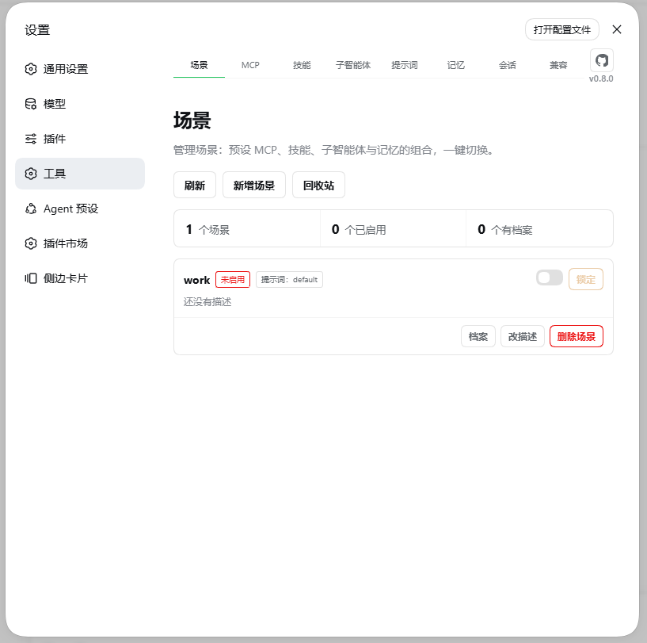
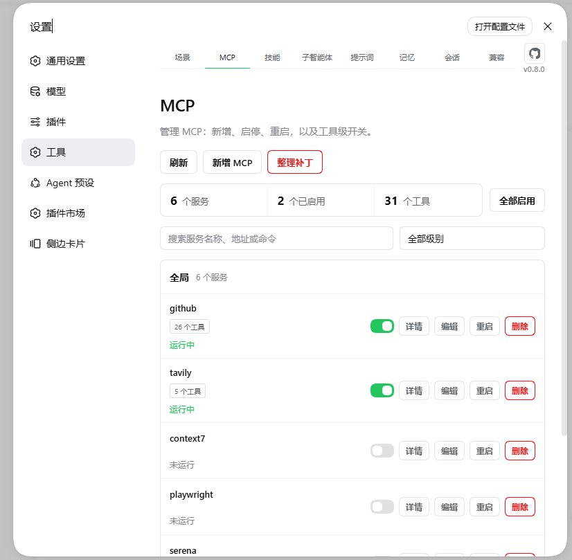
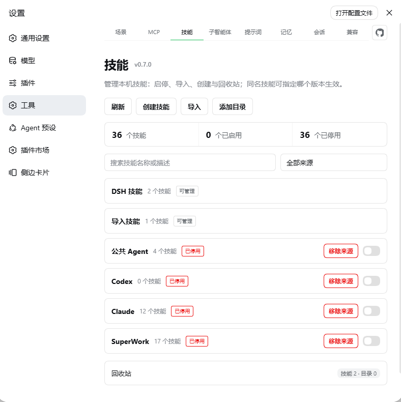
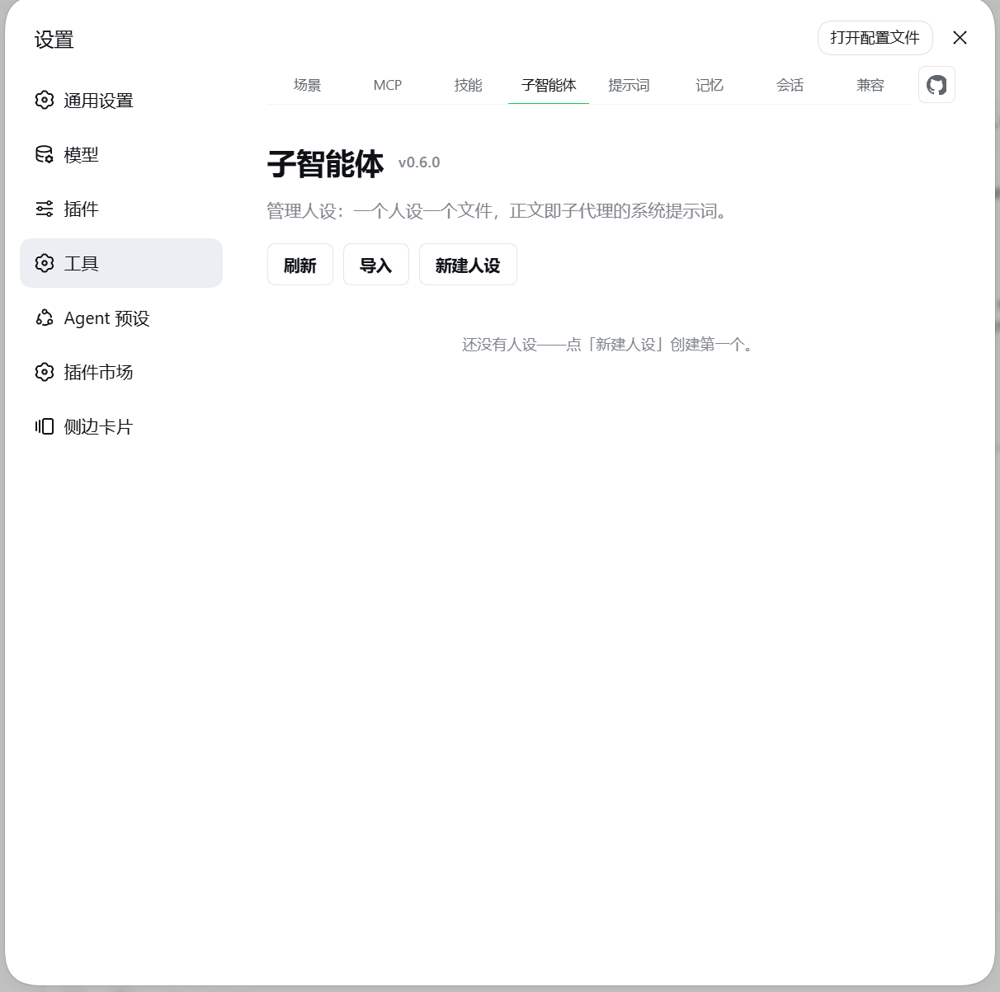
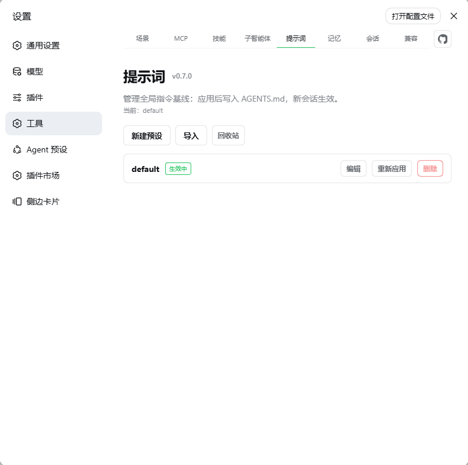
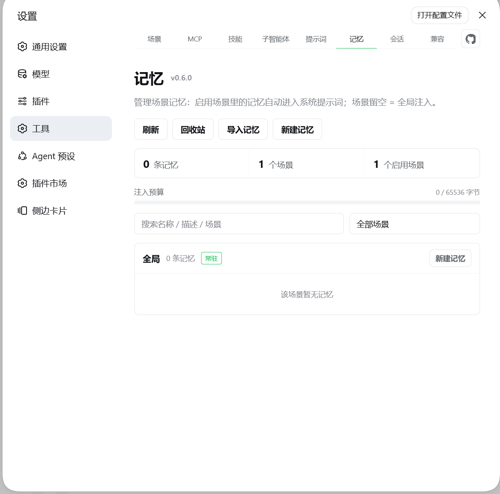
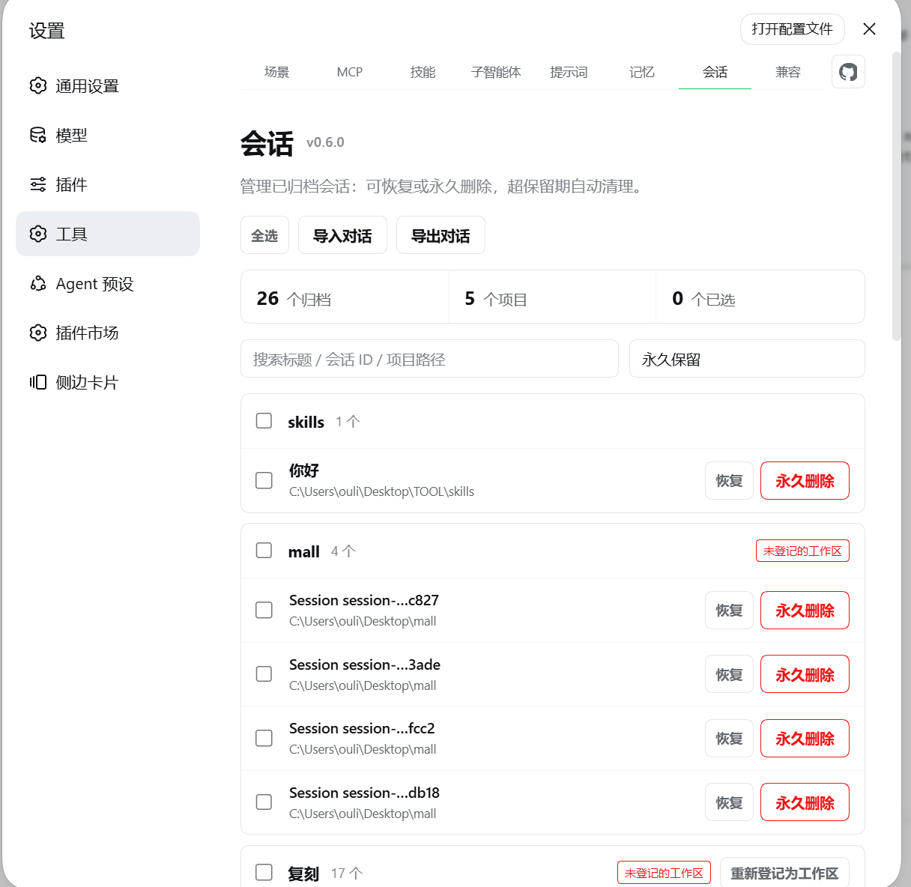
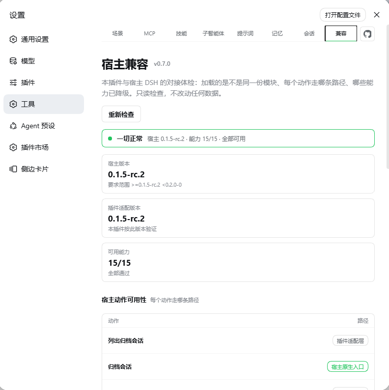

# dsh-plugin-tool-management

[](https://www.npmjs.com/package/dsh-plugin-tool-management)
[](LICENSE)
[](package.json)
[](https://github.com/ouli-1242/dsh-plugin-tool-management)
[](https://dsh.market/)
[](https://awesome-dsh-plugin.com)

**简体中文** · [English](README_EN.md) · [Changelog](CHANGELOG.md) · [版本更新概要](docs/update.md)

- DeepSeek Harness 的 **MCP、技能、场景、记忆、子智能体、提示词与归档会话**管理插件。
- 八个页签：**场景**、**MCP**、**技能**、**子智能体**、**提示词**、**记忆**、**会话**、**兼容**。

```sh
dsh plugin --profile web add dsh-plugin-tool-management@latest
```

装完硬刷新浏览器（Cmd/Ctrl+Shift-R），设置 → **工具** 即安装成功。不手改 `cordis.patch.yml`，不碰技能源文件，重启与升级后配置依旧。

---

## 截图

|  |  |
|:---:|:---:|
|  |  |
| **场景** | **MCP** |
|  |  |
| **技能** | **子智能体** |
|  |  |
| **提示词** | **记忆** |
|  |  |
| **会话** | **兼容** |

## 核心亮点

| 能力 | 说明 |
|---|---|
| 场景记忆 | 启用场景里的 `.md` 正文**自动进系统提示词**，下一个请求即生效 |
| 场景档案 | 每个场景自由搭配 **MCP 工具集 / 技能集 / 子智能体 / 记忆**；打开场景即应用，关闭按快照恢复 |
| 场景提示词 | 场景绑一份提示词预设，切换场景直接改写 `~/.dsh/AGENTS.md`（关掉自动恢复） |
| 场景锁定 | 锁住一个场景 = **五个管理域整体只读**（勾没勾的都不能动）；未启动不能上锁，锁定中关不掉，先解锁再改 |
| MCP 工具级开关 | 单台服务器里**单个工具**可独立启停：模型看不见也调不到 |
| 重启语义 | 重启只重连，**不改变启停状态** |
| 密钥安全 | 密钥默认打码；「显示密钥」与导出**必须带令牌**——没配 `token` 就不给明文 |
| 技能来源 | 接入 `~/.agents` / `~/.codex` / `~/.claude` 与自定义目录；默认来源必须读取但技能可删 |
| 回收站 | 人设 / 场景 / 提示词 / 记忆 / 技能删除都进回收站，可恢复 |
| AGENTS.md 预设 | 多套全局基线，一键应用，保留 5 代备份 |
| 归档会话 | 按项目分组、批量恢复 / 删除、保留期清理；工作区登记被删后可重建 |
| 对话导入导出 | 接管 Claude Code / Cursor / Codex / 任意文本；导出 Markdown / JSONL |
| 导入导出成对 | 技能 / 子智能体 / 提示词 / 记忆都有导出：勾选条目 → 打包 zip 到指定目录（只读源文件） |
| 子智能体 | 一个文件一个人设，**启停开关**决定是否注入上下文；即用即弃不进 History，自动继承场景记忆 |
| 上下文可见性 | 人设目录与「当前可用的 MCP server + 你的备注」进入系统提示词，模型自己知道有什么可用 |
| 前缀缓存友好 | 注入段只由「启用场景 + 文件内容」决定，逐字节稳定 |
| 兼容体检 | 「兼容」页一屏看清宿主能力、每个动作走原生还是适配、哪些降级 |
| 模型工具 | **14 个**（`skill_mcp_manager_*` / `skill_manager_*` / `agentsmd_*` / `rule_manager_*` / `subagent_*`） |
| 界面 | 自有设计系统，**八栏**，中英双语、跟随宿主语言 |

## 快速开始

前置：DSH 已安装（`dsh web` 可运行），Node.js ≥ 18。

```sh
dsh plugin --profile web add dsh-plugin-tool-management@latest   # 安装 / 更新
dsh plugin --profile web remove dsh-plugin-tool-management        # 卸载
```

装完硬刷新浏览器，设置 → **工具** 出现八栏即成功。客户端改动热加载，宿主侧改动需重启 `dsh web`。

也可以让模型代劳：

```text
安装 dsh-plugin-tool-management 插件：
dsh plugin --profile web add dsh-plugin-tool-management@latest
装完提醒我硬刷新浏览器。
```

模型可用 14 个工具管理上述功能（见亮点表）；脚本走 `POST /dsh-plugin-tool-management/api`（`{op, args}` 协议）。

---

## 功能

### 场景与记忆

- **场景 = 分组，记忆 = `.md` 文件**。`memories/<场景>/<名>.md`，整篇正文自动进系统提示词，文件名支持中文。
- **单选启用**：同时只启用一个场景（其余置灰），关掉全部 = 只注入「全局」与 `_shared`。新场景默认不启动。
- **场景绑提示词**：切换场景直接改写 `~/.dsh/AGENTS.md`（覆盖前 5 代备份，关掉自动恢复基线）。
- **场景档案**：每个场景搭配 MCP 工具集 / 技能集 / 子智能体 / 记忆（任意组合）；打开场景即应用并收窄注入，关闭按快照原文恢复（开关是唯一入口）。
- **导入**：`.md` / `.zip`（目录名 = 场景，bundle 带附件），同名跳过绝不覆盖，超限逐条回报。
- **导出**：勾选记忆打包成 zip，保留「场景/名称」层级；bundle 型连目录里的附件一起打进去。只读源文件。
- **注入预算**：默认 64 KiB，放不下的跳过并列出清单。删除进回收站。
- **场景锁定**：锁定后 MCP / 技能 / 子智能体 / 记忆 / 提示词整体只读，界面禁用 + 服务端守卫双侧拦截；未启动不能上锁，锁定中不能关闭，先解锁再改。
- **删除场景 = 连记忆一起删**：场景记录、档案与全部记忆进同一条回收站条目，恢复按原路径整条放回；使用中的场景拒绝删除。场景名可改（连带目录与档案，记忆正文不动）。

### 子智能体

- **一个文件一个人设**：`agents/<人设>.md`，frontmatter 全可选。
- **工具限制按 Agent 预设**：每个预设一份白/黑名单（互相排斥），运行期按当前预设生效——堵掉旧「全体并集」名单换预设后子代理起不来的坑。
- **即用即弃**：`subagent_run` 带人设运行、只回传结果、不进 History，自动继承场景记忆。场景可绑定可用人设。
- **启停开关**：停用的人设不注入上下文、模型不可见（文件不动）；新建 / 导入 / 恢复自动启用。启动场景时档案勾选的人设自动启用，退出按快照精确停回。
- **人设目录进系统提示词**：只列名字 + 描述，模型知道有哪些人设可委派；人设名可改，场景绑定自动跟着改。

### MCP 服务

- **增删改查 + 即改即生效**：写入 `cordis.patch.yml`，HMR 自动生效。
- **工具级开关**：单个工具可独立停用（模型看不见也调不到），整台支持批量。
- **密钥打码**：默认 `••••••`，「显示密钥」要令牌。
- **迁移与备份**：跨项目级/全局迁移失败自动回滚；JSON 导出导入。
- **状态与备注进系统提示词**：只列当前真正可用的 server，你的备注作为决策提示带给模型；级别分「全局 / 应用级」，新增默认全局。

### 技能

- **来源一览**：项目级 / DSH / Agents / Codex / Claude / 自定义目录，按来源分组。
- **两组权限相反**：默认来源（DSH / 导入技能）必须读取但技能可删；外部目录可停用/移除但技能只读。
- **移除 ≠ 停用**：移除 = 连目录都不扫（文件零改动，可恢复）；停用 = 仍列出但不可调用。
- **同名自选 / 自定义目录 / ZIP 导入导出 / 回收站**。

### 提示词预设

- 多套 `~/.dsh/AGENTS.md` 基线，一键应用（宿主每轮重读该文件，下一轮对话生效），保留 5 代备份。
- **描述**：每条预设可写一句「这份是干什么的」，只显示在插件界面里；它存在同目录的 `meta.json`，不进 AGENTS.md，也就不会被注入提示词。
- 新建即可写正文，编辑可改 id（= 目录改名，场景绑定自动跟着改）。正在生效的不能删；删除进回收站。

### 历史会话

- 按项目分组、搜索、批量恢复 / 永久删除、保留期自动清理。
- 工作区登记被删后按会话目录重建分组，可一键重新登记。
- 导入 Claude Code / Cursor / Codex / 任意文本；导出 Markdown / JSONL。

### 宿主兼容

插件运行期用宿主同一批 `@deepseek-ai/*` 库——必须是同一份物理模块，否则判断退化成猜。

- **「兼容」页**：宿主版本、能力可用数、每个动作走原生/适配/不可用、降级项与原因。只读。
- **命令行**：`node scripts/doctor.mjs`（体检）、`node scripts/host-deps.mjs --fix`（依赖对齐）。
- `minimal` 预设下，场景记忆 / AGENTS.md / 技能目录不生效（该预设的设计意图），兼容页逐列标出。

---

## 数据落点

| 内容 | 位置 |
|---|---|
| MCP 定义 | `cordis.patch.yml`（改前自动 `.bak`） |
| 技能策略 / 自定义目录 | `~/.dsh/tool-management/state.json` |
| 技能 / 记忆 / 人设 / 预设 | `~/.dsh/tool-management/{skills,memories,agents,agents-md}/` |
| 子智能体启停 | `~/.dsh/tool-management/agents-index.json` |
| 回收站 | `~/.dsh/tool-management/trash/` |
| 归档账本 / 保留期 | `~/.dsh/tool-management/history-*.json` |
| 记忆索引 / 场景 / 档案 | `~/.dsh/tool-management/rules-index.json` |
| 页面设置 | `~/.dsh/dsh-plugin-tool-management-settings.json` |
| 运行日志 | `~/.dsh/dsh-plugin-tool-management.log` |

**插件安装目录里不存用户数据**（`dsh plugin update` 会整体替换该目录）。

## 配置与安全

| 字段 | 说明 |
|---|---|
| `token` | 访问令牌。设了之后**所有写操作 + 明文密钥**都要求 `x-dsh-token`；**不设时明文接口一律关闭**。也是 curl / 局域网的逃生门。 |
| `maxBodyBytes` | 请求体上限，默认 88 MiB。 |

- **浏览器**：读写走 cookie，不需要 token；但**明文密钥**（显示密钥 / 导出）要令牌。
- **curl / 脚本**：带 `x-dsh-token`，或带浏览器 cookie。
- **端口转发到公网**：建议配 token——防陌生人注入 MCP 命令（等同远程执行）与窃取密钥。

## 常见问题

| 现象 | 解决 |
|---|---|
| 装完没有页面 | 硬刷新；不行重启 DSH。 |
| 重复 MCP 页签 | 删 `cordis.patch.yml` 里的旧 loader 行后重启。 |
| 改坏配置 DSH 起不来 | 取最近的 `.bak-<时间戳>` 恢复。 |
| 升级 DSH 后动作不可用 | 设置 → 工具 → **兼容** 看原因；`doctor.mjs` → `host-deps.mjs --fix`。 |
| `approval=never` 还要确认吗 | 不弹卡，直接放行并记日志；想问回来切回「工作区内修改」。 |
| `subagent_run` 报 spawn 不可用 | 宿主没注册 spawn provider；挂载 `@deepseek-ai/dsh-subagent-spawn-in-process` 后重启。 |
| 场景绑了 A 人设，官方 `subagent` 还跑别的 | 两条通道：本插件只管 `subagent_run`；官方 `subagent` / `subagent_fork` 无确认门、不认人设。 |

---

## 开发

```bash
npm install
npm run build        # tsc + 同步客户端
npm test             # 构建 + i18n + 语义契约测试
npm run check:i18n   # 词典自检
npm run doctor       # 宿主兼容体检
```

`lib/` 不入版本库，克隆后先 `npm run build`。改完重启 `dsh web` 才生效。运行时依赖仅 `fflate`；`@deepseek-ai/*` 一律用宿主那份。

## 许可证

MIT
