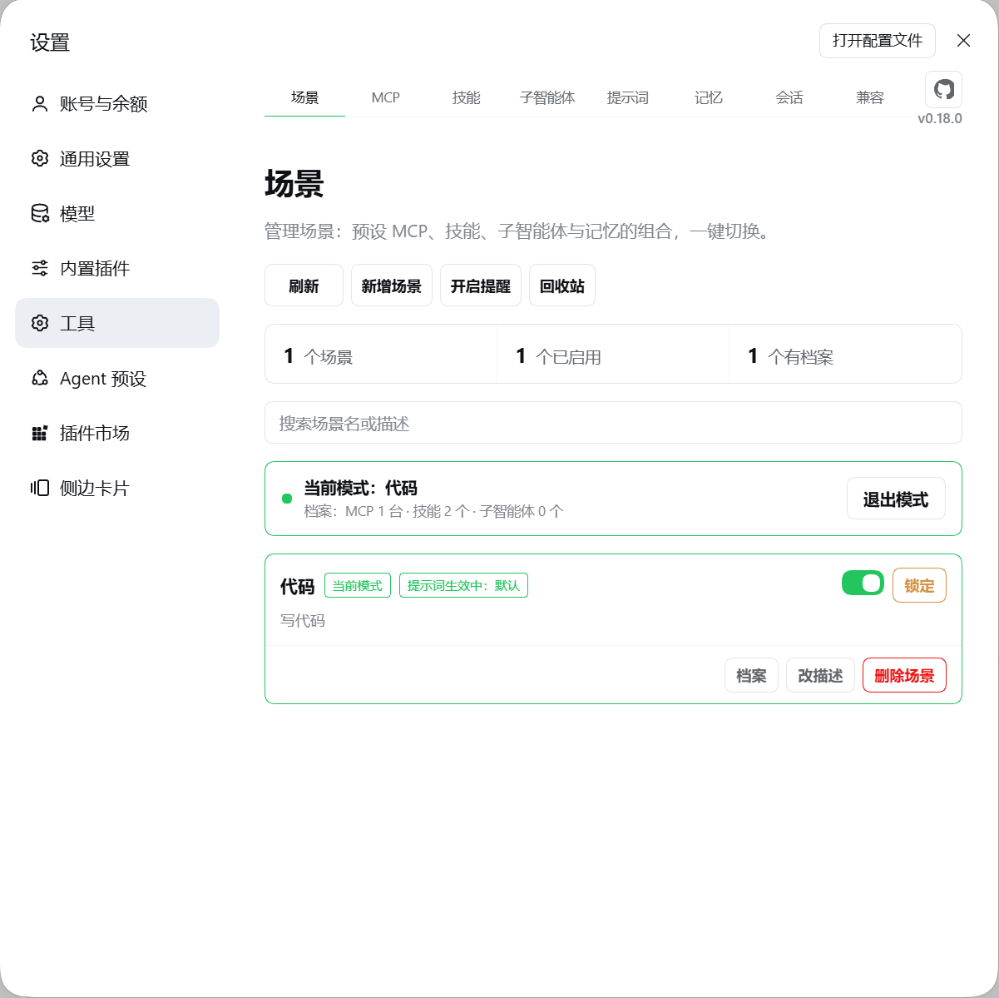
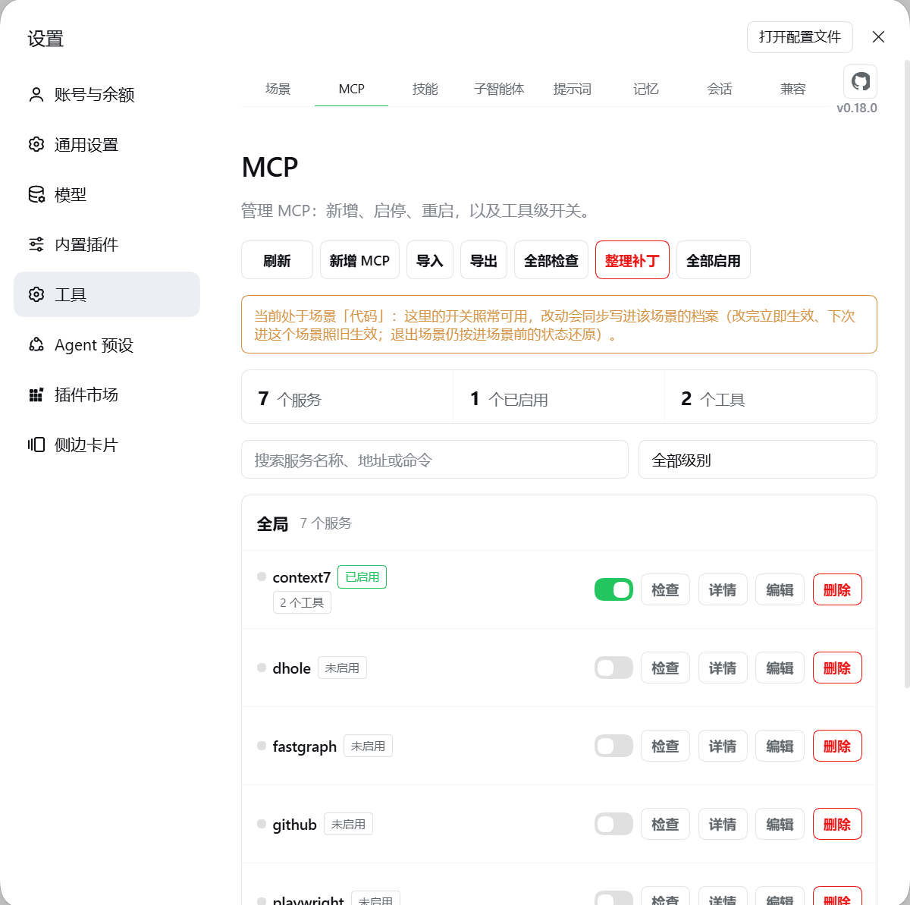
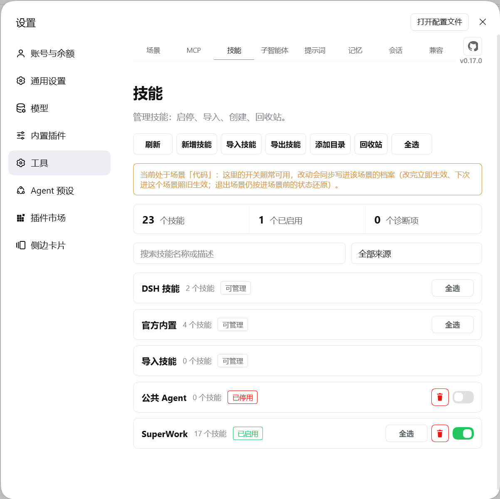
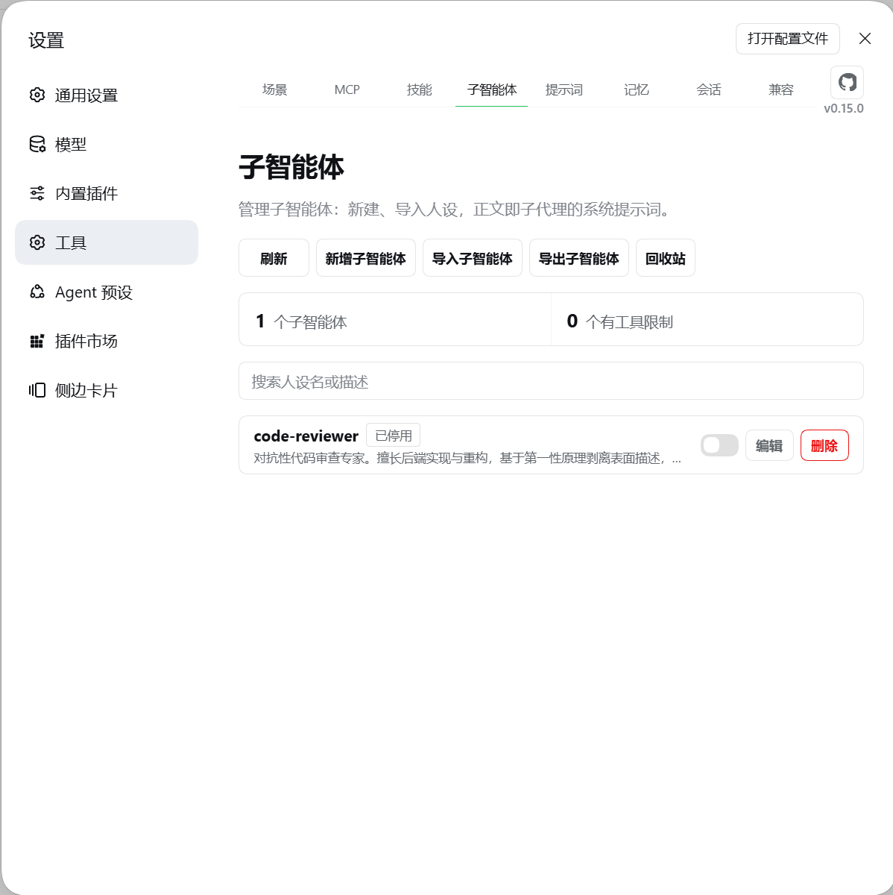
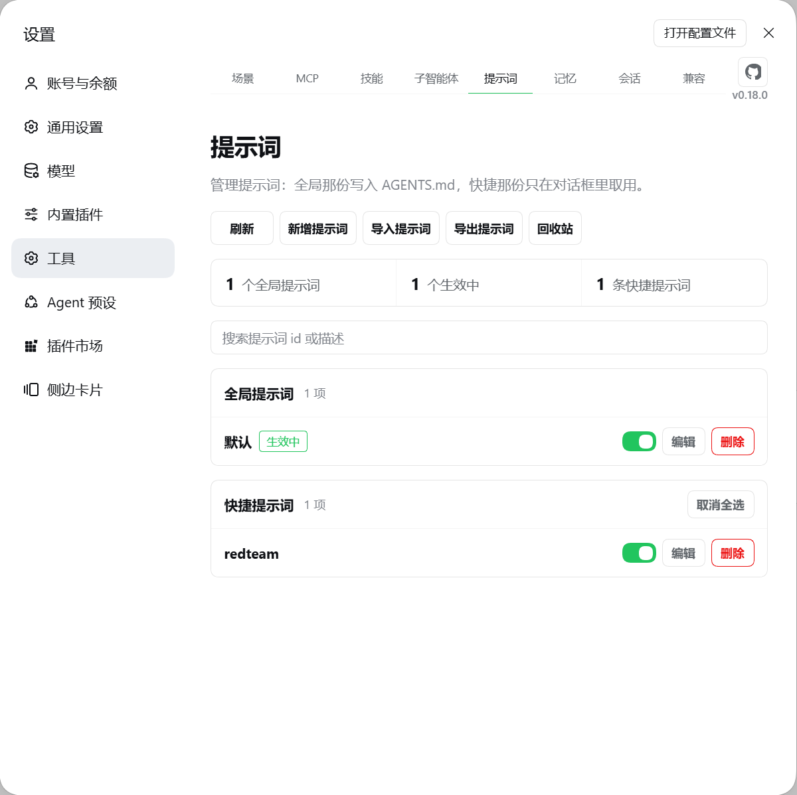
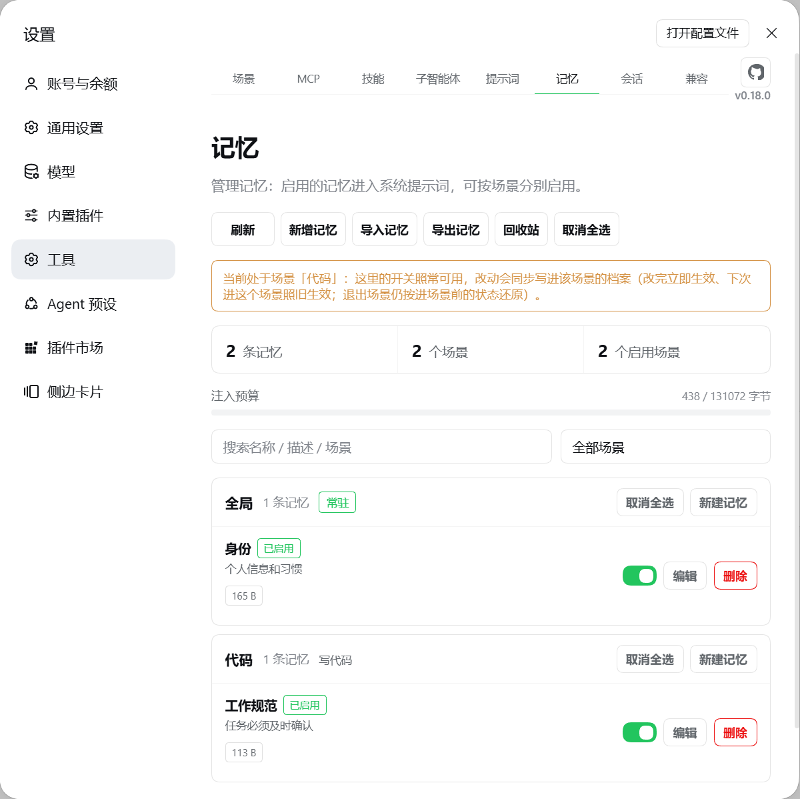
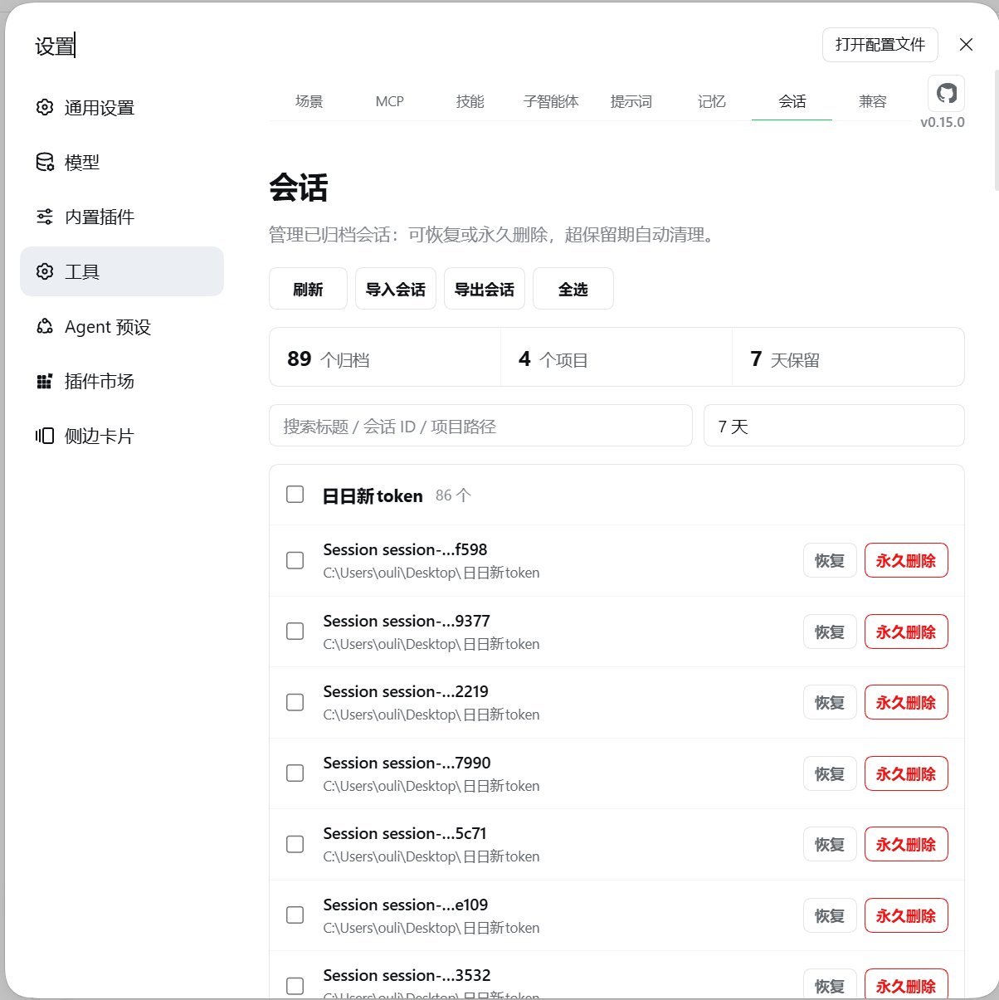
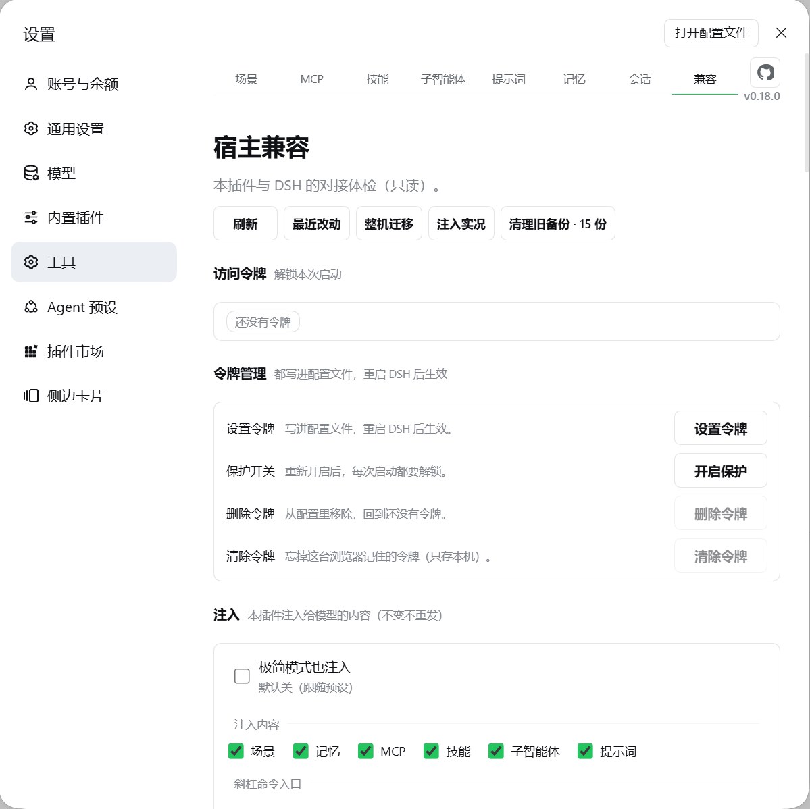

# dsh-plugin-tool-management

[](https://www.npmjs.com/package/dsh-plugin-tool-management)
[](LICENSE)
[](package.json)
[](https://github.com/ouli-1242/dsh-plugin-tool-management)

[](https://dsh.market/)
[](https://awesome-dsh-plugin.com)
[](https://dshfind.com/zh/plugins/ouli-1242/dsh-plugin-tool-management)
[](https://github.com/0xsline/awesome-deepseek-harness)

**简体中文** · [English](README_EN.md) · [Changelog](CHANGELOG.md) · [版本更新概要](docs/update.md)

DeepSeek Harness 的 **MCP、技能、场景、记忆、子智能体、提示词与归档会话**管理插件。八个页签：场景 / MCP / 技能 / 子智能体 / 提示词 / 记忆 / 会话 / 兼容。

```sh
dsh plugin --profile web add dsh-plugin-tool-management@latest
```

装完硬刷新浏览器（Cmd/Ctrl+Shift+R），设置 → **工具**。插件只写自己的文件，不改技能源文件；重启与升级后配置都在。

---

## 截图

|                              |                                |
|:----------------------------:|:------------------------------:|
|    |       |
| **场景**                     | **MCP**                        |
|    |  |
| **技能**                     | **子智能体**                   |
|  |      |
| **提示词**                   | **记忆**                       |
|    |      |
| **会话**                     | **兼容**                       |

## 核心亮点

一句话：**把「工作 / 写作 / 编程」各配成一套场景，点一下整套切换；插件管的东西，模型都看得见。**

| 亮点                        | 说明                                                                                      |
| --------------------------- | ----------------------------------------------------------------------------------------- |
| 一键换场景                  | 每个场景各配一套 MCP / 技能 / 人设 / 记忆（绑了的话还有快捷提示词），进入时整套切换、退出时还原；模型也能按你说的切 |
| 不离开对话就能管            | 在对话输入框打 `/` 出「工具」段：进场景、启停技能 / MCP / 子智能体 / 提示词 / 记忆，点一下就生效    |
| 记忆自动送到模型眼前        | 每个场景下写几段 `.md` 就是它的资料库，正文自动进上下文，不用每次复制粘贴                 |
| 给 MCP 服务器写备注         | 「A 不可用时改用 B 兜底」这类话写进备注，模型每轮都看得到，会照做                         |
| 单个工具也能关              | 一台服务器里可以只停某个工具，模型看不见也调不到；「重启」只重连，不改开关状态            |
| 技能状况一眼看穿            | 哪份在生效标「首选」，被同名覆盖的标出来源                                                |
| 子智能体 = 一个文件一个角色 | 写一份角色说明就能派活；跑完只回结果、不占你的会话记录                                    |
| 提示词备好几套              | `AGENTS.md` 可以存多份、一键切换；场景可以各自绑一份                                      |
| 会话不再丢                  | 归档按项目分组、能搜、能批量恢复；Claude Code / Cursor / Codex 的记录能导进来             |
| 模型一定看得见              | 六个域各注入一条上下文，内容没变不重发；压制型预设下默认不注入，可在「兼容」页开          |
| 锁住就不怕手滑              | 场景可以上锁：五个域的增删改整体只读，先解锁才能改                                        |
| 删了能找回                  | 技能 / 记忆 / 人设 / 提示词 / 场景的删除都进回收站（会话永久删除是例外）                  |
| 安全、不添乱                | 只写自己的文件；密钥默认打码、看明文要令牌                                                |

## 快速开始

前置：DSH 已安装（`dsh web` 可运行），Node.js ≥ 18。

```sh
dsh plugin --profile web add dsh-plugin-tool-management@latest   # 安装 / 更新
dsh plugin --profile web remove dsh-plugin-tool-management        # 卸载
```

装完硬刷新浏览器，设置 → **工具** 出现八栏即成功。界面改动即时生效，宿主侧改动需重启 `dsh web`。

也可以让模型代劳：

```text
安装 dsh-plugin-tool-management 插件：
dsh plugin --profile web add dsh-plugin-tool-management@latest
装完提醒我硬刷新浏览器。
```

## 功能

### 斜杠命令（在对话里直接管）

- **打 `/` 出「工具」段**：六行 —— 场景 / 技能 / MCP 服务器 / 子智能体 / 提示词 / 记忆。点一行原地进入这一域的条目（顶栏面包屑点「工具」回上一级），再点一条直接生效。**点完菜单不关**，接着点下一条也行 —— 连点多个开关是主要用法。
- **状态看得见**：启用项图标位是绿色对勾、停用项是空心框，右侧灰字是条目自己的备注（场景说明 / 技能描述 / MCP 备注 / 人设描述 / 预设描述 / 记忆描述，超 40 字截断；没写备注才退回「已启用 / 未启用」）；域行右侧给当前态摘要（`当前：工作`、`3 启用 / 1 停用`），不点进去也知道现在什么状况。点下去立刻翻转（本地乐观状态），写失败会翻回来并说明原因。
- **条目多也不挡路**：每个域全量列出，靠面板自己滚动；技能按来源目录分组、记忆按场景分组，组内已启用的排前面。每个外部技能目录另给一行「目录名 · 目录」，钉在本组最上面，点它就是启停整个来源（开着也列，所以也关得掉；关掉时它里面的技能整组收起，重新启用当场又摆回来）。场景域里两个恒开的保留项（「全局」与公共基线）不出现，但记忆域默认带上「全局」那几条，并把这一组钉在最前面 —— 它们不属于当前场景，却对任何对话都成立。
- **只放可逆动作**：进场景与各类启停。再点当前场景 = 退出场景（只注入全局与公共基线）；只有全局提示词那一档关不掉（基线没有"全部不应用"这一态），点当前那一份只回一句「当前就是它」。增删改、导入导出、改配置仍各归各页。
- **走宿主官方通道**：用 DSH 的输入触发器接口注册（官方技能菜单同一条路），不 patch 官方包；宿主没有该服务时这个入口不出现，「兼容」页会照实说明。两段各一颗开关（「工具」/「快捷提示词」），在「兼容 → 注入」块的「斜杠命令入口」一组里，行末那枚标签说的是本次启动真挂上没；两段各挂各的源，关掉一个不影响另一个；两段都关掉后 `/` 菜单回到出厂样子（修改后重启 DSH 即可生效）。
- **「工具 › 提示词」里两类提示词都在，每一行都是启停**：全局那组 = 哪一份写进 `AGENTS.md`（单选，各带分组标题），快捷那组 = 这条还开不开着（与提示词页那颗药丸开关同一个动作、同一份状态）。这一域里连已经关着的快捷词也列 —— 管理那一层不该因为被管起来就找不到。
- **另起一段「快捷提示词」管取用**：只列开着的那几条，点一行把存好的那段话原样替换进输入框，**不自动发送**（发送键留给你），所以那一行不带对勾 —— 它不是启停。

### 场景与记忆

- **场景 = 分组，记忆 = `.md` 文件**：`memories/<场景>/<名>.md`，整篇正文自动注入上下文，文件名支持中文。
- **「启用」与「进入」是两件事**：启用决定注入按哪个场景走（单选，全关 = 只注入「全局」与 `_shared`）；进入才按档案整套切换 MCP / 技能 / 人设（绑了的话还有快捷提示词），并把绑定的提示词写进 `AGENTS.md`。**两者必须恒等，而这条恒等由服务端兜住**：`rules-set-active` 先把运行时切到位再写启用集合（切不动就一个字都不写），所以面板开关、`/` 菜单、模型工具哪个入口都只发一次调用就两轴齐动。
- **场景档案**：每个场景搭配 MCP 工具集 / 技能集 / 子智能体 / 记忆（任意组合）。语义是**勾的启用、没勾的停用**，整段没建 = 该域全部停用；退出按进场景前的快照还原。场景内这三个域的开关照常可用，改动会同步写进档案。
- **场景锁定**：锁定后 MCP / 技能 / 子智能体 / 记忆 / 提示词五个域的增删改整体只读（界面与服务端双侧拦截）；场景自身的启停、MCP 重启、导出不受影响。
- **删除场景 = 连记忆一起删**：场景记录、档案与全部记忆进同一条回收站条目，恢复时按原路径整条放回；使用中的场景拒绝删除。改名会连带改目录与档案。
- **导入导出**：`.md` / `.zip`（目录名 = 场景，bundle 带附件），同名跳过绝不覆盖；导出勾选记忆打包成 zip，只读源文件。
- **注入预算**：默认 128 KiB，放不下的跳过并列出清单。
- **子代理会话不注入记忆**：记忆是父会话的现场；子代理需要的事实应由父代理写进任务。

### 子智能体

- **一个文件一个人设**：`subagents/<人设>.md`，frontmatter 全可选。`output:` 一行一条写"产出必须长什么样"（可检验的格式要求比一句抽象要求更容易被遵守）。
- **委派**：`subagent_manager_run` 带人设运行、只回最终结果、不进 History。默认新起独立会话（任务要写全）；`inherit: true` 则继承本次会话**已完成的轮次**（本轮内容继承不到，此时任务仍要写全）。
- **启停与目录**：停用的人设不注入、模型不可见（文件不动）；新建 / 导入 / 恢复默认停用。人设目录只列名字 + 描述；改名后场景绑定自动跟着改。
- **目录注入深度（`catalogDepth`）**：默认 `1` = 只在顶层会话注入目录，`99` = 任何深度都注入。它只管目录，不限制嵌套深度（那由宿主决定）。
- **工具限制按 Agent 预设**：每个预设一份白 / 黑名单（互斥）。两条要知道的行为：白名单会并回当前所有 `mcp__*` 工具，所以"只勾 read"拦不住暴露 shell 的 MCP 服务器；名单里的名字全都对不上时按"不限制"处理。
- **思考强度**：在高级选项里与「模型」并排，档位由所选模型声明。换模型后旧档位若不在新清单里会自动清掉并告知；指定了模型时留空 = 回落到该模型的默认档位，不是沿用主会话那一档。

### MCP 服务

- **增删改查、即改即生效**：写入 `cordis.patch.yml`，改前自动备份。级别分「全局 / 应用级」，新增默认全局。
- **工具级开关**：单个工具可独立停用（模型看不见也调不到），整台支持批量。
- **停着也能看清单**：没在跑的服务器仍显示上次见过的工具名与描述（标「上次运行时」）；从没跑过的可以一键启动读取。
- **备注**：每台服务器可写一句给模型的提示，随状态段一起注入。曾经连上过、现在连不上的服务器会列出来并标注 —— 这样模型会说"它没连上，检查一下"，而不是建议你去装一个。
- **密钥打码**：默认把凭据整值打码（`$VAR`、`!!js` 这类间接引用不动；URL 的查询串、`user:pass@` 与 `#片段` 一并打码），看明文要令牌。打码值**不会被写回配置** —— 保存时你原样留着的字段会还原成已存的值，地址里没有可还原的原值时整次保存会被拒绝（静默丢掉查询串会留下一个"连得上但认证失败"的地址）。打码只管界面展示，详见「配置与安全」。
- **迁移与备份**：跨项目级 / 全局迁移失败自动回滚；支持 JSON 导出导入。

### 技能

- **来源一览**：项目级 / DSH / Agents / Codex / Claude / 自定义目录，按来源分组。
- **两组权限相反**：默认来源的技能可删可停；外部目录可以停用或移除，但里面的技能文件只读。
- **移除 ≠ 停用**：移除 = 连目录都不扫（文件零改动，可恢复）；停用 = 仍列出但不可调用。
- **同名谁在生效**：真正生效的那份标「首选」，被覆盖的标出来源；启用被覆盖的副本会明说"这样不会生效"。
- **自定义目录 / ZIP 导入导出 / 回收站**。

### 提示词预设

- 多套 `~/.dsh/AGENTS.md` 基线一键应用（下一轮对话生效），保留 5 代备份。
- **记得「最近一次应用的是哪份」**：就算你手改过 `AGENTS.md`，也答得出来源（会注明"此后文件有变"）。
- 每条预设可写一句"这份是干什么的"，只存在插件侧、不进 `AGENTS.md`。
- **被引用的不能删**（场景绑定 / 当前内容 / 退出场景要恢复的那一份），删除进回收站。
- **生效与否就是卡片左边那颗开关**：点亮 = 把这一份写进 `AGENTS.md`；已经亮着的那颗再点一次 = 重新写回（把被手改的文件拉回来）。基线没有"全部不应用"这一态，所以这颗开关关不掉 —— 想换一份就点亮另一份（单选）。
- 场景接管期间点亮另一份 = 把该场景改绑到那一份（同步写进场景档案）；锁定时拒绝。
- **快捷提示词**（同页第二段）：存一段常用的话，之后在对话框打 `/` 点一下就原样贴进输入框，可直接编辑再发送。它**不注入上下文**，卡片上那颗开关只管一件事 —— 这条还在不在 `/` 的「快捷提示词」段里出现（关掉时正文与备注都留着；同一颗开关在「工具 › 提示词」那一域里也拨得动）。只由你自己点出来；与全局基线分开存，删除进回收站，也能导出与随迁移快照带走。
- **场景可以绑定一组快捷提示词**：「修改场景」里「提示词预设」下面那颗下拉，默认「当前启用的（保持现状）」= 不绑、进出不碰；改成「按场景勾选」后，进入本场景只启用你勾的那几条、其余停用，**退出场景按进场景前的开关还原**。一条都不勾是"进入后全部停用"，和"不绑"是两件事。
- **两组各自是一张可折叠卡片**（点卡片头收起 / 展开，打了字自动展开）。快捷那组的卡片头有一颗「全选 / 取消全选」，只作用于当前可见的那几条；全局那组没有 —— 那一档是单选，"全部应用"没有意义。

### 历史会话

- 按项目分组、搜索、批量恢复 / 永久删除、保留期自动清理；工作区登记被删后可一键重新登记。
- 导入 Claude Code / Cursor / Codex / 任意文本，工作区可以从已登记的里挑、浏览文件夹或直接给路径；导出 Markdown / JSONL，分三档**累进**：仅正文 → 正文 + 工具 → 正文 + 工具 + 思考。**导出仍是可读转录，不是完整备份**：附加段每块有上限并明说截断，token 统计不在里面。要留全量请用「归档」。

### 宿主兼容

- **「兼容」页**：宿主版本、能力可用数、每个动作走原生 / 适配 / 不可用、降级项与原因。这一页有三个写入口：**访问令牌**（重启生效）、**注入设置**、**模型工具表**。
- **命令行**：`node scripts/doctor.mjs`（体检）、`node scripts/host-deps.mjs --fix`（依赖对齐）。
- **压制型预设**（`minimal` 这类）下本插件的注入默认停用（跟随预设的设计意图），可在「兼容」页按域强制打开。
- **关掉「技能」「提示词」的勾选 = 连宿主那份一起停**（这两域在标准预设下由官方送，插件让位）；其余三域宿主本来就不送，勾选完全生效。
- **注入长什么样**：每个域一条 `<system-reminder>`，`# 板块标题` + 正文 + 一句"以本份为准"，只写"现在是什么"、不写指令。你写的内容里出现 `</system-reminder>` 会被转义。

---

## 数据落点

| 内容                                        | 位置                                                                      |
| ------------------------------------------- | ------------------------------------------------------------------------- |
| MCP 定义                                    | `~/.dsh/cordis.patch.yml`（插件只写它；改前自动备份到 hub 的 `backups/`） |
| 技能策略 / 自定义目录                       | `~/.dsh/tool-management/skills-state.json`                                |
| 技能 / 记忆 / 人设 / 预设                   | `~/.dsh/tool-management/{skills,memories,subagents,prompts}/`             |
| 子智能体启停                                | `~/.dsh/tool-management/subagents-index.json`                             |
| 回收站（技能 / 人设 / 预设 / 场景）         | `~/.dsh/tool-management/trash/{skills,subagents,prompts,scenes}-trash/`   |
| 记忆回收站                                  | `~/.dsh/tool-management/memories-trash/`（在 hub 根下，不在 `trash/` 里） |
| 归档账本 / 保留期                           | `~/.dsh/tool-management/history-*.json`                                   |
| 记忆索引 / 场景 / 档案                      | `~/.dsh/tool-management/memories-index.json`                              |
| MCP 侧车（停用表 / 已知工具 / 备注 / 设置） | `~/.dsh/tool-management/mcp-*.json`                                       |
| 注入设置（六个域开关）                      | `~/.dsh/tool-management/inject-settings.json`                             |
| 模型工具表（关掉的工具 + 存下的方案）       | `~/.dsh/tool-management/tool-table.json`                                  |
| 场景页界面设置（进场景前弹不弹预览卡）      | `~/.dsh/tool-management/scene-settings.json`                              |
| 运行日志 / patch 备份                       | `~/.dsh/tool-management/tool-management.log` · `backups/`                 |

**插件安装目录里不存用户数据**（`dsh plugin update` 会整体替换该目录）。备份按**每份 patch 文件各留 5 份**（全局与每个 profile 各自计），一次批量操作就可能把某层的 5 个槽位吃掉。

## 配置与安全

| 字段            | 说明                                                                                                                                           |
| --------------- | ---------------------------------------------------------------------------------------------------------------------------------------------- |
| `token`         | 访问令牌。设了之后**所有写操作 + 明文密钥**都要求 `x-dsh-token`；不设时明文接口一律关闭。也可改用环境变量 `DSH_PLUGIN_TOOL_MANAGEMENT_TOKEN`。 |
| `tokenDisabled` | `true` = 令牌保留在配置里但当前不生效（兼容页「关闭保护」写的就是这一行）。写操作不再要求令牌，明文查看仍然要。                                |
| `maxBodyBytes`  | 请求体上限，默认 88 MiB。                                                                                                                      |

**磁盘上的明文（必读）**：打码**只发生在界面展示**。MCP 的 `env` / `headers` 与插件自己的 `token` 在 `cordis.patch.yml`（及各 profile 副本）里始终是明文，而每次改配置前插件会把整份文件备份进 `~/.dsh/tool-management/backups/`（不加密、不轮转、卸载也不回收）—— 一份密钥最多有 `5 ×（含它的 patch 文件数）+ 1` 份明文副本。令牌门禁管的是"谁能通过 HTTP 拿到明文"，**管不到磁盘读取**：真正的防线是操作系统的文件权限。清理入口：**设置 → 工具 → 兼容 → 「清理旧备份」**（可按层级各删最旧的 N 份，弹窗内二次确认），也可以手工删那个目录下的旧文件。

- **浏览器**：读写走 cookie，不需要令牌；**明文密钥**（显示密钥 / 导出）要令牌。令牌在「兼容」页的「访问令牌」块管理：本次启动填一次管到 DSH 退出；写进配置文件要重启生效。
- **销毁方向一律要当场再输一次当前令牌**（关闭保护 / 修改 / 删除）—— 本次启动解锁过不算，否则"能打开界面就能关掉保护"。
- **curl / 脚本**：带 `x-dsh-token`，或带浏览器 cookie。
- **HTTP 状态码**：除安全栅栏的 401 / 403 外，一律 HTTP 200 + `{ ok: false, error }` —— 脚本分流请以 `body.ok` 为准。
- **端口转发**：宿主缺 `connection` 服务时栅栏退到「Host 回环 + 同源」判定，本机进程伪造 `Host: localhost` 即可调用写 op。转发到局域网 / 公网的场景**务必配令牌** —— 陌生人注入 MCP 命令等同远程执行。「选择文件夹」弹窗用的 `dir-list` 能列出任意绝对路径（只读），同一条前提。
- **服务器名里的 `__`（起名建议）**：工具全名是 `mcp__<服务器名>__<工具名>`，所以服务器名里再出现 `__` 会让它**切不唯一** —— `mcp__a__b__c` 既可能是服务器 `a` 的工具 `b__c`，也可能是服务器 `a__b` 的工具 `c`；两个服务器名互为 `__` 前缀（`a` 与 `a__b`）同理。本轮**不收紧校验**（今天放行 `__` 的 5 处校验一旦收紧，存量服务器会从"能管"变成"管不了"，而服务器本身照跑），改为在**兼容页**出一条提示。工具照常可用，只是界面上的勾选可能落不到停用表里那条键上 —— **起名时避开 `__` 就没有这个问题**。

## 常见问题

| 现象                                        | 解决                                                                                                                                                  |
| ------------------------------------------- | ----------------------------------------------------------------------------------------------------------------------------------------------------- |
| 装完没有页面                                | 硬刷新；不行重启 DSH。                                                                                                                                |
| 重复 MCP 页签                               | 删 `cordis.patch.yml` 里的旧 loader 行后重启。                                                                                                        |
| 改坏配置 DSH 起不来                         | 从 `~/.dsh/tool-management/backups/` 取最近的 `cordis.patch.yml.<层级>.bak-<时间戳>` 覆盖回去（每份 patch 各留 5 份）。                               |
| 升级 DSH 后动作不可用                       | 设置 → 工具 → **兼容** 看原因；`doctor.mjs` → `host-deps.mjs --fix`。                                                                                 |
| 模型调不到某条工具                          | 「兼容」页的**模型工具表**看它是不是被关了（出厂默认关着 15 条）；面板和脚本不受影响。                                                                |
| `approval=never` 还要确认吗                 | 不弹卡，直接放行并记日志；想问回来切回「工作区内修改」。                                                                                              |
| `subagent_manager_run` 报 provider 不可用   | 对应 provider 没注册：`spawn`（默认）/ `fork`（`inherit`）分别挂 `@deepseek-ai/dsh-subagent-spawn-in-process` / `-fork-in-process` 后重启。           |
| 场景绑了 A 人设，官方 `subagent` 还在跑别的 | 官方那两个是宿主的工具，本插件管不到它们的可见性；插件会把分界写进上下文 —— 贴合人设的走 `subagent_manager_run`，官方只在没有人设贴合或要后台跑时用。 |

---

## 开发

```bash
npm install
npm run build        # tsc + 同步客户端
npm test             # 构建 + i18n + 契约测试（纯函数不变量与宿主契约）
npm run check:i18n   # 词典自检
npm run doctor       # 宿主兼容体检
```

`lib/` 不入版本库，克隆后先 `npm run build`。改完重启 `dsh web` 才生效。运行时依赖：`fflate`（导出打包）、`js-yaml`（写宿主补丁前的解析校验，惰性加载）；`@deepseek-ai/*` 一律用宿主那份。

> **部署注意**：`npm run build` 的 profile 镜像清单**不含 `node_modules`**，本地联调时新增的运行时依赖（如 `js-yaml`）要么在 profile 侧装一份，要么接受"补丁校验跳过并上报"的降级。`npm install` 装到 profile 的正式安装不受影响。

## 许可证

MIT
