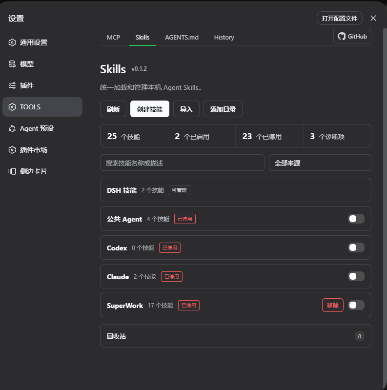
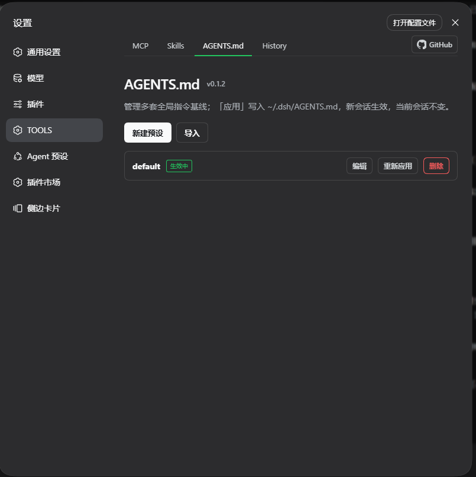
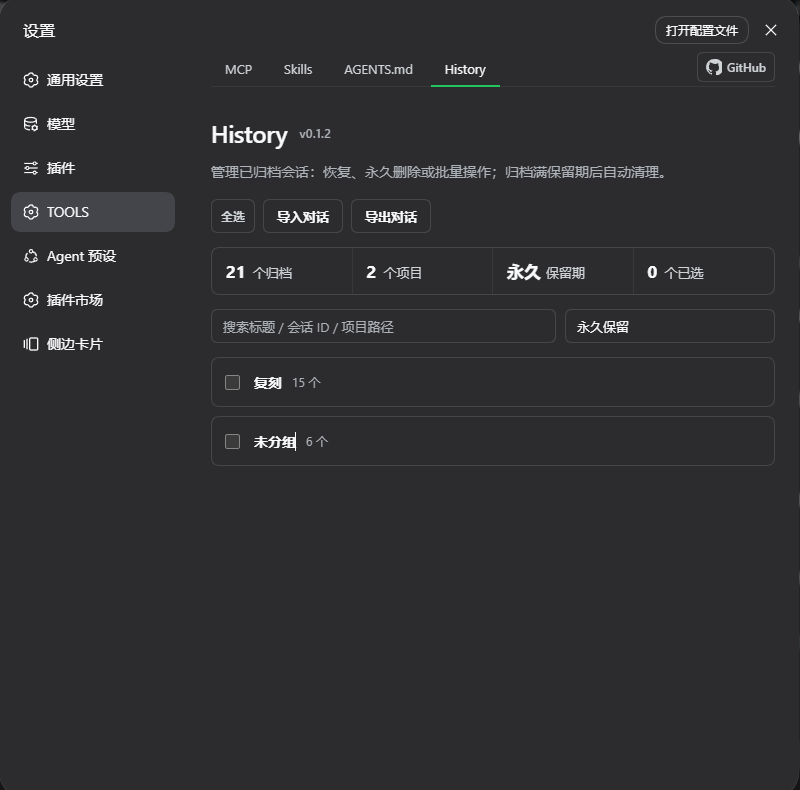
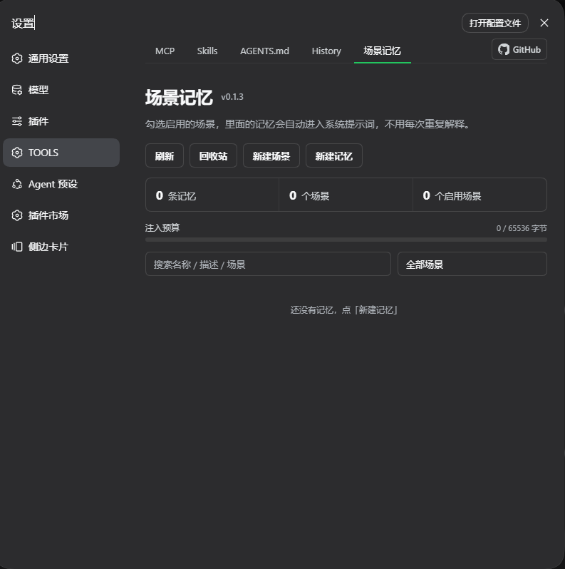

# dsh-plugin-tool-management

[](https://www.npmjs.com/package/dsh-plugin-tool-management)
[](LICENSE)
[](package.json)
[](https://github.com/ouli-1242/dsh-plugin-tool-management)

[简体中文](README.md) · **English**

**An MCP server, skills & memory manager for DeepSeek Harness.** One settings panel keeps five things under control:

- **MCP**: which servers are configured, what tools each one exposes, and which tools the model may call — add, edit, remove, toggle, restart; every change takes effect immediately;
- **Skills**: every skill on the machine (DSH / Agents / Codex / Claude / project-level / any directory you add) at a glance — toggle individually or per source, create, import, recycle;
- **AGENTS.md**: keep multiple global instruction baselines as presets, apply one with a click to write `~/.dsh/AGENTS.md` — new sessions pick it up, current sessions stay unchanged;
- **History**: archived sessions in one place — grouped by project, batch restore / delete, import & export transcripts, retention-based auto-cleanup;
- **Scene Memory**: under `~/.dsh/scene-memory/<scene>/`, one folder = one scene and one `.md` = one memory — **create a scene**, drop `.md` files in (Chinese file names are fine), toggle the scene; the full body of every memory in an enabled scene is **injected into the system prompt automatically**, so you never repeat yourself.

No hand-editing of `cordis.patch.yml`, and skill source files are never touched. Configuration survives restarts and upgrades.

---

<!-- Image slot 1: MCP management page screenshot → docs/images/mcp.png -->


<!-- Image slot 2: Skills management page screenshot → docs/images/skills.png -->



<!-- Image slot 3: AGENTS.md presets page screenshot → docs/images/agents-md.png -->



<!-- Image slot 4: History archived sessions page screenshot → docs/images/history.png -->



<!-- Image slot 5: Scene memory page screenshot → docs/images/场景记忆.png -->



## Highlights

| Capability | Description |
|---|---|
| Per-tool switches | **Toggle individual tools** inside one MCP server: hidden from the model and blocked at call time, restorable at any moment; whole-server batch enable/disable also supported |
| Restart semantics | Restart only reconnects — it **never flips the enabled state** (restarting a disabled server does not silently enable it) |
| Secret safety | Secret-looking values in `env` / `headers` are **masked by default**, URL query strings are always redacted; revealing plaintext is token-gated just like writes |
| Write protection | Every patch rewrite keeps a timestamped `.bak` backup (last 5); duplicate loader ids are rejected before write; failed cross-level migration rolls back |
| Backup / restore | JSON import supports `conflict: 'overwrite'` to replace entries with the same id, not just skip them |
| Skill sources | Hooks up `~/.agents` / `~/.codex` / `~/.claude` (three directories official DSH does not load) plus **any custom skill directory** you add (read-only, overlapping paths rejected) |
| Skill operations | Create skills, import ZIP / folders, plugin recycle bin (restore / permanent delete with OS-trash fallback), open the source file in the system editor |
| Live refresh | Skill directories are watched from a background thread — edits made in an editor show up automatically |
| AGENTS.md presets | Multiple global instruction baselines as presets — create / import / edit / apply / delete; "Apply" writes `~/.dsh/AGENTS.md` (new sessions pick it up, current sessions stay unchanged) |
| Archived session management | History page groups archived sessions by project: search, select-all, batch restore / permanent delete, retention-based auto-cleanup (changing the retention resets the countdown from the change time) |
| Transcript import / export | Seamlessly take over conversations from Claude Code / Cursor (JSONL), Codex (Markdown), or any text; export picks the session scope, defaults to the desktop, in Markdown / JSONL |
| Slash commands | `/mcp`, `/skills`, `/agents-md`, `/scene-memory` right from the chat box |
| Scene memory auto-injected | A memory is `~/.dsh/scene-memory/<scene>/<name>.md`; every `.md` inside an enabled scene is **injected into the system prompt automatically** (per-agent `systemPrompt` section) with no tool call, and toggling takes effect on the next request |
| Scene enable switch | A scene is a top-level `scene-memory/` folder (Unicode names fine); the multi-select switch persists globally in `rules-index.json`'s `active`; **all scenes enabled by default**, `_shared/` always on |
| Prefix-cache friendly | Section text depends only on enabled scenes + file contents, so it is byte-stable; switching scenes or editing a memory changes it exactly once, every other request keeps hitting the cache (this does not violate the "no injection layer" rule — that one only bans per-turn dynamic content) |
| Rule checkup | One click scans for shadowed rules, over-long descriptions, filename ≠ name, bad frontmatter, empty bodies, and memories whose scene is disabled |
| Model tools | **10**: `skill_mcp_manager_*` for MCP, `skill_manager_*` for skills, `rule_manager_*` for memories (creation asks for confirmation unless disabled in settings) |
| Model tools | **10 tools**: `skill_mcp_manager_*` for MCP servers, `skill_manager_*` for skills, `rule_manager_*` for rules (writes ask for user confirmation; can be disabled in settings) |
| UI | Its own `dsm-*` design system, consistent across all six pages |

## Getting started

Prerequisites: DSH installed (`dsh web` runs), Node.js ≥ 18.

```sh
# Install (package + auto-mount)
dsh plugin --profile web add dsh-plugin-tool-management@latest

# Update: run the same command again
# Uninstall:
dsh plugin --profile web remove dsh-plugin-tool-management
```

Hard-refresh the browser (Cmd/Ctrl+Shift-R) after installing — the **MCP**, **Skills**, **AGENTS.md**, **History** and **Scene Memory** pages appear in Settings (client changes are hot-loaded by DSH, no restart needed).

You can also tell any DSH session:

```text
Install the dsh-plugin-tool-management plugin:
dsh plugin --profile web add dsh-plugin-tool-management@latest
Then remind me to hard-refresh the browser.
```

## Feature guide

### Managing MCP servers

- **Add a server**: fill in `serverName` (unique, 1–32 chars `[A-Za-z0-9_-]`), the transport and its fields (`streamable-http` → URL / headers; `stdio` → command / args / env), and choose project or global level. The write lands as a loader row in `cordis.patch.yml` and applies via HMR.
- **See the state**: every card shows live status, loader phase and registered tool count; a summary bar sits on top, and fatal issues such as duplicate loader ids are flagged right on the page.
- **Turn off just one tool**: the "Details" dialog lists every tool with its parameter summary — disable the ones the model keeps misusing; the schema disappears from the model's view and calls are denied, ready to re-enable anytime.
- **Inspect secrets safely**: secret-looking values render as `••••••` by default; click "Reveal" only when you need them.
- **Move and back up**: editing can rename a server or migrate it between project/global level (with automatic rollback on failure); JSON export/import covers full backups.

### Managing skills

- **See everything**: skills are grouped by source — project, runtime, built-in, plugin-shipped, the four user directories (`~/.dsh` / `~/.agents` / `~/.codex` / `~/.claude`; the last three are hooked up by this plugin) and any custom directories you added.
- **Toggle**: individual skills, whole sources or whole projects — implemented as an override-provider shadow policy, so not a single byte of the source file changes; moving machines is just copying the state file.
- **Custom directories**: click "Add directory", enter an absolute path, and that directory becomes a read-only skill source — ideal for skill collections living in repos or synced folders; overlapping paths are rejected to keep the shadow policy sound.
- **Create / import / recycle**: create from a form; drag in a ZIP, a `.md` file or a skill folder; deleted skills go to the plugin recycle bin first, and permanent delete still tries the OS trash as a last safety net.

### Managing AGENTS.md presets

- **Preset library**: create, import and edit multiple global instruction baselines (e.g. different teams' coding standards or role behaviors).
- **Apply = write**: "Apply" writes the selected preset to `~/.dsh/AGENTS.md` — **new sessions pick it up, current sessions stay unchanged**; "Re-apply" syncs the latest content after editing; switch to another preset before deleting.

### Managing archived sessions

- **Grouped by project**: archived sessions are grouped by workspace automatically; search by title / session ID / project path; sessions whose workspace folder no longer exists are flagged with ⚠.
- **Batch operations**: "Select all" then batch-restore or permanently delete; restored sessions return to the workspace list, and deletion cascades to their subagent sessions.
- **Retention**: pick the cleanup period from the dropdown (0 = keep forever); the expiry baseline is the later of the archive time and the last retention change, so changing the retention resets the countdown.
- **Import conversations**: take over sessions from other tools — Claude Code / Cursor JSONL, Codex Markdown, and arbitrary text — and keep chatting right after import.
- **Export conversations**: pick a session scope (all / archived only / by workspace); each session becomes a Markdown or JSONL file; the export directory defaults to the desktop, and the adjacent "Select" button opens a directory tree to browse and fill in the absolute path.

### Managing scene memory (the Scene Memory page)

> This page merges the former "Rules" and "Scenes" pages: **a scene (top-level folder) is the grouping dimension, a memory (`.md`) is the content.**
> The folder was also renamed from `~/.dsh/rules/` to **`~/.dsh/scene-memory/`** — move your existing files over after upgrading (see "Upgrade note" below).

- **A scene is a top-level folder under `scene-memory/`; the folder name *is* the scene name**: `~/.dsh/scene-memory/办公/流程.md` is one memory in the "办公" scene. Folder names accept any Unicode (≤64 chars, no `/ \ < > : " | ? *`, must not start with a dot); `_shared/` is the reserved shared scene.
- **New scene**: "New scene" creates the folder for you (or just `mkdir` under `scene-memory/` — same result). Empty scenes are listed and get a "Delete scene" button; a scene that still holds memories cannot be deleted, so nothing is lost in one click.
- **Every `.md` is one memory**: a sentence or a paragraph, no frontmatter needed, and the whole body is injected. Drop a file into the scene folder and it takes effect, or use "New memory" on the card to write it on the page — **file names can be Chinese** (e.g. `站会流程.md`).
- **Toggle a scene**: the switch on the right of each scene card enables/disables it (same component and layout as the Skills page). Every `.md` inside an enabled scene is **injected into the system prompt automatically**; the model needs no tool call and you never have to explain again. Toggling takes effect on the **very next request**, with no new session and no plugin reload.
- **All scenes are enabled by default**: with no configuration at all, every scene is live ("drop it in and it works"); narrow the set in the UI once you have many scenes. `_shared/` is always on (its card has no checkbox).
- **One memory = one Markdown file**: `<scene>/<name>.md` (flat) or `<scene>/<name>/SKILL.md` (bundle, with attachments). When creating, fill in the scene (pick an existing one or **type a new scene name** — its folder is created for you), the name (= file name), description and body — frontmatter is entirely optional and derived automatically when missing.
- **Bundle attachments**: with the bundle form you can **add attachments** right in the dialog (multi-select, ≤8 MB each, ≤16 MB / 32 files per upload); they live in the memory folder and are **never injected into the prompt** (only the `SKILL.md` body is), and you can remove them one by one while editing. The flat form is a single file, so it has nowhere to put attachments.
- **Toggle & recycle**: enable/disable each memory (the switch on the right of every row — a disabled memory stays on disk and is simply left out of the prompt), edit, and move to trash; the "Trash" button in the page header can **restore** or **permanently delete** removed memories, with a confirmation step before the permanent delete. `enabled` and friends live in the sidecar index and are never written back to your files.
- **Injection budget is visible**: a budget bar (used / max bytes) sits under the summary and turns red with an "Over budget" label. Default cap 64 KiB; when one memory does not fit it is **skipped** while smaller ones behind it are still included, and the section tail carries a "not injected (over budget)" list — both the model and you can see what was left out instead of losing it silently.
- **`~/.dsh/AGENTS.md` is no longer written**: the old "always layer" is gone; the shared baseline now lives in `_shared/` and flows through the system-prompt section.

#### Caching and refresh (§5.2)

| Situation | Is the prefix stable? | Result |
|---|---|---|
| Scene set unchanged, memory files unchanged | byte-for-byte stable | ✅ prompt prefix cache hits |
| Enabling/disabling a scene (explicit action) | changes once | ⚠️ that session re-warms once — acceptable |
| Editing a memory (page or editor) | changes once | ⚠️ same, and it takes effect on the **next request** |
| Timestamps / counts / relative time in the section | changes every request | ❌ forbidden (and absent from the implementation) |

The implementation uses a **two-phase scan with a fingerprint cache**: each assembly only walks
directories with `stat` to build a fingerprint (no body reads) and reuses the previous rendering
when it is unchanged; only a changed fingerprint (scene toggle, file edit, enable/disable) triggers
reading bodies and re-rendering. **`fs.watch` is deliberately not used** — recursive watching is
unreliable on Windows, and a silently dead watcher would return stale content forever; the
fingerprint probe costs sub-milliseconds and buys "always fresh, never silently stale".

#### Upgrade note: the folder was renamed

Since v0.3 the default folder is `~/.dsh/scene-memory/`; the plugin **neither reads nor migrates** the
old `~/.dsh/rules/` automatically. Just move your content over (instant on the same volume):

```sh
# Windows PowerShell
Move-Item ~/.dsh/rules ~/.dsh/scene-memory
# macOS / Linux
mv ~/.dsh/rules ~/.dsh/scene-memory
```

If the new folder already exists, move the **scene subfolders** one by one instead; `_shared/` is an
ordinary scene folder and moves along with the rest.

### Let the model and scripts help

| Entry point | What it does |
|---|---|
| `/mcp`, `/skills`, `/agents-md`, `/scene-memory` | Check the current state from the chat box |
| `skill_mcp_manager_list / set_enabled / restart / add` | Let the model query and operate MCP servers |
| `skill_manager_list / set_enabled / create` | Let the model query and operate skills (creating asks for your consent) |
| `rule_manager_list / read / write` | Let the model query and write rules (writes ask for your consent; can be disabled in settings) |
| `POST /dsh-plugin-tool-management/api` | HTTP API for scripts (`{op, args}` protocol) |

## Configuration & security

Optional fields on the plugin loader row (`dsh plugin add` inserts it automatically):

| Field | Description |
|---|---|
| `token` | Optional access token. When set, **every write operation and "Reveal"** requires the `x-dsh-token` header. The client reads it from localStorage (key `dsh-plugin-tool-management-token`; set it in the DevTools console and refresh), or via the `DSH_PLUGIN_TOOL_MANAGEMENT_TOKEN` environment variable. |
| `maxBodyBytes` | Request body cap, default 88 MiB (skill ZIP uploads need it). |

Why a token: the cross-site protection (POST-only + custom header + same-origin check) assumes DSH listens on localhost only. If you forward the port to a LAN or the public internet, the token is the last line of defense against strangers injecting MCP commands (equivalent to remote code execution) and reading plaintext secrets — not needed for local single-user setups.

## Where data lives

| Content | Location |
|---|---|
| MCP server definitions | `profiles/<profile>/cordis.patch.yml` (project) or `~/.dsh/cordis.patch.yml` (global), auto-`.bak` before every rewrite |
| Server notes / page settings / disabled tools / export | Sidecar JSON files under the DSH home (`dsh-plugin-tool-management-*.json`) |
| Skill toggle policy / custom directories | `~/.dsh/tool-management/state.json` |
| Skill recycle bin / import staging | `~/.dsh/tool-management/trash`, `uploads` |
| AGENTS.md presets / applied file | Plugin dir `data/agents-md-presets/`; "Apply" writes `~/.dsh/AGENTS.md` |
| Archived session ledger / retention | Plugin dir `data/history-archived-at.json`, `data/history-retention.json` |
| Rule files (source of truth) | `~/.dsh/scene-memory/<scene>/<name>.md` (flat) or `<scene>/<name>/SKILL.md` (bundle); scene folder names may be non-ASCII |
| Rule index / enabled scenes | `~/.dsh/tool-management/rules-index.json` (`enabled` / order / tags + `active` enabled-scene set; `active: null` = all scenes enabled) |
| Rule recycle bin | `~/.dsh/tool-management/rules-trash/<trashId>/` (deleted memories land here and can be restored) |
| Runtime log | `~/.dsh/dsh-plugin-tool-management.log` (rolling) |

## FAQ

| Symptom | Fix |
|---|---|
| Pages missing in Settings after install | Hard refresh; if that fails, restart DSH once. |
| Duplicate MCP tabs / duplicated tools | Stale loader row double-mounting the plugin — remove the old entry from `cordis.patch.yml` and restart. |
| Broken config, DSH won't boot | Restore the newest `cordis.patch.yml.bak-<timestamp>` next to it. |
| Page data not refreshing | Wait for the automatic polling (default 5s) or click "Refresh". |
| Latest version not found on a mirror | Add `--registry=https://registry.npmjs.org` and retry later. |

## Development

```bash
npm install
npm run build        # build (tsc + sync client bundle)
npm run build:client # sync src/client.js → lib/client.js only
npm run lint         # syntax self-check (node --check on both artifacts)
```

> This project keeps no test suite. Changes are verified by **actually exercising the real
> behaviour** (see the acceptance items in the change requests under `docs/`) instead of asserting
> what the code currently does — the latter just copies the implementation and passes by construction.

Layout: host half `src/index.ts` (object-form Cordis plugin, `lib/index.js` is the shipped artifact); skill core `src/skills/core.js` (pure Node); AGENTS.md presets `src/agents-md/service.ts`; archived session management `lib/history/` (`workspace.js` / `projcache.js` / `tombstone.js`); transcript import parsing `src/imports/parsers.js`; scene-memory store `src/rules/` (`service.ts` discovery/CRUD/index/checkup/two-phase section render, `provider.ts` per-agent `systemPrompt` section registration; the module path and `rules-*` op names stay as internal protocol, while the user-visible page and folder became “Scene Memory” / `scene-memory/`); browser half `src/client.js` (ModuleLoader CJS bundle, `dsm-*` design system, talks to the host through the same-origin API). The only runtime dependency is `fflate` (ZIP extraction).

Publish: `npm version patch && npm publish` (`prepublishOnly` builds automatically).

## License

MIT
