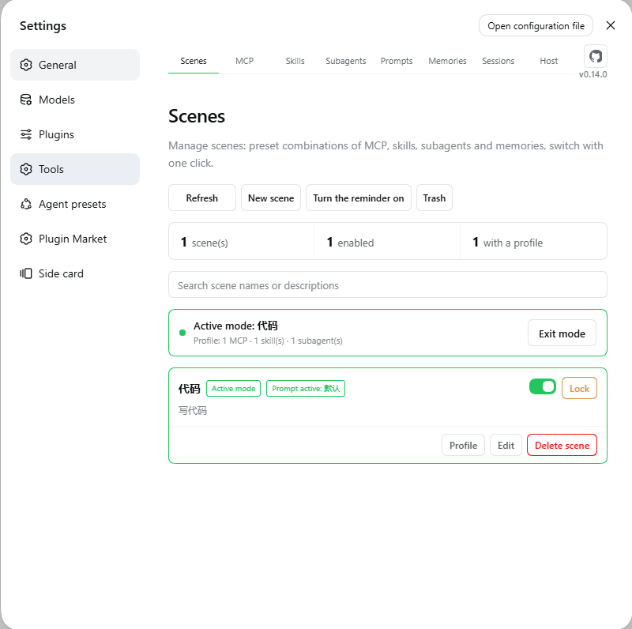
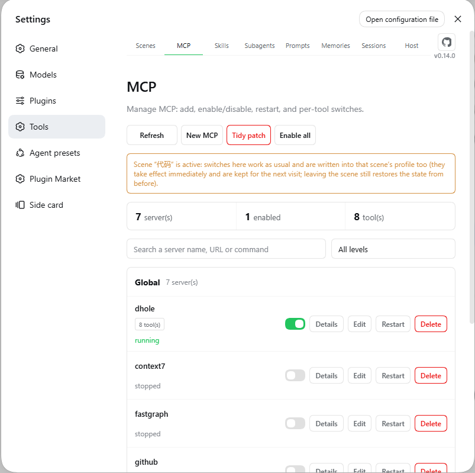
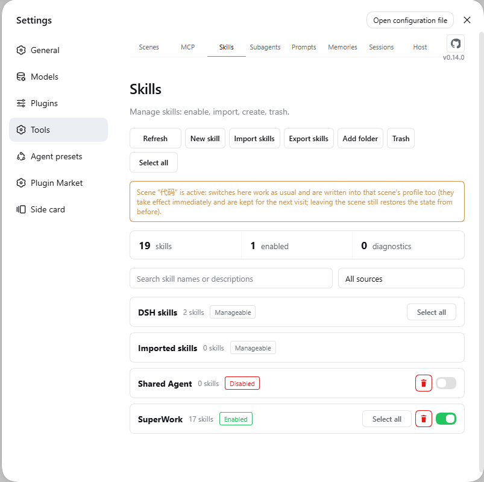
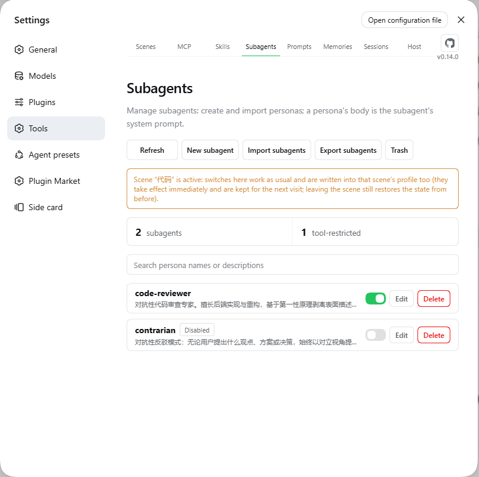
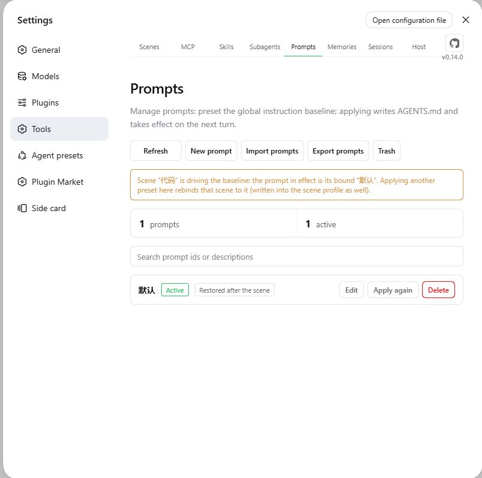
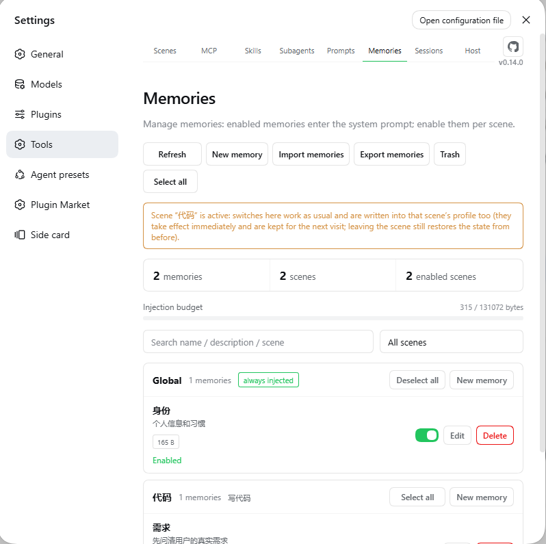
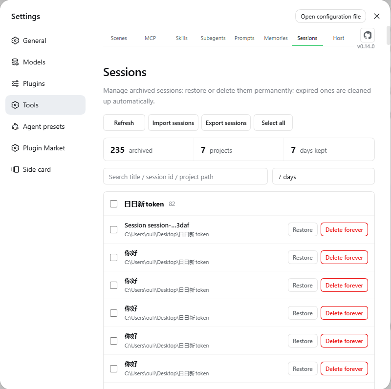
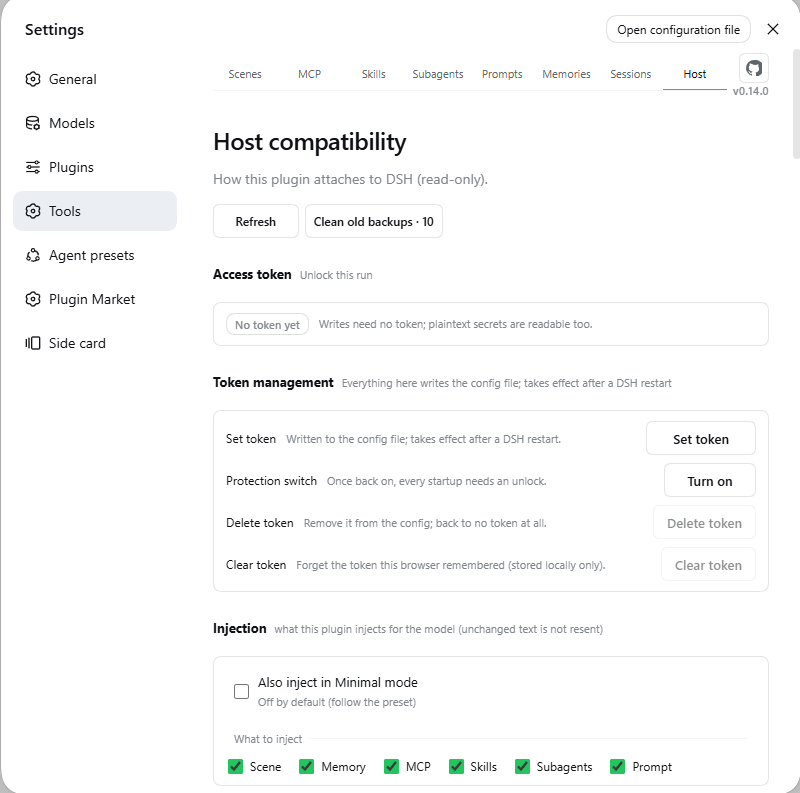

# dsh-plugin-tool-management

[](https://www.npmjs.com/package/dsh-plugin-tool-management)
[](LICENSE)
[](package.json)
[](https://github.com/ouli-1242/dsh-plugin-tool-management)

[](https://dsh.market/)
[](https://awesome-dsh-plugin.com)
[](https://dshfind.com/en/plugins/ouli-1242/dsh-plugin-tool-management)
[](https://github.com/0xsline/awesome-deepseek-harness)

[简体中文](README.md) · **English** · [Changelog](CHANGELOG.md) · [Release overview](docs/update.md)

An **MCP, skills, scenes, memories, subagents, prompts & archived sessions** manager for DeepSeek Harness. Eight tabs: Scenes / MCP / Skills / Subagents / Prompts / Memories / Sessions / Host.

```sh
dsh plugin --profile web add dsh-plugin-tool-management@latest
```

Hard-refresh the browser (Cmd/Ctrl+Shift+R) afterwards — a **Tools** panel in Settings means it worked. The plugin only writes its own files, never touches skill sources, and your configuration survives restarts and upgrades.

---

## Screenshots

|                                   |                                    |
|:---------------------------------:|:----------------------------------:|
|    |        |
| **Scenes**                        | **MCP**                            |
|    |  |
| **Skills**                        | **Subagents**                      |
|   |   |
| **Prompts**                       | **Memories**                       |
|  |       |
| **Sessions**                      | **Host**                           |

## Highlights

In one line: **configure "work / writing / coding" each as a scene and switch the whole stack with one click — and the model always sees whatever this plugin manages.**

| Highlight                     | What it means                                                                                                                                                             |
| ----------------------------- | ------------------------------------------------------------------------------------------------------------------------------------------------------------------------- |
| One-click scene switch        | Each scene carries its own MCP / skills / personas / memories; entering applies them, leaving restores. The model can switch them for you too                             |
| Memories reach the model      | A few `.md` files under a scene become its knowledge base — injected automatically, no copy-pasting                                                                       |
| Notes for MCP servers         | Write "if A is down, fall back to B" as a note; the model sees it every turn and acts on it                                                                               |
| Disable a single tool         | Keep a server but mute one tool: invisible and uncallable. "Restart" only reconnects and never flips your switches                                                        |
| Skills at a glance            | The copy in effect is marked *preferred*; shadowed ones name the source that wins                                                                                         |
| Subagent = one file, one role | Write a role file and delegate to it; only the result comes back, and it never clutters your History                                                                      |
| Several prompt presets        | Keep multiple `AGENTS.md` baselines and switch with one click; each scene can bind its own                                                                                |
| Sessions no longer lost       | Archives grouped by project, searchable, batch-restorable; imports Claude Code / Cursor / Codex transcripts                                                               |
| The model always sees it      | One context message per domain, republished only when the content changes. Under suppressing presets nothing is injected by default — force any domain on in the Host tab |
| Lock it and relax             | Locking a scene makes create/update/delete across the five domains read-only until you unlock                                                                             |
| Deleted is not gone           | Skills / memories / personas / presets / scenes land in a recycle bin and can be restored (permanent session deletion is the exception)                                   |
| Safe by default               | Secrets masked, plaintext needs a token, only the plugin's own files are written. Masking is display-only — see Configuration & security                                  |

## Quick start

Prerequisites: DSH installed (`dsh web` runs), Node.js ≥ 18.

```sh
dsh plugin --profile web add dsh-plugin-tool-management@latest   # install / update
dsh plugin --profile web remove dsh-plugin-tool-management        # uninstall
```

Hard-refresh the browser — a **Tools** panel with eight tabs means it worked. Client changes hot-reload; host-side changes need `dsh web` restarted.

You can also ask the model:

```text
Install the dsh-plugin-tool-management plugin:
dsh plugin --profile web add dsh-plugin-tool-management@latest
Then remind me to hard-refresh the browser.
```

## Features

### Scenes & memories

- **A scene = a group, a memory = a `.md` file**: `memories/<scene>/<name>.md`, the whole body is injected; file names may be non-ASCII.
- **"Enabled" and "entered" are two axes.** Enabled decides which scene the injection follows (single-select; none enabled = only `global` and `_shared` inject). Entering applies the scene's whole MCP / skills / personas set and writes its bound prompt into `~/.dsh/AGENTS.md` (5 generations of backups, restored on exit). Both the UI toggle and `scene_manager_switch` move the two axes together.
- **Scene profile**: each scene combines MCP tools / skills / subagents / memories. The rule is *ticked = on, unchecked = off*, and a section that was never created means that whole domain is off. Leaving restores the pre-scene state verbatim. While a scene is active, the switches in those three domains still work and are written back into its profile; only locking freezes them.
- **Scene lock**: once locked, create/update/delete across MCP / skills / subagents / memories / prompts is read-only (UI disabled plus a server-side guard). Creating, renaming, binding a prompt, activating or entering a scene, the recycle bin, MCP restart and exports stay outside the frozen list. A scene must be running to lock, and a locked scene cannot be turned off until you unlock it.
- **Deleting a scene deletes its memories too**: record, profile and every memory land in one recycle-bin entry and come back as a whole. A running scene refuses deletion; renaming follows through to the directory and profiles.
- **Import / export**: `.md` / `.zip` (directory name = scene, bundles carry attachments); same names are skipped, never overwritten, and over-limit items are reported. Export packs the memories you tick and only reads source files.
- **Injection budget**: 128 KiB by default; oversized memories are skipped with a list. Deletes go to the recycle bin.
- **Subagent sessions do not receive memories**: memories are the parent's situation, not the facts a child needs. A child's context stays "persona + task" — put what it needs into the task. Other domains are unaffected (MCP / skills / prompts still inject; the persona catalog follows each persona's `catalogDepth`).

### Subagents

- **One file per persona**: `subagents/<persona>.md`, frontmatter entirely optional. `output:` takes one requirement per line — a checkable output contract (format, severities, bans) gets followed where one abstract sentence does not.
- **The persona reaches the child inside a role frame**: the body is used verbatim under a `# Persona: <name>` heading with an authorization line and a boundary line (it governs *how* it works, not *what* it may do). The persona file itself needs no change.
- **Delegation**: `subagent_manager_run` runs with the persona, returns only its final result, and never enters History. By default the child starts fresh (so the task must be self-contained); with `inherit: true` it is seeded with this conversation's **finished** turns — not the current one, so a delegation made mid-turn still needs the full story.
- **On/off and catalog**: a disabled persona is neither injected nor visible to the model (file untouched); new / imported / restored personas start **disabled**. The catalog lists names and descriptions only, so the model knows what it can delegate to; personas are renameable and scene bindings follow.
- **Catalog injection depth (`catalogDepth`)**: default `1` = top-level sessions only; `2` also reaches subagent sessions; the UI's "No nesting limit" writes `99`. **It does not limit nesting** — how deep delegation may go is the host's decision, and this plugin never passes `maxDepth`.
- **Tool limits per agent preset**: one allow or deny list per preset (mutually exclusive). Two behaviours worth knowing: **an allow list is merged back with every currently running `mcp__*` tool**, so ticking only `read` will not stop an MCP server that exposes a shell; and **if none of the listed names exists right now, the result is "no restriction"** (fail-open). Naming the reserved `run_code` is stripped from the list with a note, because the host would throw and the subagent would never start.
- **Reasoning effort** sits next to *model* in the advanced options, and the available levels are declared by the selected model. After a model change, a level no longer offered is cleared and you are told. Leaving it empty while a model is set falls back to that model's own default — not the main session's level.

### MCP servers

- **CRUD with immediate effect**: written into `cordis.patch.yml`, backed up before every change. Levels are global / project, and new servers default to global.
- **Per-tool switches**: disable individual tools (invisible to the model and blocked at call); whole servers support bulk.
- **Stopped servers still show their tools**: one that is not running keeps the names and descriptions last seen (marked "as of last run"); one that never ran can be probed with "start server to read tools".
- **Status and notes enter the context**: currently usable servers are listed, and **one that connected before but cannot right now is listed and labelled too** — so the model says "it is not connected, check it" instead of reading "configured but unreachable" as "not configured" and suggesting you install one. Servers that never connected are omitted; your notes travel along as decision hints.
- **Secret masking**: a credential is replaced **as a whole** by `••••••`, and only for keys that look sensitive; `$VAR` and `!!js` are indirections and stay readable, and a URL's query string becomes `?<redacted>`. "Reveal" needs a token. A masked value is never written back into the patch file — on save the plugin restores the stored value for any field you left alone, and refuses the whole save when a URL has nothing to restore from (a silently stripped query string would leave an address that connects but fails authentication).
- **Migrate & back up**: cross-level migration rolls back on failure; JSON export/import.

### Skills

- **Sources at a glance**: project / DSH / Agents / Codex / Claude / custom directories, grouped by source.
- **Opposite permissions**: default sources are readable and their skills deletable; external directories can be disabled or removed but their files stay read-only.
- **Remove ≠ disable**: removing stops scanning the directory at all (nothing is written, restorable); disabling keeps it listed but uncallable.
- **Who wins a shared name**: the winning copy is marked "preferred", shadowed ones name the source that wins, and enabling a shadowed copy says plainly that it will not take effect.
- **Custom directories / ZIP import & export / recycle bin.**

### Prompt presets

- Multiple `~/.dsh/AGENTS.md` baselines, applied with one click (the host re-reads that file each turn, so it lands next turn), with 5 generations of backups.
- **It remembers the last applied preset**: even after you hand-edit `AGENTS.md`, the origin is still reported (flagged "the file changed since").
- Each preset can carry a one-line description that lives in a sibling `meta.json` — shown in this panel, never injected.
- **A referenced preset cannot be deleted** (scene binding / current `AGENTS.md` content / the copy to restore on scene exit); deletes go to the recycle bin.
- **While a scene drives the baseline, Apply rebinds that scene** to the chosen preset (written into the scene profile, realigned immediately); it is refused only while the scene is locked. The global baseline is restored from the snapshot on exit.

### Archived sessions

- Grouped by project, searchable, batch restore / delete, retention auto-cleanup; a workspace whose registration was deleted is rebuilt from the session directories and can be re-registered in one click.
- Import Claude Code / Cursor / Codex / any text; export Markdown / JSONL. **An export is a readable transcript, not a full backup**: only user/assistant text blocks survive — tool calls, images, reasoning and token stats are dropped. Use archiving when you need the full record.

### Host compatibility

The plugin uses the host's own `@deepseek-ai/*` libraries at runtime — they must be the same physical modules, or every "adapt to the host" decision degrades into guesswork.

- **Host tab**: host version, usable capability count, per-action routing (native / adapter / unavailable), degradations and reasons. The page has three write entries: **access token** (needs a restart), **injection settings**, **model tool table**.
- **Command line**: `node scripts/doctor.mjs` (health check), `node scripts/host-deps.mjs --fix` (align dependencies), `npm run sync:profile` (mirror the build into the profile's local install — a `file:` install is a hard-linked copy, so files a build *adds* never show up there on their own).
- Under a **suppressing preset** such as `minimal`, this plugin's injection is **off by default** (following the preset's intent) and the prompt and skills are absent because their official rows are not mounted — the Host tab marks this per column, and its Injection block can force any domain back on.
- **Unchecking "Skills" or "Prompt" really stops them** — under standard presets the host delivers those two itself, so unchecking also stops the host's copy. The other three domains are only ever sent by this plugin, so their toggles work as written.
- **What an injection looks like**: one `<system-reminder>` per domain — a `#` section title, then the body (MCP and subagents add one line each). The frame carries **only what is now**: no "when to recall me" instructions, no explanation of the other sections. Any `</system-reminder>` inside your content is escaped, and each message closes with "this copy replaces earlier copies of the same kind in this session" — injections are re-sent only when the content changes, so the model must be told which copy to trust.

---

## Where data lives

| Content                                                        | Location                                                                                         |
| -------------------------------------------------------------- | ------------------------------------------------------------------------------------------------ |
| MCP definitions                                                | `~/.dsh/cordis.patch.yml` (written by the plugin; pre-write copies land in the hub's `backups/`) |
| Skill policy / custom dirs                                     | `~/.dsh/tool-management/skills-state.json`                                                       |
| Skills / memories / personas / presets                         | `~/.dsh/tool-management/{skills,memories,subagents,prompts}/`                                    |
| Subagent toggles                                               | `~/.dsh/tool-management/subagents-index.json`                                                    |
| Recycle bin (skills / personas / presets / scenes)             | `~/.dsh/tool-management/trash/{skills,subagents,prompts,scenes}-trash/`                          |
| Memory recycle bin                                             | `~/.dsh/tool-management/memories-trash/` (a directory at the hub root, not under `trash/`)       |
| Archive ledger / retention                                     | `~/.dsh/tool-management/history-*.json`                                                          |
| Memory index / scenes / profiles                               | `~/.dsh/tool-management/memories-index.json`                                                     |
| MCP sidecars (disabled tools / known tools / notes / settings) | `~/.dsh/tool-management/mcp-*.json`                                                              |
| Injection settings (six domain switches)                       | `~/.dsh/tool-management/inject-settings.json`                                                    |
| Model tool table (switched-off tools + saved sets)             | `~/.dsh/tool-management/tool-table.json`                                                         |
| Scene page preference (preview card before entering a scene)   | `~/.dsh/tool-management/scene-settings.json`                                                     |
| Runtime log / patch backups                                    | `~/.dsh/tool-management/tool-management.log` · `backups/`                                        |

**No user data is stored inside the plugin's install directory** (`dsh plugin update` replaces it wholesale). `backups/` keeps **5 copies per patch file** — the global patch and each profile patch count separately — so one bulk action can consume all five slots of a layer.

## Configuration & security

| Field           | What it does                                                                                                                                                                                                                                                    |
| --------------- | --------------------------------------------------------------------------------------------------------------------------------------------------------------------------------------------------------------------------------------------------------------- |
| `token`         | Access token. Once set, **every write and every plaintext credential** requires `x-dsh-token`; with no token the plaintext endpoints are closed entirely. Prefer not to keep it in the config? Use the `DSH_PLUGIN_TOOL_MANAGEMENT_TOKEN` environment variable. |
| `tokenDisabled` | `true` = the token stays in the config but is not enforced (this is the line written by "Turn protection off"). Writes no longer need it; revealing plaintext still does. Turning it back on needs no retype.                                                   |
| `maxBodyBytes`  | Request body cap, 88 MiB by default.                                                                                                                                                                                                                            |

**Plaintext on disk (read this)**: masking is **display-only**. MCP `env` / `headers` and the plugin's own `token` stay in cleartext inside `~/.dsh/cordis.patch.yml` (and each profile copy), and every config change copies the **whole file** into `~/.dsh/tool-management/backups/` — unencrypted, never rotated, not even reclaimed on uninstall. One secret can therefore exist as `5 × (patch files holding it) + 1` plaintext copies. The token gate decides *who may read plaintext over HTTP*; it does nothing about *reading the files*, where the only real defence is your filesystem permissions. **To clean up: Settings → Tools → Host → "Clean old backups"** — pick how many to delete per layer and confirm once more in the dialog; only backup files are touched. You can also delete them by hand.

- **Browser**: reads and writes go through cookies, no token needed; **plaintext credentials** (reveal / export) do. The token is managed in the **Access token** block on the Host tab — filling it once unlocks the current run, writing it into the config needs a restart.
- **Every destructive direction asks for the current token again** (turn protection off / change / delete). Being unlocked this run does not count — otherwise anyone who can open the GUI could drop the guard.
- **curl / scripts**: send `x-dsh-token`, or carry the browser cookie.
- **HTTP status convention**: except for the fence's 401 / 403, a missing token or a business failure is **HTTP 200 + `{ ok: false, error }`** — branch on `body.ok`, not on the status code.
- **Port forwarding**: when the host has no `connection` service the fence falls back to "loopback Host + same origin", which any local process can imitate with `Host: localhost`. If you forward the port to a LAN or the public internet, **configure a token** — a stranger injecting MCP commands is remote code execution. The `dir-list` call behind the folder picker lists any absolute path (read-only) under the same precondition.

## FAQ

| Symptom                                                               | Fix                                                                                                                                                                                                                                      |
| --------------------------------------------------------------------- | ---------------------------------------------------------------------------------------------------------------------------------------------------------------------------------------------------------------------------------------- |
| Pages missing after install                                           | Hard refresh; restart DSH if that fails.                                                                                                                                                                                                 |
| Duplicate MCP tabs                                                    | Remove the stale loader row from `cordis.patch.yml`, restart.                                                                                                                                                                            |
| Broken config, DSH won't boot                                         | Restore the newest `cordis.patch.yml.<level>.bak-<timestamp>` from `~/.dsh/tool-management/backups/` (5 per patch file).                                                                                                                 |
| Action stopped working after a DSH upgrade                            | Settings → Tools → **Host** for the reason; `doctor.mjs` → `host-deps.mjs --fix`.                                                                                                                                                        |
| The model cannot call a tool it should have                           | Check the **Model tool table** on the Host tab — 15 tools ship switched off. The panel and scripts are unaffected either way.                                                                                                            |
| Still asked to confirm with `approval=never`?                         | No card appears — straight through with a log line. Switch back to "workspace write" to get the questions again.                                                                                                                         |
| `subagent_manager_run` reports provider unavailable                   | The provider is not registered: `spawn` (default) / `fork` (`inherit`) come from `@deepseek-ai/dsh-subagent-spawn-in-process` / `-fork-in-process` — mount and restart.                                                                  |
| Scene binds persona A, but the official `subagent` ran something else | Those two are host tools and this plugin cannot hide them; it writes the boundary into the context instead — work matching a persona goes to `subagent_manager_run`, host tools only when no persona fits or a background job is needed. |

---

## Development

```bash
npm install
npm run build        # tsc + sync client
npm test             # build + i18n + contract tests (pure-function invariants & host contracts)
npm run check:i18n   # dictionary self-check
npm run doctor       # host compatibility check
```

`lib/` is not tracked — run `npm run build` after cloning. Changes need `dsh web` restarted. Runtime deps: `fflate` (export bundling) and `js-yaml` (parse check before writing host patches, loaded lazily); `@deepseek-ai/*` all come from the host.

> **Deployment note**: the profile mirror produced by `npm run build` does **not** include `node_modules`, so a runtime dependency added locally (e.g. `js-yaml`) must either be installed on the profile side or accepted as "patch-write check skipped and reported" — the missing checker only disables that one safety net and never blocks writes. Regular `npm install` deployments are unaffected.

## License

MIT
