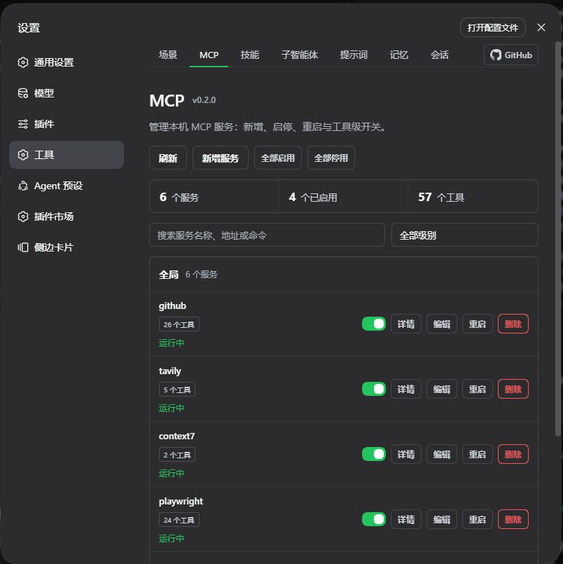
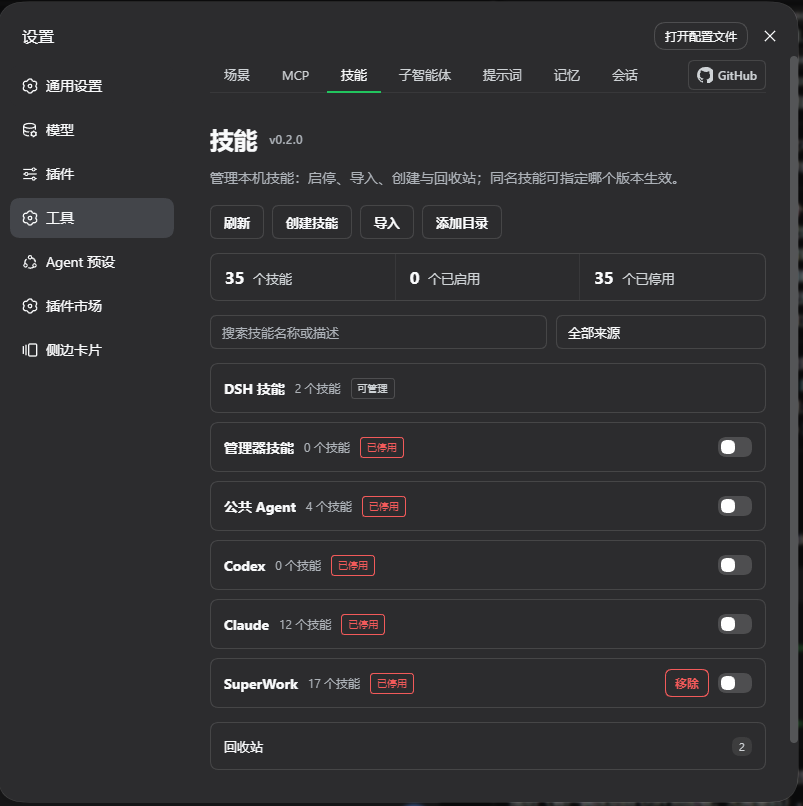
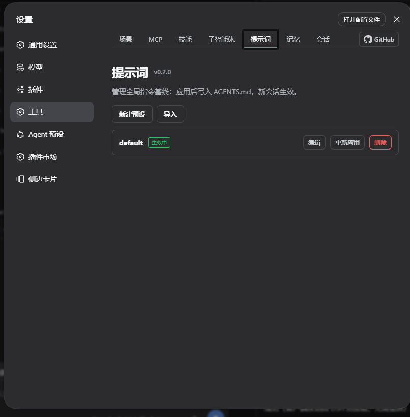
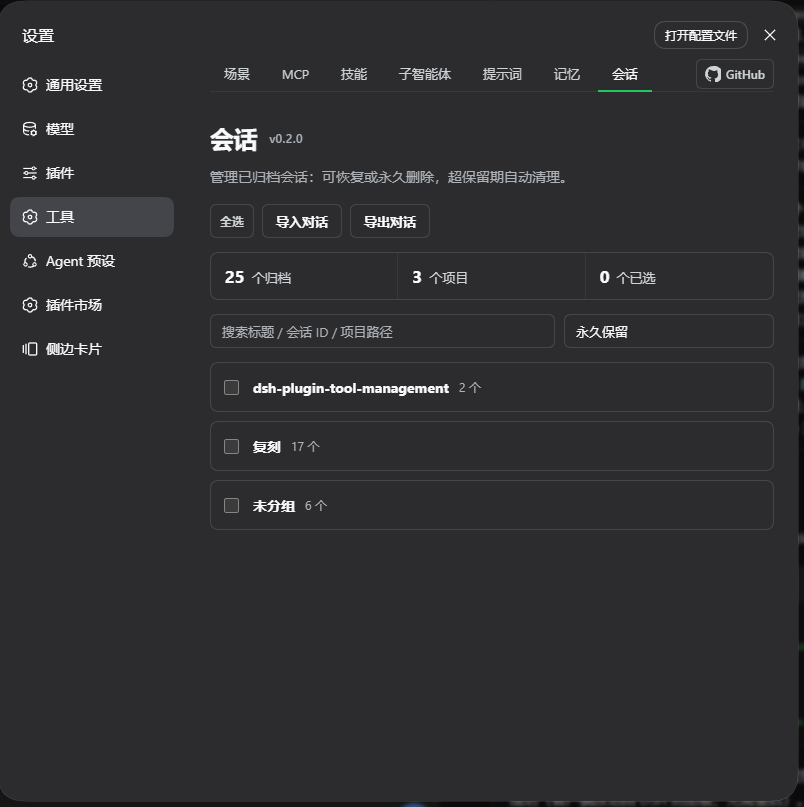
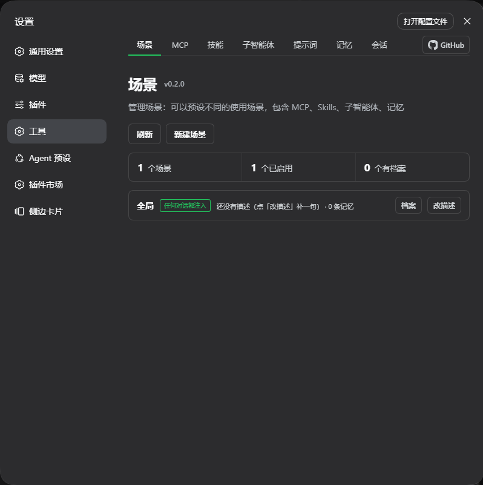
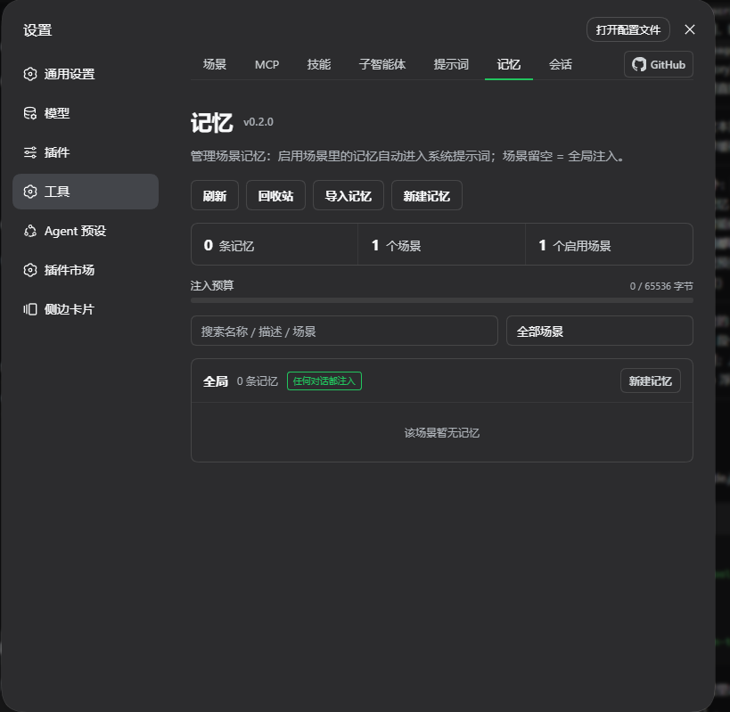
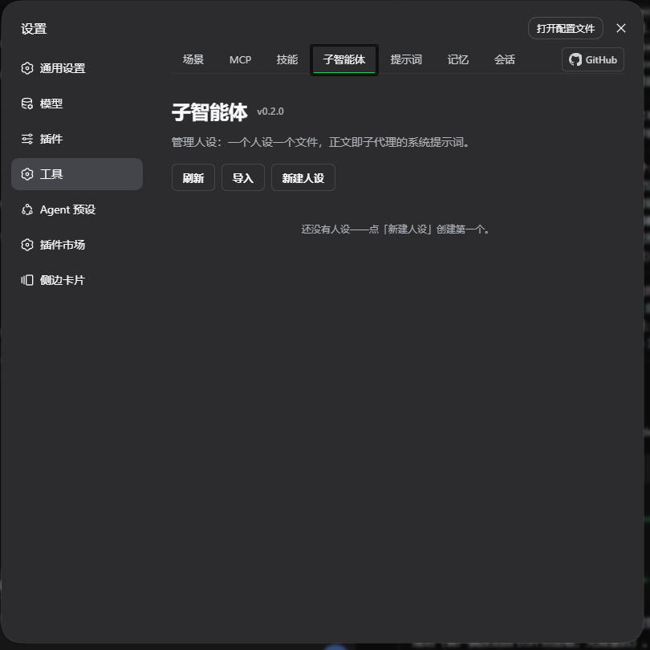

# dsh-plugin-tool-management

[](https://www.npmjs.com/package/dsh-plugin-tool-management)
[](LICENSE)
[](package.json)
[](https://github.com/ouli-1242/dsh-plugin-tool-management)
[](https://dsh.market/)

[简体中文](README.md) · **English** · [Changelog](docs/Changelog.md)

**An MCP server, skills & memory manager for DeepSeek Harness.** One settings panel keeps five things under control:

- **MCP**: which servers are configured, what tools each one exposes, and which tools the model may call — add, edit, remove, toggle, restart; every change takes effect immediately;
- **Skills**: every skill on the machine (DSH / Agents / Codex / Claude / project-level / any directory you add) at a glance — toggle individually or per source, create, import, recycle;
- **AGENTS.md**: keep multiple global instruction baselines as presets, apply one with a click to write `~/.dsh/AGENTS.md` — new sessions pick it up, current sessions stay unchanged;
- **History**: archived sessions in one place — grouped by project, batch restore / delete, import & export transcripts, retention-based auto-cleanup;
- **Scene Memory**: under `~/.dsh/tool-management/memories/<scene>/`, one folder = one scene and one `.md` = one memory — **create scenes** (with a description), drop `.md` files in (non-ASCII names are fine), toggle scenes; the bodies of memories in an enabled scene are **injected into the system prompt in full**, so you never re-explain them. The reserved scene `global` ("Global" in the UI) is injected into every conversation.

No hand-editing of `cordis.patch.yml`, and skill source files are never touched. Configuration survives restarts and upgrades.

---

<!-- Image slot 1: MCP management page screenshot → docs/images/MCP.png -->



<!-- Image slot 2: Skills management page screenshot → docs/images/技能.png -->



<!-- Image slot 3: AGENTS.md presets page screenshot → docs/images/提示词.png -->



<!-- Image slot 4: History archived sessions page screenshot → docs/images/会话.png -->



<!-- Image slot 5: Scene memory page screenshot → docs/images/场景.png -->


<!-- Image slot 6: Memory page screenshot → docs/images/记忆.png -->


<!-- Image slot 7: Subagents page screenshot → docs/images/子智能体.png -->


## Highlights

| Capability | Description |
|---|---|
| Per-tool switches | **Toggle individual tools** inside one MCP server: hidden from the model and blocked at call time, restorable at any moment; whole-server batch enable/disable also supported |
| Restart semantics | Restart only reconnects — it **never flips the enabled state** (restarting a disabled server does not silently enable it) |
| Secret safety | Secret-looking values in `env` / `headers` are **masked by default**, URL query strings are always redacted; revealing plaintext is token-gated just like writes |
| Write protection | Every patch rewrite keeps a timestamped `.bak` backup (last 5); duplicate loader ids are rejected before write; failed cross-level migration rolls back |
| Backup / restore | JSON import supports `conflict: 'overwrite'` to replace entries with the same id, not just skip them |
| Skill sources | Hooks up `~/.agents` / `~/.codex` / `~/.claude` (three directories official DSH does not load) plus **any custom skill directory** you add (read-only, overlapping paths rejected) |
| Skill operations | Create skills, import ZIP / folders, plugin recycle bin (restore / permanent delete with OS-trash fallback), open the source file in the system editor. **Deletion is project-level only**: DSH skills and imported skills (`~/.dsh/skills/`, `~/.dsh/tool-management/skills/`) cannot be deleted — disable them instead |
| Skill source names | `DSH skills` = the official `~/.dsh/skills/`; **`Imported skills`** = where this plugin puts what you create/import, `~/.dsh/tool-management/skills/` (higher priority, so a same-named copy shadows the official one) |
| Live refresh | Skill directories are watched from a background thread — edits made in an editor show up automatically |
| AGENTS.md presets | Multiple global instruction baselines as presets — create / import / edit / apply / delete; "Apply" writes `~/.dsh/AGENTS.md` (new sessions pick it up, current sessions stay unchanged) |
| Archived session management | History page groups archived sessions by project: search, select-all, batch restore / permanent delete, retention-based auto-cleanup (changing the retention resets the countdown from the change time) |
| Transcript import / export | Seamlessly take over conversations from Claude Code / Cursor (JSONL), Codex (Markdown), or any text; export picks the session scope, defaults to the desktop, in Markdown / JSONL |
| Scene memory auto-injected | A memory is `~/.dsh/tool-management/memories/<scene>/<name>.md`; every `.md` inside an enabled scene has its body **injected into the system prompt automatically** (per-agent `systemPrompt` section), with no tool call from the model and effect on the **very next request**; the reserved scene **`global`** ("Global" in the UI) is injected into every conversation. |
| Memory import | "Import memory" on the Memory page: `.md` / `.zip` (multi-select, drag-and-drop); inside a zip a directory name is the scene, and a bare `.md` lands in the scene picked in the dialog (leave it empty = the reserved scene "Global"); `<scene>/<name>/SKILL.md` inside a zip is imported as a **bundle** (sibling files become attachments); same names are skipped and listed, **including scenes created just for this import** |
| Scene enable switch | A scene is an **explicit record** (with a description and order); the multi-select switch persists globally in `rules-index.json`'s `active`; **all scenes enabled by default**, `global` and `_shared/` always on |
| Scene profile (four free-form sections) | Each scene can select its own **MCP tool set / skill set / subagent bindings / memories** in any combination (the lists show only what exists right now; checked = enabled, unchecked = disabled; MCP has two levels: not checking a server disables it entirely, checking a server but none of its tools stops that whole server). **The memory section only affects injection** (an unchecked memory stays out of the prompt while the file is left exactly as it is). A scene with a tool or skill section also gets "Set as active mode": applying the profile persists a snapshot first, and exiting restores it **verbatim**; a scene with only memories or only subagents shows no mode button; the change takes effect on the next request |
| Lightweight subagents | `~/.dsh/tool-management/agents/<persona>.md` — one file per persona (optional frontmatter: `description` / `provider` + `model` / `tools` allowlist / `toolsDeny` denylist; the body is the persona prompt and is derived automatically when missing); the page header's "Import" takes `.md` / `.zip` (same names skipped and listed); the model calls them through `subagent_list` / `subagent_run` — the child runs with the persona, returns only its result, and is discarded (it never enters History); it **inherits the memories of the currently enabled scenes automatically**; a scene profile can bind "which personas are available in this scene" (calls outside the binding are refused); running asks for confirmation by default, which can be turned off in settings |
| Prefix-cache friendly | Section text depends only on enabled scenes + file contents, so it is byte-stable; switching scenes or editing a memory changes it exactly once, every other request keeps hitting the cache (this does not violate the "no injection layer" rule — that one only bans per-turn dynamic content) |
| Model tools | **14**: `skill_mcp_manager_*` for MCP (4), `skill_manager_*` for skills (3), `agentsmd_list` / `agentsmd_apply` for the AGENTS.md preset library (2 — the model may only list and switch, never create or delete, so it cannot wipe your presets), `rule_manager_*` for scene memories (3; creating asks for your consent, can be turned off in settings), `subagent_list` / `subagent_run` for persona subagents (2; running asks for your consent by default, turn off with `requireConfirmForModelSubagentRun`). **All three confirm gates respect the session approval policy**: under `approval=never` (full access) no card can appear, so the plugin treats it as "the user has pre-approved" and passes through, logging `confirm-bypass` — matching the official subagent tools' behaviour under full access |
| UI | Its own `dsm-*` design system, **seven columns** (Scenes / MCP / Skills / Subagents / Prompts / Memory / Sessions) with a uniform page header and shared section cards; every checkbox-style surface (the four profile sections, the persona tool allow/deny lists) uses one layout, and long lists all have a filter box; a persona's model and tool limits live in an "Advanced options" fold-out (auto-expanded once configured); notices come in two levels (success = toast, warning/error = in-page banner); the profile dialog has a fixed height so adding or removing sections never makes it jump |

## Getting started

Prerequisites: DSH installed (`dsh web` runs), Node.js ≥ 18.

```sh
# Install (package + auto-mount)
dsh plugin --profile web add dsh-plugin-tool-management@latest

# Update: run the same command again
# Uninstall:
dsh plugin --profile web remove dsh-plugin-tool-management
```

Hard-refresh the browser (Cmd/Ctrl+Shift-R) after installing — a **Tools** panel appears in Settings with seven tabs (Scenes / MCP / Skills / Subagents / Prompts / Memory / Sessions), which means the install worked (client changes are hot-loaded by DSH, no restart needed).

You can also tell any DSH session:

```text
Install the dsh-plugin-tool-management plugin:
dsh plugin --profile web add dsh-plugin-tool-management@latest
Then remind me to hard-refresh the browser.
```

## Feature guide

### Managing MCP servers

- **Add a server**: fill in `serverName` (unique, 1–32 chars `[A-Za-z0-9_-]`), the transport and its fields (`streamable-http` → URL / headers; `stdio` → command / args / env), and choose project or global level. The write lands as a loader row in `cordis.patch.yml` and applies via HMR.
- **See the state**: every card shows live status, loader phase and registered tool count; a summary bar sits on top, and fatal issues such as duplicate loader ids are flagged right on the page.
- **Turn off just one tool**: the "Details" dialog lists every tool with its parameter summary — disable the ones the model keeps misusing; the schema disappears from the model's view and calls are denied, ready to re-enable anytime.
- **Inspect secrets safely**: secret-looking values render as `••••••` by default; click "Reveal" only when you need them.
- **Move and back up**: editing can rename a server or migrate it between project/global level (with automatic rollback on failure); JSON export/import covers full backups.

### Managing skills

- **See everything**: skills are grouped by source — project, runtime, built-in, plugin-shipped, the four user directories (`~/.dsh` / `~/.agents` / `~/.codex` / `~/.claude`; the last three are hooked up by this plugin) and any custom directories you added.
- **Toggle**: individual skills, whole sources or whole projects — implemented as an override-provider shadow policy, so not a single byte of the source file changes; moving machines is just copying the state file.
- **Remove a source**: unlike disabling one — a disabled source is still scanned and listed (its skills simply cannot be called) — **removing means the directory is not scanned at all**: its skills disappear from the list, drop out of the same-name priority, and become invisible to the model too (provider candidates). Not a single byte is touched on disk, and it can be restored at any time. The reserved `dsh` (official DSH skills) and `hub` (the plugin's own import target) sources, and project-level sources, cannot be removed and show no button.
- **Custom directories**: click "Add directory", enter an absolute path, and that directory becomes a read-only skill source — ideal for skill collections living in repos or synced folders; overlapping paths are rejected to keep the shadow policy sound.
- **Create / import / recycle**: create from a form; drag in a ZIP, a `.md` file or a skill folder; deleted skills go to the plugin recycle bin first, and permanent delete still tries the OS trash as a last safety net.

### Managing AGENTS.md presets

- **Preset library**: create, import and edit multiple global instruction baselines (e.g. different teams' coding standards or role behaviors).
- **Apply = write**: "Apply" writes the selected preset to `~/.dsh/AGENTS.md` — **new sessions pick it up, current sessions stay unchanged**; "Re-apply" syncs the latest content after editing; switch to another preset before deleting.

### Managing archived sessions

- **Grouped by project**: archived sessions are grouped by workspace automatically; search by title / session ID / project path; sessions whose workspace folder no longer exists are flagged with ⚠.
- **Batch operations**: "Select all" then batch-restore or permanently delete; restored sessions return to the workspace list, and deletion cascades to their subagent sessions.
- **Retention**: pick the cleanup period from the dropdown (0 = keep forever); the expiry baseline is the later of the archive time and the last retention change, so changing the retention resets the countdown.
- **Import conversations**: take over sessions from other tools — Claude Code / Cursor JSONL, Codex Markdown, and arbitrary text — and keep chatting right after import.
- **Export conversations**: pick a session scope (all / archived only / by workspace); each session becomes a Markdown or JSONL file; the export directory defaults to the desktop, and the adjacent "Select" button opens a directory tree to browse and fill in the absolute path.

### Managing scene memory (the Scene Memory page)

> This page merges the former "Rules" and "Scenes" pages: **a scene is the grouping dimension, a memory (`.md`) is the content.**
> The data folder also moved to **`~/.dsh/tool-management/memories/`** — existing files are moved in automatically (see "Upgrade note" below).

- **A scene is an explicit record** (name + description, stored in the `scenes` slice of `rules-index.json`); `memories/<scene>/` holds its memories: `~/.dsh/tool-management/memories/办公/流程.md` is one memory in the "办公" scene. Scene names accept any Unicode (≤64 chars, no `/ \ < > : " | ? *`, must not start with a dot, **a single path segment**); `global` is the reserved always-on scene ("Global" in the UI) and `_shared/` is the legacy shared scene.
- **New scene**: "New scene" asks for a name and a one-line description (or just `mkdir` under `memories/` — a record is filled in on the next read). **An empty scene is perfectly valid**, so you can create scenes first and add memories later; the card also has "Edit" for the description.
- **Every `.md` is one memory**: a sentence or a paragraph, no frontmatter needed, and the whole body is injected. Drop a file into the scene folder and it takes effect, or use "New memory" on the card to write it on the page — **file names can be Chinese** (e.g. `站会流程.md`). A memory whose scene does not exist is **rejected outright** (`scene not found`) instead of silently creating one.
- **Toggle a scene**: the switch on the right of each scene card enables/disables it (same component and layout as the Skills page). Every `.md` inside an enabled scene is **injected into the system prompt automatically**; the model needs no tool call and you never have to explain again. Toggling takes effect on the **very next request**, with no new session and no plugin reload.
- **All scenes are enabled by default**: with no configuration at all, every scene is live ("drop it in and it works"); narrow the set in the UI once you have many scenes. `global` ("Global") and `_shared/` are always on (their cards have no switch).
- **One memory = one Markdown file**: `<scene>/<name>.md` (flat) or `<scene>/<name>/SKILL.md` (bundle, with attachments). When creating, fill in the scene (pick an existing one or **type a new scene name** — its folder is created for you), the name (= file name), description and body — frontmatter is entirely optional and derived automatically when missing.
- **Bundle attachments**: with the bundle form you can **add attachments** right in the dialog (multi-select, ≤8 MB each, ≤16 MB / 32 files per upload); they live in the memory folder and are **never injected into the prompt** (only the `SKILL.md` body is), and you can remove them one by one while editing. The flat form is a single file, so it has nowhere to put attachments.
- **Toggle & recycle**: enable/disable each memory (the switch on the right of every row — a disabled memory stays on disk and is simply left out of the prompt), edit, and move to trash; the "Trash" button in the page header can **restore** or **permanently delete** removed memories, with a confirmation step before the permanent delete. `enabled` and friends live in the sidecar index and are never written back to your files.
- **Injection budget is visible**: a budget bar (used / max bytes) sits under the summary and turns red with an "Over budget" label. Default cap 64 KiB; when one memory does not fit it is **skipped** while smaller ones behind it are still included, and the section tail carries a "not injected (over budget)" list — both the model and you can see what was left out instead of losing it silently.
- **`~/.dsh/AGENTS.md` is no longer written**: the old "always layer" is gone; the shared baseline now lives in `_shared/` and flows through the system-prompt section.
- **Scene profile (four free-form sections)**: the "Profile" button opens an editor where **MCP tools**, **skills**, **subagent bindings** and **memories** are added/removed independently. For memories the editor lists each scene as a card (description + how many of its memories are checked) and "Pick memories" drills into that scene; check semantics are the same as the other sections (**unchecked = not injected for that scene; files and content are never touched**). Sections with a defined-but-empty selection disable that whole domain. Every section body has a filter box, and the dialog keeps a fixed height so adding/removing sections never makes it jump. A scene with MCP/skill sections also gets a "Set as active mode" button: entering takes a runtime snapshot, persists it first, applies the selections and narrows memory injection to that scene; exiting restores the snapshot **verbatim**. Failures roll back and are reported honestly (an incomplete rollback is written into the error text rather than claimed as "rolled back").
- **Subagents (personas)**: `~/.dsh/tool-management/agents/<persona>.md`, one file per persona — frontmatter is optional (`description` for when to call it, **one sentence is enough**; `provider` + `model` for the model route (**a pair**: switching providers requires both, e.g. `provider: sensenova` + `model: sensenova-6.8-flash-lite`; a bare `model` resolves against the main session's provider); `tools` allowlist; `toolsDeny` denylist), and the body is the persona prompt. On the page all of this sits in an **Advanced options** fold-out (auto-expanded when the persona already uses a model or tool restriction): the model is a **dropdown** (the `provider · model` pairs from the host LLM catalogue, with a "Custom" entry to type one it does not list), and the tool allow/deny lists are **pickers** whose candidates are the **union of tool names across all agent presets**, tagged "available in this session" vs "available in other presets" — a persona can be reused under any preset, and listing only this session's tools would make the child fail to start after a preset switch (the official `toolFilter` rejects unknown names outright).

#### Caching and refresh (§5.2)

| Situation | Is the prefix stable? | Result |
|---|---|---|
| Scene set unchanged, memory files unchanged | byte-for-byte stable | ✅ prompt prefix cache hits |
| Enabling/disabling a scene (explicit action) | changes once | ⚠️ that session re-warms once — acceptable |
| Editing a memory (page or editor) | changes once | ⚠️ same, and it takes effect on the **next request** |
| Timestamps / counts / relative time in the section | changes every request | ❌ forbidden (and absent from the implementation) |

The implementation uses a **two-phase scan with a fingerprint cache**: each assembly only walks
directories with `stat` to build a fingerprint (no body reads) and reuses the previous rendering
when it is unchanged; only a changed fingerprint (scene toggle, file edit, enable/disable) triggers
reading bodies and re-rendering. **`fs.watch` is deliberately not used** — recursive watching is
unreliable on Windows, and a silently dead watcher would return stale content forever; the
fingerprint probe costs sub-milliseconds and buys "always fresh, never silently stale".

#### Upgrade note: the data folder moved (v0.4)

Since v0.4 **all plugin data lives under one directory**, `~/.dsh/tool-management/`
(easier to inspect and back up):

```
~/.dsh/tool-management/
├─ memories/<scene>/<name>.md | <scene>/<name>/SKILL.md   memory bodies (source of truth)
├─ agents/<persona>.md                                    subagent personas
├─ agents-md/<preset id>/AGENTS.md                        AGENTS.md preset library
├─ skills/                                                skills created/imported by the plugin
├─ trash/                                                 skill trash; rules-trash/ = memory trash
├─ rules-index.json                                       enable/order/scene records/profiles/mode
└─ state.json                                             skill enable policy and custom roots
```

**Old locations are moved in automatically on first start** (move only, never delete, never
overwrite an existing target, once per process, failures do not block startup):

| Old location | New location |
|---|---|
| `~/.dsh/scene-memory/<scene>/…` | `~/.dsh/tool-management/memories/<scene>/…` |
| `~/.dsh/scene-memory/<root>.md` (the old global memory) | `~/.dsh/tool-management/memories/global/<root>.md` |
| `~/.dsh/rules/…` (pre-v0.3) | as the two rows above |
| `~/.dsh/subagents/<persona>.md` | `~/.dsh/tool-management/agents/<persona>.md` |
| plugin dir `data/agents-md-presets/` | `~/.dsh/tool-management/agents-md/` |

The move uses `rename` (instant on one volume) and leaves the source folder as an empty shell you can
delete once you are satisfied. `~/.dsh/skills/` (the official DSH skill directory) is **not** moved: it
stays listed as a switchable source, while skills **created or imported by the plugin** now land in
`tool-management/skills/` (the hub copy wins when both define the same name).

### Let the model and scripts help

| Entry point | What it does |
|---|---|
| `skill_mcp_manager_list / set_enabled / restart / add` | Let the model query and operate MCP servers |
| `skill_manager_list / set_enabled / create` | Let the model query and operate skills (creating asks for your consent) |
| `agentsmd_list / agentsmd_apply` | Let the model list the AGENTS.md preset library and switch the active preset (writes `~/.dsh/AGENTS.md`, effective for new sessions); **no create or delete**, so the model cannot wipe your presets |
| `rule_manager_list / read / write` | Let the model query and write scene memories (writes ask for your consent; can be disabled in settings) |
| `subagent_list / subagent_run` | Let the model list personas and run a one-shot persona subagent (result only, discarded afterwards; running asks for your consent by default, can be disabled in settings) |
| `POST /dsh-plugin-tool-management/api` | HTTP API for scripts (`{op, args}` protocol) |

> v0.4 **no longer registers slash commands** (there used to be `/mcp`, `/skills`, `/agents-md`,
> `/scene-memory`): they could only print a text snapshot, could not operate anything, and drifted from
> the panel state. Every one of them has an equivalent entry in the settings panel.

## Configuration & security

Optional fields on the plugin loader row (`dsh plugin add` inserts it automatically):

| Field | Description |
|---|---|
| `token` | Optional access token. When set, **every write operation and "Reveal"** requires the `x-dsh-token` header. The client reads it from localStorage (key `dsh-plugin-tool-management-token`; set it in the DevTools console and refresh), or via the `DSH_PLUGIN_TOOL_MANAGEMENT_TOKEN` environment variable. |
| `maxBodyBytes` | Request body cap, default 88 MiB (skill ZIP uploads need it). |

Why a token: the cross-site protection (POST-only + custom header + same-origin check) assumes DSH listens on localhost only. If you forward the port to a LAN or the public internet, the token is the last line of defense against strangers injecting MCP commands (equivalent to remote code execution) and reading plaintext secrets — not needed for local single-user setups.

## Where data lives

| Content | Location |
|---|---|
| MCP server definitions | `profiles/<profile>/cordis.patch.yml` (project) or `~/.dsh/cordis.patch.yml` (global), auto-`.bak` before every rewrite |
| Server notes / page settings / disabled tools / export | Sidecar JSON files under the DSH home (`dsh-plugin-tool-management-*.json`) |
| Skill toggle policy / custom directories | `~/.dsh/tool-management/state.json` |
| Skill recycle bin / import staging | `~/.dsh/tool-management/trash`, `uploads` |
| Skills created/imported by the plugin | `~/.dsh/tool-management/skills/<skill>/` (the official `~/.dsh/skills/` stays listed as a source, read-only) |
| AGENTS.md presets / applied file | `~/.dsh/tool-management/agents-md/<preset id>/AGENTS.md`; "Apply" writes `~/.dsh/AGENTS.md` |
| Archived session ledger / retention | Plugin dir `data/history-archived-at.json`, `data/history-retention.json` |
| Memory files (source of truth) | `~/.dsh/tool-management/memories/<scene>/<name>.md` (flat) or `<scene>/<name>/SKILL.md` (bundle); scene names may be non-ASCII; the reserved scene **`global`** (shown as "Global") is injected into every conversation; a bare `.md` in the `memories/` root belongs to no scene and is **never injected** (the checkup reports `noScene`) |
| Memory index / scene records / enabled scenes | `~/.dsh/tool-management/rules-index.json` (`enabled` / order / tags + `scenes` records (label/description/order) + `active` enabled-scene set (`null` = all) + `archives` profile selections + `mode` snapshot) |
| Persona files (source of truth) | `~/.dsh/tool-management/agents/<persona>.md` (frontmatter optional, body = persona prompt) |
| Page settings / confirm switches | `~/.dsh/dsh-plugin-tool-management-settings.json` (`requireConfirmForModelSubagentRun` etc.) |
| Memory recycle bin | `~/.dsh/tool-management/rules-trash/<trashId>/` (deleted memories land here and can be restored) |
| Runtime log | `~/.dsh/dsh-plugin-tool-management.log` (rolling) |

## FAQ

| Symptom | Fix |
|---|---|
| Pages missing in Settings after install | Hard refresh; if that fails, restart DSH once. |
| Duplicate MCP tabs / duplicated tools | Stale loader row double-mounting the plugin — remove the old entry from `cordis.patch.yml` and restart. |
| Broken config, DSH won't boot | Restore the newest `cordis.patch.yml.bak-<timestamp>` next to it. |
| Page data not refreshing | Wait for the automatic polling (default 5s) or click "Refresh". |
| Latest version not found on a mirror | Add `--registry=https://registry.npmjs.org` and retry later. |
| Do the confirmations still apply in full access (`approval=never`)? | **No, and no card appears.** The three confirm gates (`rule_manager_write` / `skill_manager_create` / `subagent_run`) treat a `never` session as "the user has pre-approved", so they pass straight through and write a `confirm-bypass` line to `~/.dsh/dsh-plugin-tool-management.log`. Switch the access mode back to "workspace write" to get asked again, or turn off a single gate with the matching `requireConfirmForModel*` setting. |
| `subagent_run` reports "spawn provider unavailable" | **Conditional**: the host ships a `spawn` provider (recent versions need no extra package and no mount). It only appears when the host really registers none *and* this plugin cannot mount `@deepseek-ai/dsh-subagent-spawn-in-process` either — the message carries the original reason, and it is mostly an older version or a specific profile. Mount that package in the host profile and restart DSH: this plugin deliberately keeps it out of `cordis.patch.yml` so a host without the package still boots. |
| The scene binds only persona A, so why did an unbound subagent still run? | **There are two subagent channels.** This plugin's `subagent_run` goes through its confirm gate and the scene persona binding; DSH's own `subagent` / `subagent_fork` are host capabilities with **no confirm gate and no notion of this plugin's personas**, so they honour neither in any mode (verified live: in one message the official `subagent` returned with no approval card while the following `subagent_run` did prompt; `subagent_fork` likewise ran card-free). This plugin's governance covers `subagent_run` only — tightening the official pair would take a host-side convention or a later version that brings them into the plugin's pre-execute gate. |

## Development

```bash
npm install
npm run build        # build (tsc + sync client bundle)
npm run build:client # sync src/client.js → lib/client.js only
npm run lint         # syntax self-check (node --check on both artifacts)
npm run check:i18n   # zh/en dictionary key-set + placeholder alignment
npm test             # build + i18n check + all semantic-contract tests (node --test test/*.test.mjs, 11 groups / 81 cases)
```

> Changes are verified by **actually exercising the real behaviour** (evidence and known issues live in
> [Changelog](docs/Changelog.md)) instead of asserting what the code currently does — the latter
> just copies the implementation and passes by construction. The exception is eleven groups of
> **semantic-contract** tests (`npm test`, run against the built `lib/`, 81 cases):
> `archive.test.mjs` (engine state machine), `import.test.mjs` (ZIP expansion, landing plans, limit
> reporting), `approval-policy.test.mjs` (never-policy detection, driving a real cordis context and
> a real `ApprovalService`), `subagent-scene.test.mjs` (scene binding must reject *before* a
> subagent runs), `subagent-persona.test.mjs` (persona frontmatter round-trip: `provider`,
> `model` and `toolsDeny` survive a UI save; creating a persona with no directory present),
> `hub-layout.test.mjs` (unified data directory: legacy layouts move without overwriting, the
> reserved `global` scene always exists and cannot be deleted, a memory must belong to an existing
> scene, and the profile memory section only affects projection), `skills-delete.test.mjs` (which
> skills may be deleted: user-level sources cannot be, read-only sources stay read-only),
> `skills-state.test.mjs` (state-file read resilience: missing keys self-heal, type errors stay
> fail-closed), `skills-source-remove.test.mjs` (the "remove a source" semantics: a removed source is
> no longer read, drops out of the same-name priority and is invisible to the model, while not a byte
> on disk changes and it can be restored), `client-exports.test.mjs`
> (client export contract: evaluating the factory alone — without running `apply` — must already
> expose `dict`/`pages`; exports written inside the `apply` method body are rejected), and
> `client-render.test.mjs` (assembly and rendering: a fake ctx drives the whole `apply`, asserts
> `settings.section` is registered, then renders the entire component tree without throwing). They
> assert contracts, not
> implementation copies; real-behaviour
> acceptance still happens
> in the browser/host and these tests do not replace it.
> `npm run check:i18n` additionally checks the zh/en dictionaries for key-set and placeholder
> drift, and `node scripts/i18n-debt.mjs` reports how much hard-coded Chinese is left (113 lines
> today: 38 on the prompts page, 75 on the sessions page).

Layout: host half `src/index.ts` (object-form Cordis plugin, `lib/index.js` is the shipped artifact); data-directory constants and migration `src/hub.ts`; skill core `src/skills/core.js` (pure Node); AGENTS.md presets `src/agents-md/service.ts`; archived session management `lib/history/` (`workspace.js` / `projcache.js` / `tombstone.js`); transcript import parsing `src/imports/parsers.js`; scene-memory store `src/rules/` (`service.ts` discovery/CRUD/index/checkup/two-phase section render, `provider.ts` per-agent `systemPrompt` section registration; the module path and `rules-*` op names stay as internal protocol, while the user-visible page and folder became “Scene Memory” / `memories/`); browser half `src/client.js` (ModuleLoader CJS bundle, `dsm-*` design system, talks to the host through the same-origin API). The only runtime dependency is `fflate` (ZIP extraction).

Publish: `npm version patch && npm publish` (`prepublishOnly` builds automatically).

## License

MIT
