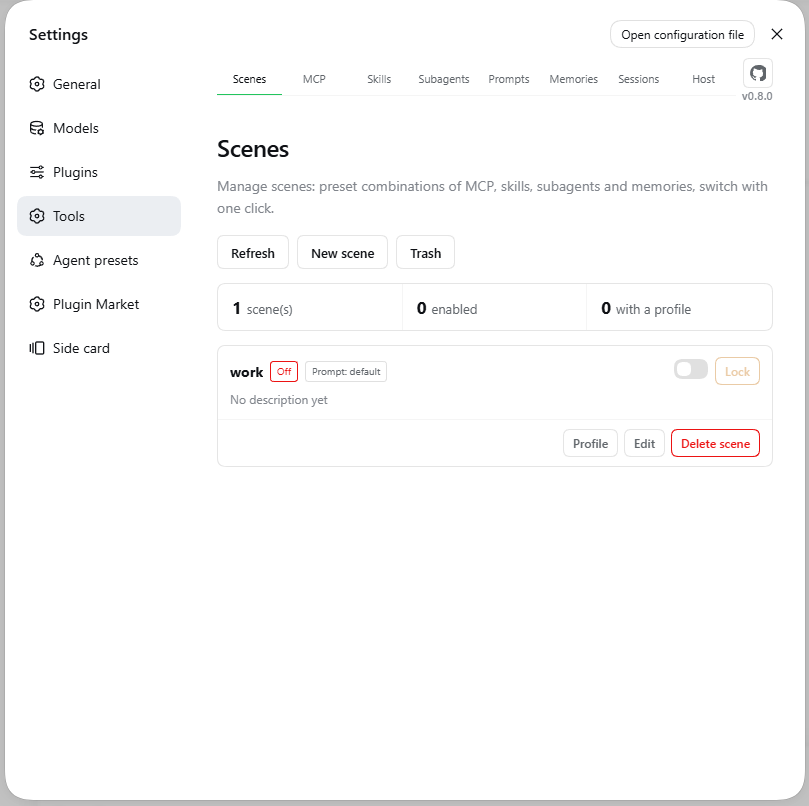
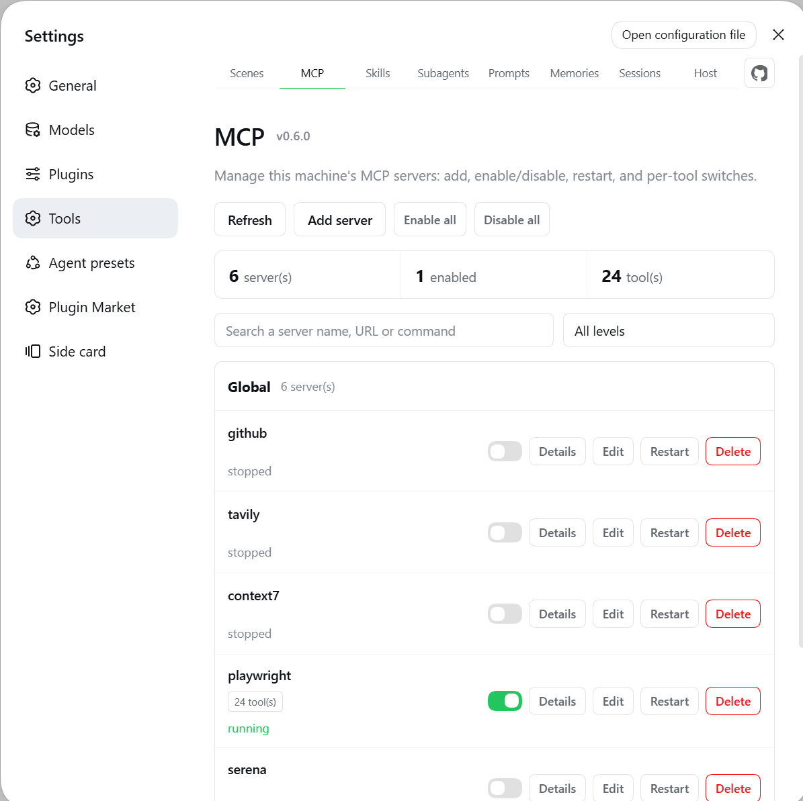
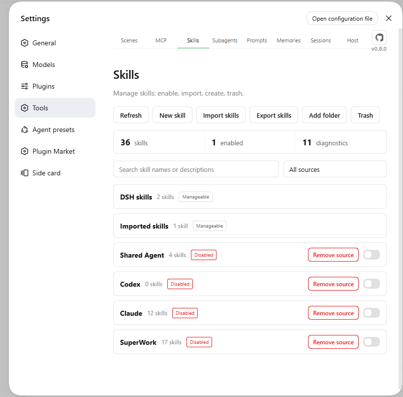
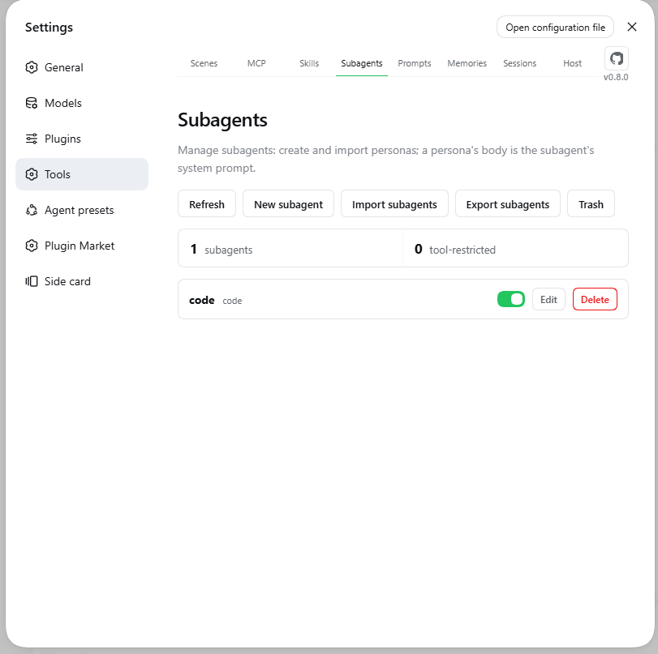
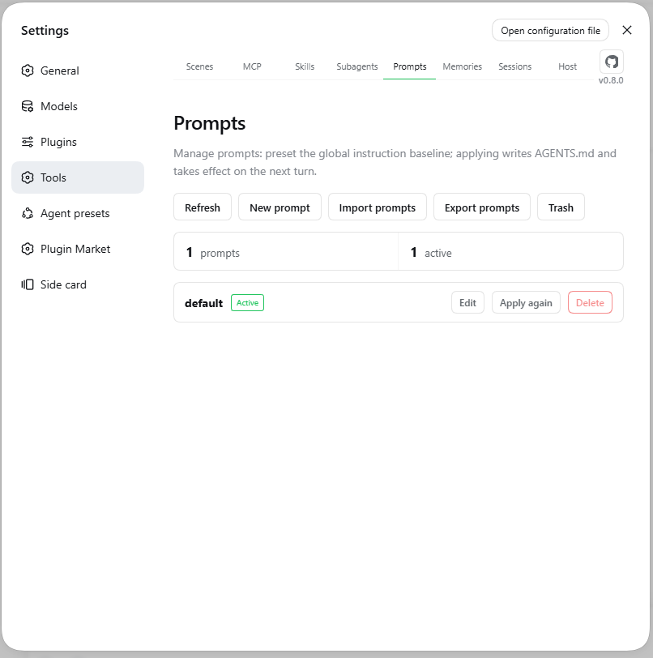
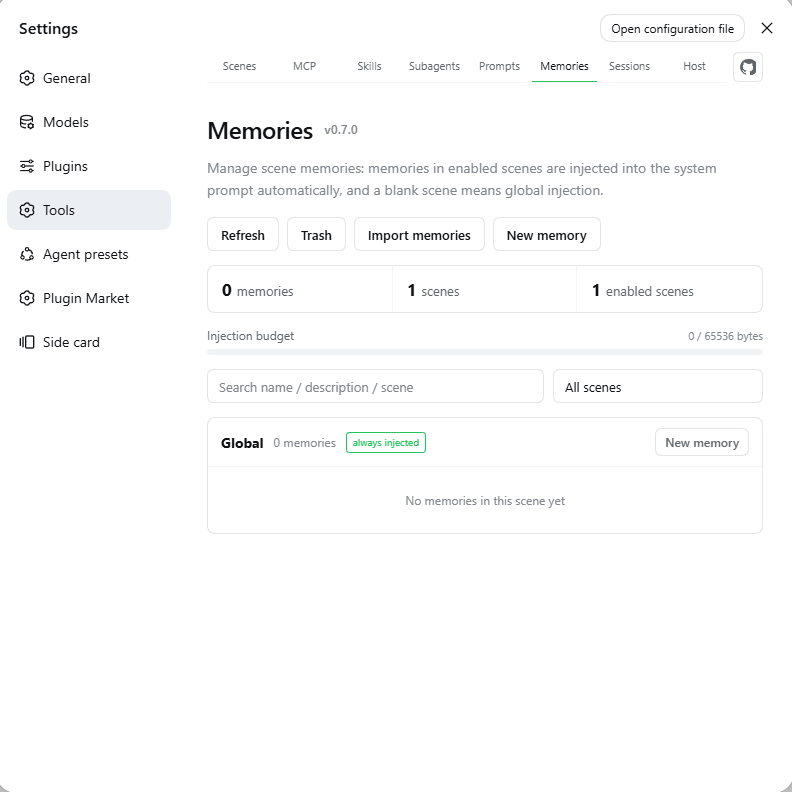
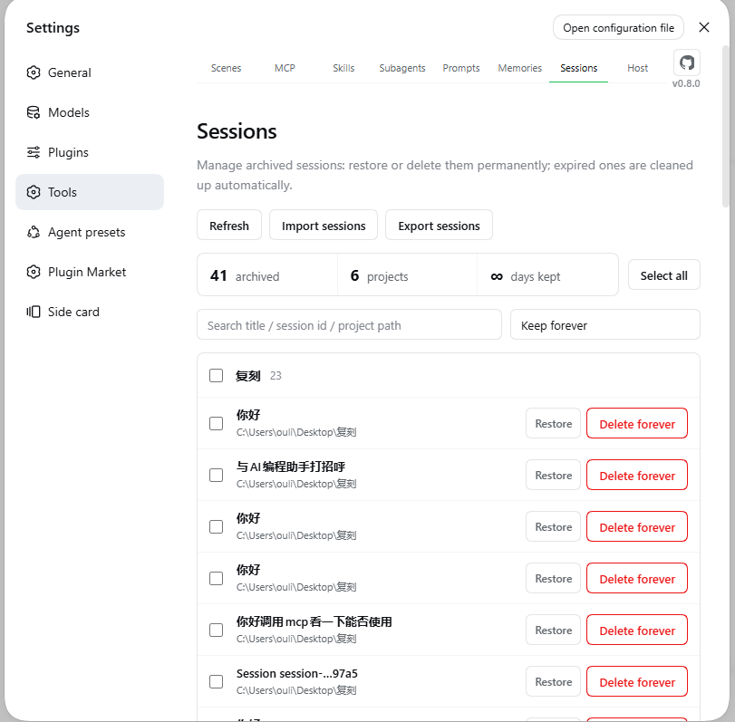
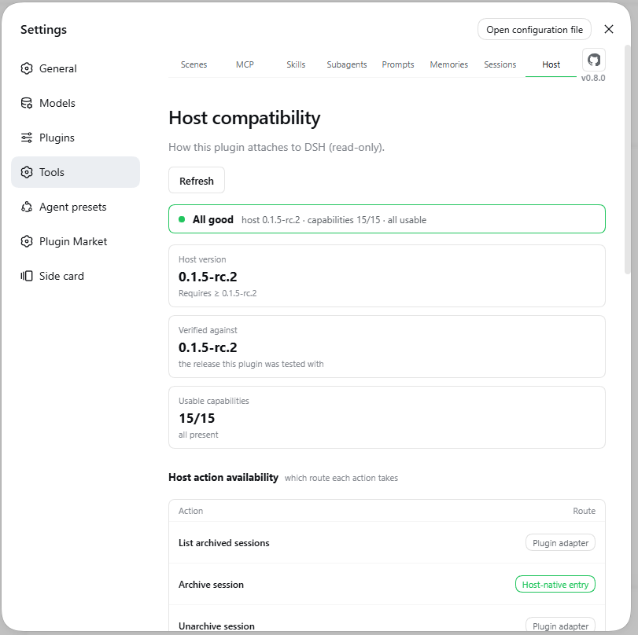

# dsh-plugin-tool-management

[](https://www.npmjs.com/package/dsh-plugin-tool-management)
[](LICENSE)
[](package.json)
[](https://github.com/ouli-1242/dsh-plugin-tool-management)

[](https://dsh.market/)
[](https://awesome-dsh-plugin.com)
[](https://dshfind.com/zh/plugins/ouli-1242/dsh-plugin-tool-management)

[简体中文](README.md) · **English** · [Changelog](CHANGELOG.md) · [Release overview](docs/update.md)

- An **MCP, skills, scenes, memories, subagents, prompts & archived sessions** manager for DeepSeek Harness.
- Eight tabs: **Scenes**, **MCP**, **Skills**, **Subagents**, **Prompts**, **Memories**, **Sessions**, **Host**.

```sh
dsh plugin --profile web add dsh-plugin-tool-management@latest
```

Hard-refresh the browser (Cmd/Ctrl+Shift-R) afterwards — a **Tools** panel in Settings means it worked. No hand-editing of `cordis.patch.yml`, no skill source files touched, configuration survives restarts and upgrades.

---

## Screenshots

|  |  |
|:---:|:---:|
|  |  |
| **Scenes** | **MCP** |
|  |  |
| **Skills** | **Subagents** |
|  |  |
| **Prompts** | **Memories** |
|  |  |
| **Sessions** | **Host** |

## Highlights

| Capability | Description |
|---|---|
| Scene memory | `.md` bodies in an enabled scene are **injected into the system prompt**, effective on the next request |
| Scene profile | Every scene freely combines **MCP tools / skills / subagents / memories**; opening a scene applies it, closing restores from the snapshot |
| Scene prompt | A scene can bind a prompt preset; switching scenes rewrites `~/.dsh/AGENTS.md` (auto-restores on exit) |
| Scene lock | Locking a scene freezes **all five domains read-only** (bound entries or not); a scene must be running to lock, and a locked scene can't be turned off — unlock first |
| Per-tool switches | **Individual tools** inside one MCP server can be disabled: invisible to the model, blocked at call time |
| Restart semantics | Restart only reconnects — it **never flips the enabled state** |
| Secret safety | Secrets masked by default; "Reveal" & export **require a token** — no `token` configured means no plaintext |
| Skill sources | Hooks up `~/.agents` / `~/.codex` / `~/.claude` & custom dirs; default sources must be read but skills can be deleted |
| Recycle bin | Personas / scenes / prompts / memories / skills all go to recycle bin on delete, restorable |
| AGENTS.md presets | Multiple global baselines, one-click apply, 5-generation backup |
| Archived sessions | Grouped by project, batch restore / delete, retention cleanup; rebuildable after workspace deletion |
| Transcript import/export | Take over Claude Code / Cursor / Codex / any text; export Markdown / JSONL |
| Import pairs with export | Skills / subagents / prompts / memories all export too: pick items → zip into a directory you choose (read-only on sources) |
| Subagents | One file per persona, with an **on/off toggle** deciding whether it is injected; run-and-discard, never enters History, inherits scene memories |
| Context visibility | The persona catalog and "currently usable MCP servers + your notes" enter the system prompt, so the model knows what is available |
| Prefix-cache friendly | Section text depends only on enabled scenes + file contents, byte-stable |
| Compatibility check | The **Host** tab shows host capabilities, per-action routing, and degradations at a glance |
| Model tools | **14** (`skill_mcp_manager_*` / `skill_manager_*` / `agentsmd_*` / `rule_manager_*` / `subagent_*`) |
| UI | Custom design system, **eight tabs**, bilingual, follows host language |

## Quick start

Prerequisites: DSH installed (`dsh web` runs), Node.js ≥ 18.

```sh
dsh plugin --profile web add dsh-plugin-tool-management@latest   # install / update
dsh plugin --profile web remove dsh-plugin-tool-management       # uninstall
```

Hard-refresh the browser — a **Tools** panel with eight tabs means it worked. Client changes hot-reload; host-side changes need `dsh web` restarted.

You can also ask the model:

```text
Install the dsh-plugin-tool-management plugin:
dsh plugin --profile web add dsh-plugin-tool-management@latest
Then remind me to hard-refresh the browser.
```

The model can manage everything above via 14 tools (see highlights); scripts use `POST /dsh-plugin-tool-management/api` (`{op, args}` protocol).

---

## Features

### Scenes & memories

- **A scene = a group, a memory = a `.md` file**. `memories/<scene>/<name>.md`, the whole body is injected, file names can be non-ASCII.
- **Single-choice toggle**: only one scene at a time (others greyed out); turning all off = only `global` and `_shared` inject. New scenes start off.
- **Scene-bound prompt**: switching scenes rewrites `~/.dsh/AGENTS.md` (5-gen backup, auto-restore on exit).
- **Scene profile**: every scene combines MCP tools / skills / subagents / memories (any mix); opening a scene applies and narrows injection, closing restores verbatim (the toggle is the only entry).
- **Import**: `.md` / `.zip` (dir name = scene, bundles carry attachments), same names skipped never overwritten, over-limit items reported.
- **Export**: pick memories and zip them, keeping the `scene/name` layout; bundle memories bring their attachments along. Sources are read-only.
- **Injection budget**: default 64 KiB, oversized memories skipped with a list. Deletes go to recycle bin.
- **Scene lock**: once locked, MCP / skills / subagents / memories / prompts are read-only — UI disabled plus a server-side guard; a scene must be running to lock, and a locked scene can't be closed until unlocked.
- **Deleting a scene deletes its memories too**: the scene record, profile and every memory go into one recycle-bin entry, restored as a whole; a running scene refuses deletion. Scene names are renameable (dir and profile follow, memory bodies untouched).

### Subagents

- **One file per persona**: `agents/<persona>.md`, frontmatter entirely optional.
- **Tool limits per Agent preset**: each preset gets its own allow/deny list (mutually exclusive), effective at runtime by the current preset — fixes the old "union of all presets" list that broke subagents after a preset switch.
- **Run and discard**: `subagent_run` runs with the persona, returns only the result, never enters History, inherits scene memories. Scenes can bind which personas are available.
- **On/off toggles**: a disabled persona is not injected and invisible to the model (file untouched); newly created / imported / restored personas start enabled. Starting a scene auto-enables the personas its profile binds; exit restores precisely from the snapshot.
- **Persona catalog enters the system prompt**: names + descriptions only, so the model knows what it can delegate to; personas are renameable, scene bindings follow.

### MCP servers

- **CRUD + immediate effect**: writes to `cordis.patch.yml`, HMR picks it up.
- **Per-tool switches**: disable individual tools (invisible to the model, blocked at call), whole-server batch.
- **Secret masking**: defaults to `••••••`, "Reveal" needs a token.
- **Migrate & back up**: cross-project/global migration rolls back on failure; JSON export/import.
- **Status & notes enter the system prompt**: only currently usable servers are listed, and your notes travel along as decision hints; levels are "global / app", new servers default to global.

### Skills

- **Sources at a glance**: project / DSH / Agents / Codex / Claude / custom dirs, grouped by source.
- **Opposite permissions**: default sources must be read but skills can be deleted; external dirs can be disabled/removed but skills are read-only.
- **Remove ≠ disable**: remove = directory not scanned at all (files untouched, restorable); disable = still listed but not callable.
- **Same-name picker / custom dirs / ZIP import & export / recycle bin**.

### Prompt presets

- Multiple `~/.dsh/AGENTS.md` baselines, one-click apply (the host re-reads that file every turn, so it takes effect on the next turn), 5-gen backup.
- **Description**: one line saying what a preset is for — shown in this panel only. It lives in a sibling `meta.json`, never in AGENTS.md, so it is never injected into prompts.
- Create with body inline, edit can change id (= dir rename, scene bindings follow). Active preset can't be deleted; deletes go to recycle bin.

### Archived sessions

- Grouped by project, search, batch restore / delete, retention auto-cleanup.
- Workspace registration deleted → group rebuilt from session dirs, one-click re-register.
- Import Claude Code / Cursor / Codex / any text; export Markdown / JSONL.

### Host compatibility

The plugin uses the host's own `@deepseek-ai/*` libraries at runtime — they must be the same physical modules, or every "adapt to host" decision degrades into guesswork.

- **Host tab**: host version, usable capability count, per-action routing (native/adapter/unavailable), degradations & reasons. Read-only.
- **Command line**: `node scripts/doctor.mjs` (check), `node scripts/host-deps.mjs --fix` (align deps).
- Under `minimal` preset, scene memory / AGENTS.md / skill directory don't take effect (by design); the Host tab marks this per column.

---

## Where data lives

| Content | Location |
|---|---|
| MCP definitions | `cordis.patch.yml` (auto `.bak` before rewrite) |
| Skill policy / custom dirs | `~/.dsh/tool-management/state.json` |
| Skills / memories / personas / presets | `~/.dsh/tool-management/{skills,memories,agents,agents-md}/` |
| Subagent toggles | `~/.dsh/tool-management/agents-index.json` |
| Recycle bin | `~/.dsh/tool-management/trash/` |
| Archive ledger / retention | `~/.dsh/tool-management/history-*.json` |
| Memory index / scenes / profiles | `~/.dsh/tool-management/rules-index.json` |
| Page settings | `~/.dsh/dsh-plugin-tool-management-settings.json` |
| Runtime log | `~/.dsh/dsh-plugin-tool-management.log` |

**No user data is stored inside the plugin's install directory** (`dsh plugin update` replaces it wholesale).

## Configuration & security

| Field | Description |
|---|---|
| `token` | Access token. When set, **all writes + plaintext secrets** require `x-dsh-token`; **unset = plaintext endpoints closed**. Also the escape hatch for curl / LAN. |
| `maxBodyBytes` | Request body cap, default 88 MiB. |

- **Browser**: reads/writes via cookie, no token needed; but **plaintext secrets** (Reveal / export) need a token.
- **curl / scripts**: send `x-dsh-token`, or carry the browser cookie.
- **Port forwarded to public**: configure a token — prevents strangers injecting MCP commands (≈ remote code execution) and stealing secrets.

## FAQ

| Symptom | Fix |
|---|---|
| Pages missing after install | Hard refresh; restart DSH if that fails. |
| Duplicate MCP tabs | Remove the stale loader row from `cordis.patch.yml`, restart. |
| Broken config, DSH won't boot | Restore the newest `.bak-<timestamp>`. |
| Action stopped after DSH upgrade | Settings → Tools → **Host** for the reason; `doctor.mjs` → `host-deps.mjs --fix`. |
| Still asked to confirm in `approval=never`? | No card appears — straight through with a log line; switch back to "workspace write" to get asked again. |
| `subagent_run` reports spawn unavailable | Host has no spawn provider; mount `@deepseek-ai/dsh-subagent-spawn-in-process` and restart. |
| Scene binds persona A, but official `subagent` ran something else | Two channels: this plugin only governs `subagent_run`; official `subagent` / `subagent_fork` have no gate and don't know about personas. |

---

## Development

```bash
npm install
npm run build        # tsc + sync client
npm test             # build + i18n + semantic-contract tests
npm run check:i18n   # dictionary self-check
npm run doctor       # host compatibility check
```

`lib/` is not tracked — run `npm run build` after cloning. Changes need `dsh web` restarted. Runtime dep is only `fflate`; `@deepseek-ai/*` all come from the host.

## License

MIT
