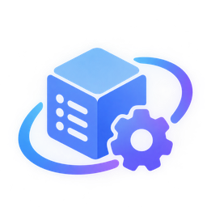
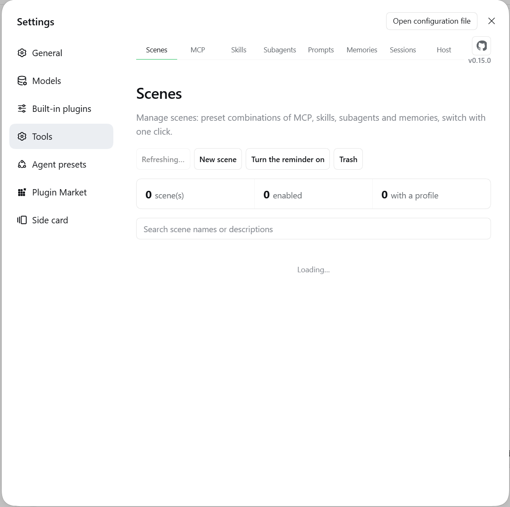
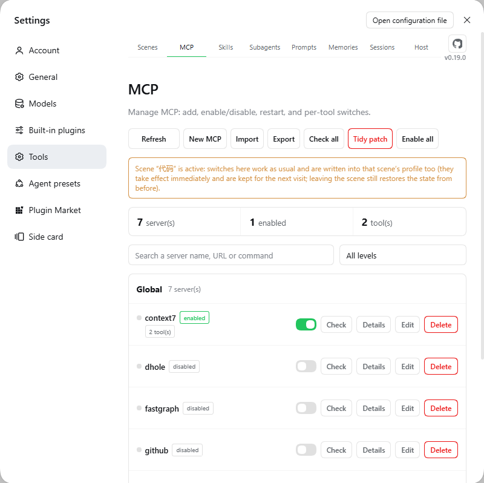
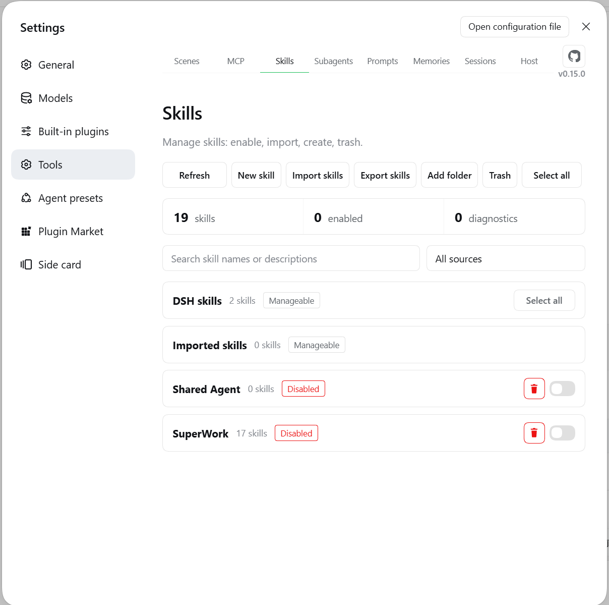
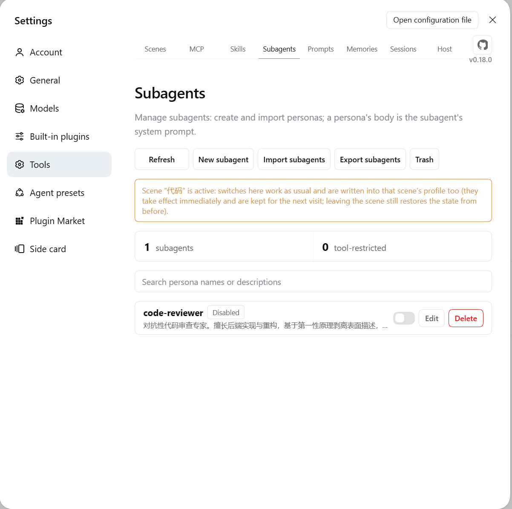
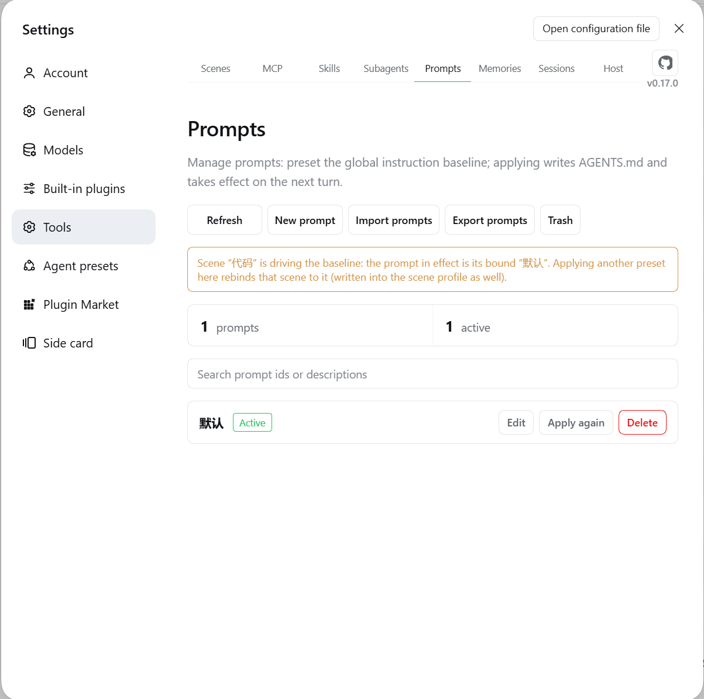
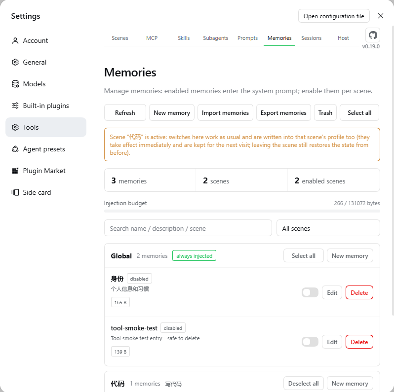
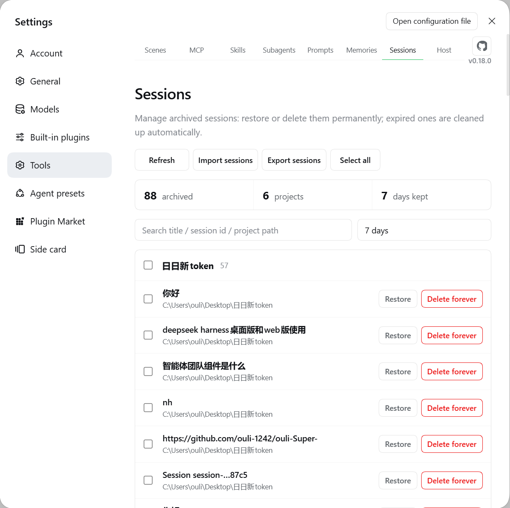
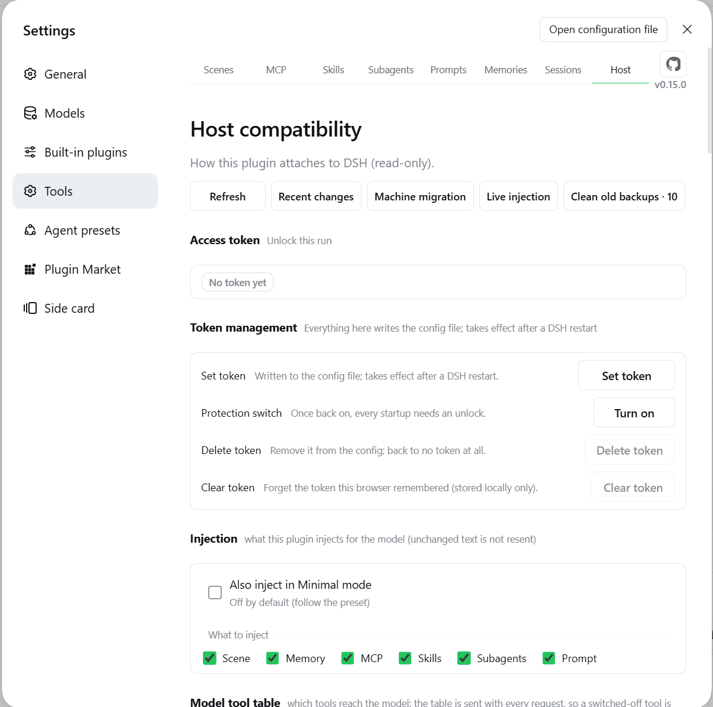

<p align="center">
  
</p>

# dsh-plugin-tool-management

[](https://www.npmjs.com/package/dsh-plugin-tool-management)
[](LICENSE)
[](package.json)
[](https://github.com/ouli-1242/dsh-plugin-tool-management)

[](https://dsh.market/)
[](https://awesome-dsh-plugin.com)
[](https://dshfind.com/en/plugins/ouli-1242/dsh-plugin-tool-management)
[](https://github.com/0xsline/awesome-deepseek-harness)

[简体中文](README.md) · **English** · [Changelog](CHANGELOG.md) · [Release overview](docs/update.md)

An **MCP, skills, scenes, memories, subagents, prompts & archived sessions** manager for DeepSeek Harness. Eight tabs: Scenes / MCP / Skills / Subagents / Prompts / Memories / Sessions / Host.

```sh
dsh plugin --profile web add dsh-plugin-tool-management@latest      # web
dsh plugin --profile desktop add dsh-plugin-tool-management@latest  # desktop
```

Hard-refresh the browser after installing for web (Cmd/Ctrl+Shift+R), or restart the desktop app after installing for desktop — a **Tools** panel in Settings means it worked. The plugin only writes its own files, never touches skill sources, and your configuration survives restarts and upgrades.

---

## Demo

<video controls src="https://github.com/user-attachments/assets/91b9673d-d201-462a-83de-8bc663c7629d"></video>

Every interface shown is a real screenshot of the running product — no redrawn UI, no fabricated controls.

Music: Kevin MacLeod「Limit 70」, [CC BY 4.0](https://creativecommons.org/licenses/by/4.0/).

---

## Screenshots

|                                   |                                    |
|:---------------------------------:|:----------------------------------:|
|    |        |
| **Scenes**                        | **MCP**                            |
|    |  |
| **Skills**                        | **Subagents**                      |
|   |   |
| **Prompts**                       | **Memories**                       |
|  |       |
| **Sessions**                      | **Host**                           |

## Highlights

In one line: **configure "work / writing / coding" each as a scene and switch the whole stack with one click — and the model always sees whatever this plugin manages.**

| Highlight                     | What it means                                                                                                                                                                                                      |
| ----------------------------- | ------------------------------------------------------------------------------------------------------------------------------------------------------------------------------------------------------------------ |
| One-click scene switch        | Each scene carries its own MCP / skills / personas / memories; entering applies them, leaving restores. The model can switch for you too                                                                           |
| Manage without leaving chat   | Type `/` for a "Tools" section and toggle any domain's items — one click, done                                                                                                                                     |
| Memories reach the model      | A few `.md` files under a scene become its knowledge base, injected automatically                                                                                                                                  |
| Notes for MCP servers         | A note you write is seen by the model every turn and acted on                                                                                                                                                      |
| Disable a single tool         | Mute one tool on a server: invisible to the model and uncallable                                                                                                                                                   |
| Skills at a glance            | The copy in effect is marked "preferred"; shadowed ones name the winning source                                                                                                                                    |
| Subagent = one file, one role | Write a role file and delegate to it; only the result comes back, never in History                                                                                                                                 |
| Several prompt presets        | Keep multiple `AGENTS.md` baselines and switch with one click; each scene can bind its own, or none                                                                                                                |
| Sessions no longer lost       | Archives grouped by project, searchable, batch-restorable; imports Claude Code / Cursor / Codex transcripts                                                                                                        |
| The model always sees it      | One context message per domain, republished only when the content changes                                                                                                                                          |
| Lock it and relax             | Locking a scene makes create/update/delete across the five domains read-only                                                                                                                                       |
| Deleted is not gone           | Skills / memories / personas / presets / scenes land in a recycle bin (permanent session deletion excepted); tick items to delete in bulk, or set a retention period so it cleans itself (keep-forever by default) |
| Safe by default               | Only the plugin's own files are written; secrets masked, plaintext needs a token                                                                                                                                   |

## Quick start

Prerequisites: DSH installed (`dsh web` runs), Node.js ≥ 18. Pick the profile matching your client: `--profile web` for the browser app, `--profile desktop` for the desktop app. The desktop profile is initialized by DSH Desktop itself — open the app once, then quit it completely before running the command.

```sh
dsh plugin --profile web add dsh-plugin-tool-management@latest         # web · install / update
dsh plugin --profile web remove dsh-plugin-tool-management             # web · uninstall
dsh plugin --profile desktop add dsh-plugin-tool-management@latest     # desktop · install / update
dsh plugin --profile desktop remove dsh-plugin-tool-management         # desktop · uninstall
```

Hard-refresh the browser (web) or restart the desktop app, then a **Tools** panel with eight tabs means it worked. Client changes hot-reload; host-side changes need the client restarted (`dsh web` / the desktop app).

You can also ask the model:

```text
Install the dsh-plugin-tool-management plugin:
dsh plugin --profile web add dsh-plugin-tool-management@latest
Then remind me to hard-refresh the browser.
```

For the desktop app, swap `web` for `desktop` and end with "remind me to restart the desktop app" instead.

## Features

### Slash commands (manage from the chat box)

- **Type `/` for a "Tools" section**: scenes / skills / MCP servers / subagents / prompts / memories. Click a row to enter that domain, click an item to apply it; the menu stays open.
- **State is visible** (green check / empty box / note in grey), and long lists scroll on their own; each external skill directory gets one row that toggles the whole source.
- **Only reversible actions**: entering a scene and the various toggles; create / delete / edit / import / export stay on their own pages.

### Scenes & memories

- **A scene = a group, a memory = a `.md` file**: `memories/<scene>/<name>.md`, the whole body is injected.
- **"Enabled" and "entered" are two axes**: enabled decides which scene the injection follows (single-select; none enabled = only `global` and `_shared`); entering applies the scene's whole MCP / skills / personas set and writes its bound prompt into `AGENTS.md`.
- **Scene profile**: ticked = on, unchecked = off, a section never created means that domain is off; leaving restores the pre-scene state.
- **Every domain offers "None"**: for MCP / skills / personas / memories / global prompt it means the scene leaves that domain alone; for quick prompts it means none are enabled while the scene is on, and it is the default for a new scene.
- **Scene lock** makes those five domains read-only; deleting a scene takes its memories with it into one recycle-bin entry. Import / export `.md` / `.zip`, same names skipped.

### Subagents

- **One file per persona**: `subagents/<persona>.md`, frontmatter entirely optional.
- **Delegation**: `subagent_manager_run` runs with the persona, returns only its final result, and never enters History; `inherit: true` seeds the child with this conversation's finished turns.
- **On/off**: a disabled persona is neither injected nor visible to the model; new / imported / restored personas start disabled.
- **Tool limits per agent preset**: one allow or deny list per preset (mutually exclusive). Model and provider are picked from the host LLM catalogue; empty means inherit the main session.

### MCP servers

- **CRUD with immediate effect**: written into `cordis.patch.yml`, backed up before every change.
- **Per-tool switches**: disable individual tools, or a whole server; a stopped server still shows the tools last seen.
- **Secret masking**: a credential is replaced as a whole, and "Reveal" needs a token; a masked value is never written back.
- A per-server note travels along as a decision hint; migration rolls back on failure, with JSON export/import.

### Skills

- **Sources at a glance**: project / DSH / Agents / Codex / Claude / custom directories, grouped by source.
- **Opposite permissions**: default sources are readable and their skills deletable; external directories can be disabled or removed but their files stay read-only.
- **Remove ≠ disable**: removing stops scanning the directory at all (nothing is written, restorable); disabling keeps it listed but uncallable.
- The winning copy of a shared name is marked "preferred"; custom directories, ZIP import/export and the recycle bin are all here.

### Prompt presets

- Multiple `~/.dsh/AGENTS.md` baselines, applied with one click (next turn), with 5 generations of backups; each preset can carry a one-line description that is never injected.
- **The switch on the left of a card is the answer to "is this one in effect"**: flip it on and that preset is written into `AGENTS.md`; flip it off to **un-apply**, which restores the state from before you started applying (and deletes the file if there was none back then). The confirmation says which one it will be, and a receipt afterwards states what happened.
- **Two kinds cannot be deleted directly**: a scene-bound preset, and the one currently applied. The copy auto-created on first open can be deleted. Deletes always go to the recycle bin.
- **Quick prompts** (the second section on the same page): save a piece of text you keep typing, then hit `/` and click it; a scene can bind a set of them.
- **This page's recycle bin is split in two by domain**, each half scrolling on its own with its own batch bar.

### Archived sessions

- Grouped by project, searchable, batch restore / delete, retention auto-cleanup; a workspace whose registration was deleted can be re-registered in one click.
- Import Claude Code / Cursor / Codex / any text; export Markdown / JSONL in three cumulative modes: text only → plus tool calls → plus reasoning. **An export is a transcript, not a backup**.

### Host compatibility

- **Host tab**: host version, usable capability count, per-action routing (native / adapter / unavailable), degradations and reasons; three write entries: access token, injection settings, model tool table.
- **Command line**: `node scripts/doctor.mjs` (health check), `node scripts/host-deps.mjs --fix` (align dependencies).
- Under a **suppressing preset** such as `minimal`, this plugin's injection is off by default; the Host tab can force any domain back on.
- Unchecking "Skills" or "Prompt" really stops them — under standard presets the host delivers those two itself.

---

## Where data lives

| Content                                                        | Location                                                                                         |
| -------------------------------------------------------------- | ------------------------------------------------------------------------------------------------ |
| MCP definitions                                                | `~/.dsh/cordis.patch.yml` (written by the plugin; pre-write copies land in the hub's `backups/`) |
| Skill policy / custom dirs                                     | `~/.dsh/tool-management/skills-state.json`                                                       |
| Skills / memories / personas / presets                         | `~/.dsh/tool-management/{skills,memories,subagents,prompts}/`                                    |
| Subagent toggles                                               | `~/.dsh/tool-management/subagents-index.json`                                                    |
| Recycle bin (skills / personas / presets / scenes)             | `~/.dsh/tool-management/trash/{skills,subagents,prompts,scenes}-trash/`                          |
| Memory recycle bin                                             | `~/.dsh/tool-management/memories-trash/` (a directory at the hub root, not under `trash/`)       |
| Archive ledger / retention                                     | `~/.dsh/tool-management/history-*.json`                                                          |
| Recycle-bin retention                                          | `~/.dsh/tool-management/trash-retention.json` (`0` = keep forever)                               |
| Memory index / scenes / profiles                               | `~/.dsh/tool-management/memories-index.json`                                                     |
| MCP sidecars (disabled tools / known tools / notes / settings) | `~/.dsh/tool-management/mcp-*.json`                                                              |
| Injection settings (six domain switches)                       | `~/.dsh/tool-management/inject-settings.json`                                                    |
| Model tool table (switched-off tools + saved sets)             | `~/.dsh/tool-management/tool-table.json`                                                         |
| Scene page preference (preview card before entering a scene)   | `~/.dsh/tool-management/scene-settings.json`                                                     |
| Runtime log / patch backups                                    | `~/.dsh/tool-management/tool-management.log` · `backups/`                                        |

**No user data is stored inside the plugin's install directory** (`dsh plugin update` replaces it wholesale). `backups/` keeps **5 copies per patch file** — the global patch and each profile patch count separately.

## Configuration & security

| Field           | What it does                                                                                                                                                                                                                                                    |
| --------------- | --------------------------------------------------------------------------------------------------------------------------------------------------------------------------------------------------------------------------------------------------------------- |
| `token`         | Access token. Once set, **every write and every plaintext credential** requires `x-dsh-token`; with no token the plaintext endpoints are closed entirely. Prefer not to keep it in the config? Use the `DSH_PLUGIN_TOOL_MANAGEMENT_TOKEN` environment variable. |
| `tokenDisabled` | `true` = the token stays in the config but is not enforced (this is the line written by "Turn protection off"). Writes no longer need it; revealing plaintext still does.                                                                                       |
| `maxBodyBytes`  | Request body cap, 88 MiB by default.                                                                                                                                                                                                                            |

**Plaintext on disk (read this)**: masking is **display-only**; MCP `env` / `headers` and the plugin's own `token` stay in cleartext inside `cordis.patch.yml` (and each profile copy), and every config change copies the whole file into `~/.dsh/tool-management/backups/` — unencrypted, never rotated, not reclaimed on uninstall. One secret can therefore exist as `5 × (patch files holding it) + 1` plaintext copies. The token gate decides *who may read plaintext over HTTP*; it does nothing about *reading the files*, where the only defence is your filesystem permissions. **To clean up: Settings → Tools → Host → "Clean old backups"**.

- **Browser**: reads and writes go through cookies, no token needed; **plaintext credentials** (reveal / export) do. The token is managed in the **Access token** block on the Host tab.
- **Every destructive direction asks for the current token again** (turn protection off / change / delete). Being unlocked this run does not count.
- **curl / scripts**: send `x-dsh-token`, or carry the browser cookie. Except for the fence's 401 / 403, failures come back as **HTTP 200 + `{ ok: false, error }`** — branch on `body.ok`.
- **Port forwarding**: when the host has no `connection` service the fence falls back to "loopback Host + same origin", which any local process can imitate. If you forward the port to a LAN or the public internet, **configure a token**.
- **Avoid `__` in a server name**: a tool's full name is `mcp__<server>__<tool>`, so an extra `__` inside a server name makes it ambiguous; the Host tab shows an informational note.

## FAQ

| Symptom                                                               | Fix                                                                                                                                                                                    |
| --------------------------------------------------------------------- | -------------------------------------------------------------------------------------------------------------------------------------------------------------------------------------- |
| Pages missing after install                                           | Hard refresh; restart DSH if that fails.                                                                                                                                               |
| Duplicate MCP tabs                                                    | Remove the stale loader row from `cordis.patch.yml`, restart.                                                                                                                          |
| Broken config, DSH won't boot                                         | Restore the newest `cordis.patch.yml.<level>.bak-<timestamp>` from `~/.dsh/tool-management/backups/` (5 per patch file).                                                               |
| Action stopped working after a DSH upgrade                            | Settings → Tools → **Host** for the reason; `doctor.mjs` → `host-deps.mjs --fix`.                                                                                                      |
| The model cannot call a tool it should have                           | Check the **Model tool table** on the Host tab — 15 tools ship switched off. The panel and scripts are unaffected either way.                                                          |
| Still asked to confirm with `approval=never`?                         | No card appears — straight through with a log line. Switch back to "workspace write" to get the questions again.                                                                       |
| `subagent_manager_run` reports provider unavailable                   | The provider is not registered: `spawn` (default) / `fork` (`inherit`) come from `@deepseek-ai/dsh-subagent-spawn-in-process` / `-fork-in-process` — mount and restart.                |
| Scene binds persona A, but the official `subagent` ran something else | Those two are host tools and this plugin cannot hide them; work matching a persona goes to `subagent_manager_run`, host tools only when no persona fits or a background job is needed. |

---

## Development

```bash
npm install
npm run build        # tsc + sync client
npm test             # build + i18n + contract tests (pure-function invariants & host contracts)
npm run check:i18n   # dictionary self-check
npm run doctor       # host compatibility check
```

`lib/` is not tracked — run `npm run build` after cloning. Changes need `dsh web` restarted. Runtime deps: `fflate` (export bundling) and `js-yaml` (parse check before writing host patches, loaded lazily); `@deepseek-ai/*` all come from the host.

> **Deployment note**: the profile mirror produced by `npm run build` does **not** include `node_modules`, so a runtime dependency added locally (e.g. `js-yaml`) must either be installed on the profile side or accepted as "patch-write check skipped and reported". Regular `npm install` deployments are unaffected.

## License

MIT
